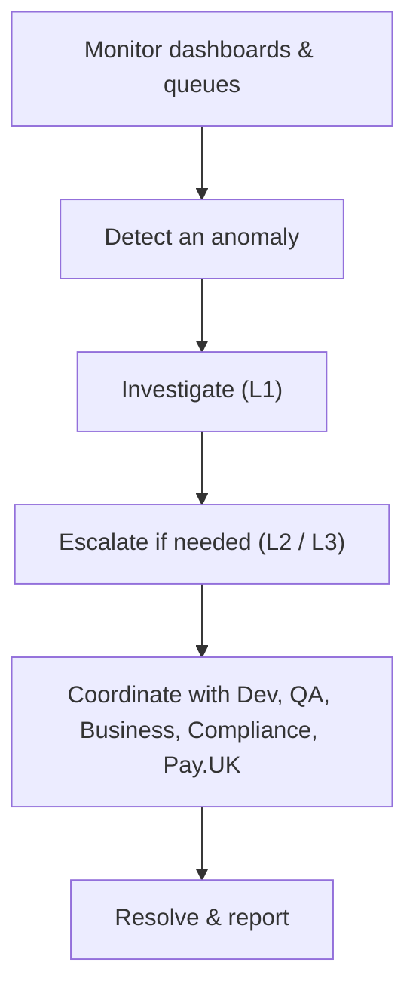

# 14. The FPS Operations Team

!!! abstract "Learning objective"
    Explain what an FPS Operations team actually does day to day, how incidents are escalated and classified, and how Operations works with Development, QA, Business, and Compliance.

## Core concepts

Faster Payments has run 24 hours a day, 365 days a year with no overnight cut-off since 2019 — which means there's no quiet batch window where a bank can safely catch and fix problems before customers notice. The FPS Operations team (also called Payments Operations, Production Support, or Live Services) exists specifically to keep that always-on processing healthy: monitoring dashboards, working exception and repair queues, handling incidents, supporting reconciliation, and producing the reporting that shows whether service levels are being met.

Operations sits at the centre of a web of other teams rather than working in isolation: Development builds and fixes the systems, QA verifies changes before and after release, Business/Product owns customer experience and commercial outcomes, Compliance/Financial Crime owns fraud and regulatory obligations (including, since October 2024, the Payment Systems Regulator's mandatory APP fraud reimbursement rules), and Pay.UK is the point of contact when a problem looks like it originates in the scheme's own central infrastructure rather than the bank's systems.

Incidents get classified by severity to determine urgency — a P1 (e.g. the gateway is down, all payments failing) triggers an immediate bridge call and hourly updates, while a P4 (a single customer query) just goes into the normal ticket queue. A typical shift starts by reading the previous shift's handover notes and checking overnight alerts, and ends by writing a clear handover of its own — a weak handover is one of the most common ways a small, contained issue quietly turns into a much bigger one.

## Visual overview

## Key terms

**FPS Operations / Production Support**
:   The team keeping live Faster Payments processing healthy — monitoring, exception handling, incident response, reconciliation support.

**Escalation levels (L1/L2/L3)**
:   L1: first-line monitoring and authorised repairs. L2: deeper technical investigation. L3: development/vendor fixes the underlying issue.

**Incident severity (P1-P4)**
:   Classifies urgency, from P1 (critical, bridge call, hourly updates) down to P4 (single query, normal ticket queue).

**Shift handover**
:   A written summary of open issues passed between shifts — critical for continuity on a 24/7 operation.

**PSR mandatory reimbursement (Oct 2024)**
:   UK regulation requiring reimbursement for APP fraud victims, directly shaping how Operations and Compliance handle fraud-related cases.

## Worked example

!!! example
    At 08:40 the exception queue jumps from a baseline of 150 to over 8,000 within twenty minutes. Operations doesn't wait for complaints — they check the pattern, find every new exception shares the same GATEWAY_TIMEOUT error code, raise a P1, and open a bridge call with Development and Infrastructure. Business gets an early estimate of affected payment count and value so they can prepare customer communications if needed, well before most customers have even noticed a delay.

## Comparison

**Incident severity**

| Severity | Example | Typical response |
|---|---|---|
| P1 — Critical | Gateway down, all payments failing | Immediate bridge call, hourly updates |
| P2 — High | One payment type failing at scale | Urgent investigation, same-day target |
| P3 — Medium | Recurring issue, small segment affected | Resolved within SLA, no bridge needed |
| P4 — Low | Single customer query | Normal ticket queue |

## Key points

- FPS's 24/7 nature is exactly why Operations needs continuous, proactive monitoring rather than an overnight batch check.
- Escalation runs L1 (first-line) → L2 (deeper technical) → L3 (development/vendor fixes root cause).
- Incidents are severity-classified (P1-P4) to determine urgency and response structure.
- Operations works with Compliance/Financial Crime specifically on fraud-related exceptions, now shaped by mandatory APP fraud reimbursement rules since October 2024.

## Exam & interview tips

!!! tip
    - Be ready to explain the difference between what Operations does and what Development does in one clean sentence: Operations keeps live systems running safely; Development builds and fixes them.
    - Know real tooling names if asked — log aggregation (Splunk, ELK), ticketing (ServiceNow, Jira Service Management), dashboards (Grafana) — it signals you understand the role isn't just theoretical.

!!! note "Memory trick"
    Operations' two questions on every action: is the customer's money safe and where is it, and who needs to know what in order to fix or explain this?

## Scenario questions

??? question "A junior analyst asks why Operations can't just let Development handle everything since they wrote the code. How do you explain the distinction?"
    Development builds and fixes systems on a project timeline; Operations exists to catch and manage problems in live, real-money processing in real time, 24/7 — a very different, continuous responsibility that Development alone isn't structured to provide.

??? question "Queue depth triples overnight with no obvious single cause yet. What's the correct first move?"
    Confirm the scope (is it isolated to one queue or spread across several) and look for a shared pattern (e.g. one error code) before escalating — jumping straight to a P1 without establishing scope and pattern wastes the incident response team's time.

??? question "Why might Operations specifically need to loop in Compliance for a payment held on suspected APP fraud, rather than resolving it alone?"
    Fraud-related holds can carry regulatory reimbursement obligations under the PSR's mandatory rules — Compliance/Financial Crime are the team equipped to make that call correctly and within required timeframes, which sits outside standard operational authority.

## Practice questions

??? question "1. Why does FPS Operations require continuous, not just daily, monitoring?"
    ▫️ FPS runs on a daily batch cycle
    ✅ FPS processes 24/7 with no overnight cut-off since 2019, so issues need near real-time detection
    ▫️ Operations only works during banking hours
    ▫️ Batch monitoring is actually preferred

??? question "2. What does an L1 (Level 1) analyst typically do?"
    ▫️ Fix underlying application code
    ✅ First-line monitoring, investigation, and authorised repairs
    ▫️ Set monetary policy
    ▫️ Design new payment schemes

??? question "3. A P1 incident typically triggers:"
    ▫️ A ticket logged for next week
    ✅ An immediate bridge call and frequent updates
    ▫️ No action required
    ▫️ Automatic account closure

??? question "4. Why is a shift handover important on a 24/7 operation?"
    ▫️ It isn't important
    ✅ Poor handovers commonly let small issues grow into larger ones due to lost context
    ▫️ It's a formality with no real function
    ▫️ Only night shifts need handovers

??? question "5. Which team does Operations work with specifically on APP fraud reimbursement cases?"
    ▫️ Marketing
    ✅ Compliance / Financial Crime
    ▫️ Facilities
    ▫️ Product design

??? question "6. What role does Pay.UK play when an issue looks scheme-side rather than bank-side?"
    ▫️ No role at all
    ✅ Operations raises it with Pay.UK's operations desk and tracks it through their status updates
    ▫️ Pay.UK has no operations desk
    ▫️ The bank must resolve it alone regardless

??? question "7. Which of these is NOT a typical Operations responsibility?"
    ▫️ Real-time monitoring
    ✅ Writing new application source code from scratch
    ▫️ Exception management
    ▫️ SLA and regulatory reporting

