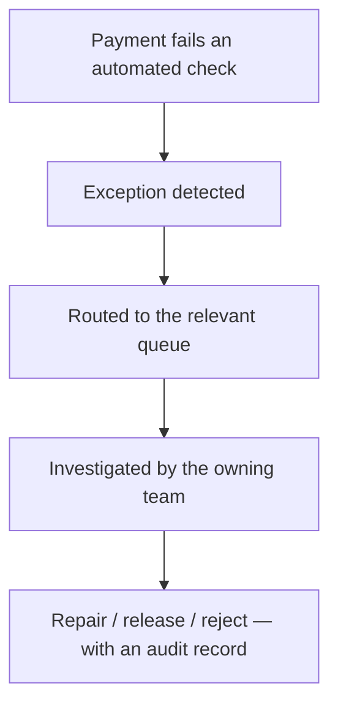

[FPS analyst deep-dive](../index.md) / [Payment Data & Operations](index.md) &middot; Lesson 15 of 40
{: .lesson-crumbs}

# 15. Exception Queues

!!! abstract "Learning objective"
    Explain what exception queues are and why payments enter them, distinguish the main queue types, and understand the controls around manually repairing a payment.

## Core concepts

Not every payment problem is a clean success or a clean failure — plenty fall into a grey area where a human, or an extra automated check, genuinely needs to make a call before the payment can safely continue. Rather than letting those payments fail silently or process incorrectly, they're paused in an exception queue: a controlled holding area with a full audit trail of what happened and why.

Banks typically run several queues, each owned by a different specialist team. A validation exception queue holds data problems — an invalid sort code format, a CoP mismatch. A fraud review queue holds payments a risk engine has flagged, pending analyst review of customer history and behaviour. A repair queue is specifically for data that can legitimately be fixed without new customer instructions, like adding a missing reference — and it comes with serious controls, because an analyst editing a live financial instruction is a real risk: dual approval ("maker-checker," sometimes "six-eyes" for high-value payments), full audit logging, and strict limits on what can even be touched. Notably, an analyst can almost never change the beneficiary account number or amount in a repair — doing so would effectively redirect the customer's money without their authority, so anything touching payee details or amount gets rejected back to the customer for resubmission instead. A technical exception queue handles system failures like gateway timeouts, a reconciliation queue handles financial mismatches, and a sanctions screening queue holds anything flagged against a watchlist, which cannot be released without formal Compliance sign-off given the legal obligations involved.

The mindset worth internalising: an exception isn't a failure, it's a signal that automated processing correctly stopped and asked for a second opinion.

## Visual overview

## Key terms

**Exception queue**
:   A controlled holding area for payments that can't continue through normal automated processing, with a full audit trail.

**Repair queue**
:   Specifically for correctable data issues (e.g. a missing reference) — never for changing beneficiary account number or amount.

**Maker-checker (dual approval)**
:   A control requiring a second authorised person to approve a repair before it takes effect — sometimes 'six-eyes' for high-value payments.

**Fraud review queue**
:   Holds payments flagged by the risk engine pending analyst review, ending in release or reject.

**Sanctions screening queue**
:   Holds payments with a possible watchlist/PEP match — requires formal Compliance sign-off, with legal obligations (e.g. reporting to OFSI) if a match is confirmed.

## Worked example

!!! example
    A payment is submitted with a blank reference field. Rather than rejecting it outright, it lands in the repair queue; an authorised analyst adds a valid reference, the change is logged with who made it, when, and why, and the payment resumes processing automatically. Compare that to a payment where the beneficiary account number looks wrong — that can never simply be "corrected" by an analyst, because changing where the money goes is exactly the kind of action that requires the customer's own fresh instruction, not an operational fix.

## Comparison

**Exception queue types**

| Queue | Handles |
|---|---|
| Validation exception | Data problems — invalid sort code, missing field, CoP mismatch |
| Fraud review | Payments flagged as suspicious by the risk engine |
| Repair | Correctable data issues only — never payee or amount details |
| Technical exception | System failures — gateway timeouts, message errors |
| Reconciliation | Internal records that don't match settlement/scheme records |
| Sanctions screening | Possible watchlist/PEP matches, pending Compliance sign-off |

## Key points

- Exception queues exist because not every payment outcome is a clean pass/fail — some genuinely need human judgement.
- Each queue type (validation, fraud, repair, technical, reconciliation, sanctions) is owned by a different specialist team.
- Repairs are tightly controlled: dual approval, full audit logging, and a hard line against ever touching beneficiary account number or amount.
- Monitoring queue size and exception age against baseline is how Operations catches systemic problems before complaints roll in.

## Exam & interview tips

!!! tip
    - A frequently asked, easy-to-fumble question: "why can't an analyst just fix a wrong account number in the repair queue?" — the answer is about redirecting customer funds without authority, not a technical limitation.
    - Know that queue size and exception age are the two core monitoring metrics — a sharp rise in either, against baseline, is what triggers escalation before customers even complain.

!!! note "Memory trick"
    An exception means processing paused to ask a question — it doesn't mean processing failed.

## Scenario questions

??? question "A payment is stuck because the beneficiary account number looks like it has a typo. Why can't this simply be corrected in the repair queue like a missing reference would be?"
    Correcting the account number would mean the bank itself is deciding where the customer's money goes, without fresh authority from the customer — that's a materially different, higher-risk action than fixing a cosmetic field like a reference, so it's rejected back for the customer to resubmit correctly instead.

??? question "Exception queue size jumps from 150 to 20,000 within an hour, all sharing the same error code. Walk through the right response."
    Confirm the scope and shared pattern, escalate as an incident given the scale and the fact it's systemic (one error code across thousands of payments) rather than isolated, and involve the team that owns whatever system that error code points to — likely a technical exception root cause given the pattern.

??? question "Why does a sanctions screening match require Compliance sign-off rather than being handled directly by an Operations analyst like a routine repair?"
    Confirmed sanctions matches carry serious legal obligations (potentially freezing funds and reporting to bodies like OFSI) that sit outside standard operational authority — Compliance is specifically equipped and mandated to make that call correctly.

## Practice questions

??? question "1. What is the purpose of an exception queue?"
    ▫️ To immediately delete failed payments
    ✅ To pause payments that can't continue automatically, for investigation with a full audit trail
    ▫️ To speed up all payments equally
    ▫️ To replace the need for validation entirely

??? question "2. Can an analyst change a beneficiary account number in a repair queue?"
    ▫️ Yes, freely
    ✅ No — that would redirect funds without customer authority; it requires reject and resubmission instead
    ▫️ Only for payments under £10
    ▫️ Only with a phone call to the customer

??? question "3. What does 'maker-checker' (or dual approval) refer to?"
    ▫️ A single person approving their own change
    ✅ A second authorised person required to approve a repair before it takes effect
    ▫️ A customer approving their own payment twice
    ▫️ A fully automated process with no human involvement

??? question "4. A payment flagged against a sanctions watchlist goes to which queue?"
    ▫️ Repair queue
    ✅ Sanctions screening queue, pending Compliance sign-off
    ▫️ Technical exception queue
    ▫️ It is auto-released immediately

??? question "5. What are the two core metrics used to monitor exception queues?"
    ▫️ Customer age and account colour
    ✅ Queue size and exception age against baseline
    ▫️ Interest rate and currency
    ▫️ Marketing spend and app rating

??? question "6. Which queue handles a gateway timeout specifically?"
    ▫️ Fraud review queue
    ✅ Technical exception queue
    ▫️ Sanctions screening queue
    ▫️ Repair queue

??? question "7. What's the correct mindset toward an exception, per this lesson?"
    ▫️ It always means the system has failed
    ✅ It means automated processing paused to ask for a decision, not that anything is necessarily wrong
    ▫️ It should always be ignored
    ▫️ It means the customer made an error

Previous
[&larr; 14. The FPS Operations Team](14-the-fps-operations-team.md)

Next
[16. Payment Returns &rarr;](../f4-investigations/16-payment-returns.md)

