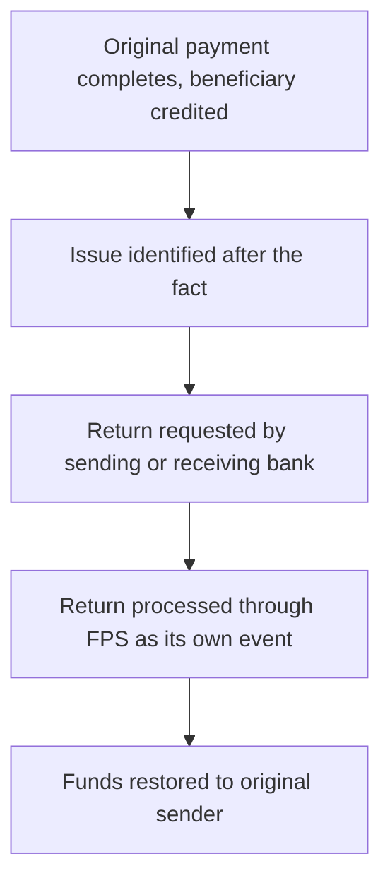

[FPS analyst deep-dive](../index.md) / [Investigations](index.md) &middot; Lesson 16 of 40
{: .lesson-crumbs}

# 16. Payment Returns

!!! abstract "Learning objective"
    Explain what a payment return is, distinguish it clearly from a rejection, and investigate why a completed payment came back.

## Core concepts

The single most confused pair of terms in FPS investigations is reject and return, and getting it wrong in front of a customer or a colleague is a quick way to lose credibility. A rejection stops a payment before it ever completes — the money never leaves the sending side. A return is the opposite scenario: the payment already completed, the beneficiary was credited, and now the funds are being sent back afterwards. Because a return unwinds money that has already moved, it's treated as a brand new payment event with its own identifier, its own status lifecycle, and its own reconciliation trail — linked back to the original payment, but never merged into it.

Returns happen for a handful of recurring reasons: the customer sent the wrong amount or the wrong beneficiary and asked for recovery, a technical fault produced a duplicate payment and one copy needs reversing, a payment was later confirmed as fraudulent, or the receiving bank found an error on its own side after posting the credit. The tricky part operationally is that a receiving bank can't just claw money back out of its customer's account on request — it needs the customer's consent, a fraud finding, or a legal basis, which is exactly why misdirected-payment recoveries can take days and sometimes fail outright if the money has already been spent.

## Visual overview

## Key terms

**Payment return**
:   A payment that already completed being sent back to the original sender — a reversal, not a prevention.

**Return vs reject**
:   Reject: stopped before completion, funds never delivered. Return: completed, then reversed, funds were delivered first.

**Return ID**
:   A separate identifier tracking the return event itself, linked to but distinct from the original Payment ID.

**Return reason**
:   The stated cause for a return — e.g. duplicate payment, customer request, fraud confirmed, account error.

**Misdirected payment recovery**
:   An industry process for recovering funds a customer sent to the wrong account by mistake — not guaranteed to succeed.

## Worked example

!!! example
    A customer means to send £100 but types an extra zero and sends £1,000. The funds land successfully — nothing about the payment itself failed. Recovering the extra £900 isn't a case of 'fixing' the original payment; the sending bank has to raise a fresh return request to the receiving bank, who can only act on it with the receiving customer's consent (or a stronger legal basis). That whole return gets its own Return ID and its own status trail, separate from the original Payment ID, and both need to reconcile independently at month end.

## Comparison

**Reject vs return**

|  | Reject | Return |
|---|---|---|
| Timing | Before completion | After completion |
| Funds delivered? | No | Yes, then reversed |
| Speed | Usually immediate | Can take minutes, hours, or days |
| Who initiates | Validation, receiving bank, or the scheme, automatically | Usually a bank, after investigation or a customer/legal request |

## Key points

- A return always happens after a payment has already completed — that's the defining feature.
- A return is tracked as its own event (Return ID, own status lifecycle) linked to, not merged with, the original payment.
- Common return causes: wrong amount/beneficiary, duplicate payment, confirmed fraud, receiving-bank posting error.
- Receiving banks can't simply reverse a credit without consent, a fraud finding, or a legal basis — recovery isn't guaranteed.

## Exam & interview tips

!!! tip
    - The cleanest way to answer "what's the difference between a reject and a return" is one sentence: reject prevents completion, return reverses it — say that line first, then add detail.
    - Know why a return needs its own ID: it's a genuinely separate financial transaction that must be independently reconciled, not a status change on the original payment.

!!! note "Memory trick"
    Reject = never arrived. Return = arrived, then came back.

## Scenario questions

??? question "A customer says 'money was taken from my account but has now disappeared.' Walk through how you'd investigate."
    Find the original payment by its Payment ID and confirm its status is COMPLETED, then search for a linked return record, check its status and reason, and explain the return's current progress and expected completion to the customer.

??? question "Why is it wrong to describe a return as 'undoing' the original payment in the system?"
    The original payment record still shows as completed — nothing is deleted or rewritten. The return is a brand new transaction moving funds back the other way, and both records need to exist and reconcile separately for an accurate audit trail.

??? question "Return volumes suddenly jump from 200/day to 20,000/day, all citing an account processing error reason code. What's the likely story?"
    A systemic issue rather than isolated customer mistakes — most likely a technical fault at a bank (e.g. a deployment causing incorrect account posting) that needs to be traced to its root cause and fixed before more returns are generated.

## Practice questions

??? question "1. What is the key difference between a reject and a return?"
    ▫️ No difference
    ✅ Reject stops a payment before completion; a return reverses one that already completed
    ▫️ Returns are always instant, rejects are not
    ▫️ Rejects only apply to international payments

??? question "2. Why does a return get its own identifier separate from the original Payment ID?"
    ▫️ It doesn't need one
    ✅ It's a distinct financial event that must be tracked and reconciled independently
    ▫️ To hide it from audit
    ▫️ Because FPS requires all payments to have two IDs

??? question "3. Why might a misdirected payment recovery fail even when requested promptly?"
    ▫️ FPS blocks all recoveries
    ✅ The receiving customer may have already spent the funds or may not consent
    ▫️ Recoveries are illegal in the UK
    ▫️ Only card payments can be recovered

??? question "4. Which of these is a typical cause of a payment return?"
    ▫️ A valid sort code
    ✅ A confirmed duplicate payment
    ▫️ A successful CoP match
    ▫️ A payment under £10

??? question "5. How does a payment return differ from a merchant refund?"
    ▫️ They are identical processes
    ✅ A return is a bank-to-bank recovery process; a refund is typically a merchant/card-scheme commercial reversal
    ▫️ Refunds are only used for FPS
    ▫️ Returns never involve banks

??? question "6. What must a receiving bank normally have before reversing a credit already posted to a customer?"
    ▫️ Nothing — it can act unilaterally
    ✅ The customer's consent, a fraud finding, or another valid legal basis
    ▫️ A phone call from the sending bank only
    ▫️ Approval from the customer's employer

Previous
[&larr; 15. Exception Queues](../f3-payment-data-and-operations/15-exception-queues.md)

Next
[17. Payment Rejections &rarr;](17-payment-rejections.md)

