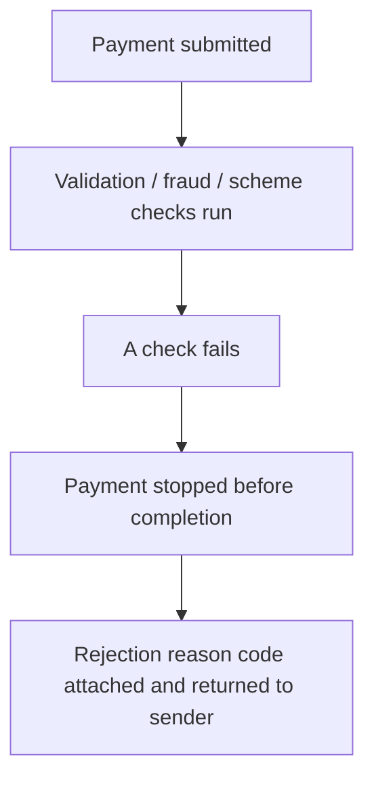

# 17. Payment Rejections

!!! abstract "Learning objective"
    Explain what causes an FPS payment to be rejected, read a rejection reason code correctly, and investigate a rejection for a customer.

## Core concepts

A rejection means a payment never actually completed — it was stopped somewhere before the beneficiary could be credited, so unlike a return, no funds ever moved. Rejections fall into a handful of recognisable categories: account-related problems (closed, invalid format, non-existent), technical or validation problems (message formatting errors, missing mandatory fields), scheme-side problems (routing failures, unavailable receiving participant), fraud or compliance holds that end in a stop rather than a release, and business rule breaches (limit exceeded, restricted payment type).

Every rejection carries a reason code, and UK payment schemes generally map their internal codes to the same ISO 20022 standard reason codes used across other payment rails, which is genuinely useful — it means the underlying vocabulary of 'why did this fail' is broadly consistent whether you're looking at FPS, CHAPS, or a SEPA payment. Codes like AC01 (incorrect account number), AC04 (closed account), AC06 (blocked account), AM02 (amount exceeds a limit), and RC01 (invalid bank identifier) recur constantly in production support work, and being able to translate a code into a plain-English explanation for a customer — without either dumbing it down or drowning them in scheme jargon — is a core analyst skill.

## Visual overview

## Key terms

**Rejection**
:   A payment stopped before completion — funds are never delivered to the beneficiary.

**ISO 20022 reason code**
:   A standardised code (e.g. AC01, AC04, AM02) explaining why a payment failed, shared across UK payment schemes.

**AC01 / AC04 / AC06**
:   Incorrect account number / closed account / blocked account — three of the most common account-related rejection codes.

**AM02 / RC01**
:   Amount exceeds an agreed limit / invalid bank identifier — common limit and routing rejection codes.

**MS03**
:   A generic 'reason not specified' code — technically valid but discouraged, since it gives the customer nothing to act on.

## Worked example

!!! example
    A customer's payment is rejected with reason code AC04. Rather than telling the customer 'AC04 - contact your bank,' a good analyst translates it: 'the account you're sending to has been closed — you'll need to check the current account details with the person or business you're paying, and resend once you have them.' Same underlying fact, one version is useful and one isn't.

## Comparison

**Common ISO 20022 rejection codes**

| Code | Meaning |
|---|---|
| AC01 | Incorrect account number |
| AC04 | Account closed |
| AC06 | Account blocked |
| AM02 | Amount exceeds agreed limit |
| RC01 | Invalid bank identifier |
| MS03 | Reason not specified (used sparingly) |

## Key points

- A rejection means the payment never completed — no funds moved, unlike a return.
- Rejections cluster into account, technical/validation, scheme, fraud/compliance, and business-rule categories.
- ISO 20022 reason codes give a broadly consistent vocabulary for 'why did this fail' across UK payment schemes.
- Translating a code into plain, actionable language for the customer is the actual skill — reciting the code is not.

## Exam & interview tips

!!! tip
    - Interviewers like hearing you name a few real ISO codes (AC01, AC04, AM02) rather than speaking only in generalities — it signals hands-on exposure.
    - Have a one-line explanation of why MS03-style 'unspecified' codes are discouraged: they satisfy the technical requirement to reject but give the customer and the analyst nothing to act on.

!!! note "Memory trick"
    AC = account problem. AM = amount problem. RC = routing/identifier problem. Read the prefix first.

## Scenario questions

??? question "A customer's payment is rejected with AC01. What do you tell them, and what should they do next?"
    Explain that the account number provided doesn't match a valid account format or doesn't exist as entered, and advise them to double-check the account number and sort code with the intended recipient before resending.

??? question "A junior analyst says 'reject and return basically mean the same bad outcome.' How do you correct this?"
    Point out the money's actual journey is completely different — a reject means funds never left the sending side at all, while a return means the money was successfully delivered and only came back afterwards; the customer's practical experience and any resend timing differs accordingly.

??? question "Why would a bank prefer a specific reason code like AC06 over MS03 whenever possible?"
    A specific code lets both the customer and the sending bank's own systems act correctly and quickly — AC06 tells you it's specifically a blocked account, which is different advice from a closed or invalid account, whereas MS03 tells you nothing beyond 'it failed.'

## Practice questions

??? question "1. What is the defining feature of a rejection?"
    ▫️ Funds are delivered then reversed
    ✅ The payment is stopped before it ever completes, so funds never move
    ▫️ It only happens to international payments
    ▫️ It always takes several days

??? question "2. What does ISO 20022 reason code AC04 mean?"
    ▫️ Amount exceeds limit
    ✅ Account closed
    ▫️ Invalid bank identifier
    ▫️ Payment successful

??? question "3. Why is code MS03 generally discouraged?"
    ▫️ It's not a real code
    ✅ It gives no specific reason, leaving the customer and analyst with nothing actionable
    ▫️ It always means fraud
    ▫️ It's only used for CHAPS

??? question "4. What does AM02 indicate?"
    ▫️ Account blocked
    ✅ Amount exceeds an agreed limit
    ▫️ Invalid account number
    ▫️ Routing failure

??? question "5. Why is ISO 20022's shared reason-code vocabulary useful to an analyst?"
    ▫️ It isn't useful
    ✅ It gives broadly consistent meaning across FPS, CHAPS, and other schemes, rather than a different code set per rail
    ▫️ It replaces the need for status history
    ▫️ It only applies outside the UK

??? question "6. Which is a strong way to communicate a rejection to a customer?"
    ▫️ Read out the raw ISO code only
    ✅ Translate the code into plain, actionable language, e.g. what to check and what to do next
    ▫️ Say nothing until asked twice
    ▫️ Blame the receiving bank without evidence

