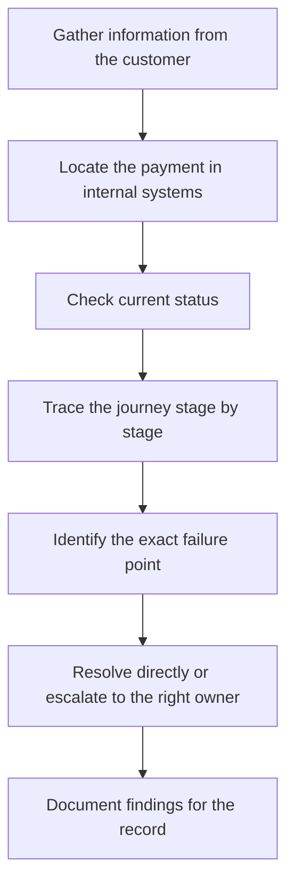

[FPS analyst deep-dive](../index.md) / [Investigations](index.md) &middot; Lesson 18 of 40
{: .lesson-crumbs}

# 18. Missing Payment Investigation

!!! abstract "Learning objective"
    Run a structured missing-payment investigation from a customer report through to identifying who owns the next action.

## Core concepts

"I sent money and it hasn't arrived" is one of the most common things an FPS analyst hears, and the first rule is never to assume the money is lost. A payment reported as missing could still be processing, delayed in a queue, held in an exception queue, rejected without the customer realising, completed but not posted correctly at the receiving bank, already returned, or — rarely — genuinely stuck due to a system fault. The investigation always follows the same logic: trace the payment end to end through customer instruction, sending bank, payment hub, FPS gateway, FPS central infrastructure, receiving bank, and beneficiary account, and find the last point it definitely succeeded.

FPS is built to settle in seconds, and while its legacy scheme rules reference a 2-hour outer ceiling, in practice most banks treat anything beyond a few minutes as worth investigating and anything past 2 hours as a formal scheme-rule concern. The seven-step workflow — gather information, locate the payment, check status, trace the journey, identify the failure point, resolve or escalate, document findings — turns a vague complaint into a concrete, ownership-assigned finding. A detail worth knowing: some smaller indirect participants batch outbound payments at fixed times rather than submitting instantly, so a payment sent late on a Friday evening can look 'stuck' when it's really just waiting for the next batch window — a frequently misread scenario.

## Visual overview

## Key terms

**Missing payment**
:   A payment the customer expected to arrive but hasn't — not automatically the same as a lost payment.

**Last successful point**
:   The furthest stage in the payment journey confirmed to have worked — the anchor for assigning investigation ownership.

**2-hour scheme ceiling**
:   FPS's legacy outer processing limit; in practice most delays are investigated long before this point is reached.

**Batch cut-off (indirect participants)**
:   Some smaller PSPs submit outbound payments at fixed times rather than instantly, which can look like a stuck payment.

**Exception status**
:   A payment held for manual review — check the owning queue, assigned team, and expected resolution time.

## Worked example

!!! example
    A payment's trace shows Created, Validated, Fraud Check, CoP, Submitted, and FPS Accepted all ticked off — but nothing after that. The sending bank's job is provably done; ownership of the next step sits with the receiving bank, since under scheme rules a receiving bank that has accepted a payment message is obliged to credit the beneficiary without undue delay. That single insight — 'where did it stop, and whose job was the next step' — is the whole investigation in miniature.

## Comparison

**Reading the payment status**

| Status found | What it tells you |
|---|---|
| COMPLETED | Sending side succeeded — check receiving bank posting next |
| SUBMITTED | Sent onward, final response still awaited |
| REJECTED | Failed before completion — check the reason code and whether the customer was told |
| EXCEPTION | Held for manual review — check the queue, owner, and SLA |
| RETURNED | Reached the beneficiary bank, then sent back — check the return reason |

## Key points

- A missing payment is not automatically a lost payment — most resolve to processing, delay, or a miscommunicated rejection.
- The investigation's anchor question is always: what was the last successful stage, and who owns the next one?
- FPS's legacy 2-hour ceiling is a formal escalation trigger, though most banks act well before that on customer experience grounds.
- Indirect participants' batch timing is a real, recurring, often-misunderstood cause of apparent delay.

## Exam & interview tips

!!! tip
    - A strong interview answer always leads with gathering precise identifiers before touching any system — Payment ID, amount, date, sort code — since vague details ('I sent money yesterday') can't be investigated.
    - Mention the Friday-evening/indirect-participant batch scenario if asked for a 'tricky' missing payment case — it shows awareness beyond the textbook happy path.

!!! note "Memory trick"
    Never guess where it went. Trace it, stage by stage, until it stops — then hand it to whoever owns the next stage.

## Scenario questions

??? question "A customer reports a missing payment but only knows the amount and roughly when they sent it. What do you do before searching any system?"
    Gather the fuller identifying detail you actually need — sending account, beneficiary details, exact date/time if possible, channel used — since a vague search risks matching the wrong payment or missing it entirely.

??? question "A trace shows Created, Validated, then nothing — no Fraud Check, no Submission. What does this suggest, versus a trace that stops after Submitted?"
    Stopping right after Created/Validated points to an internal processing issue very early in the chain (owned by the bank's own technology team), while stopping after Submitted points to a scheme-side or gateway response problem much further along — different owners, different next actions.

??? question "Hundreds of customers report missing payments, all showing ACCEPTED with no beneficiary credit, all pointing to the same receiving bank. What's the right response?"
    Treat this as a major incident rather than individual cases — the shared pattern (same bank, same status, same timeframe) points to a systemic issue at the receiving bank, so escalate with their operational contact and coordinate a combined update rather than investigating each customer separately.

## Practice questions

??? question "1. What is the first rule of a missing payment investigation?"
    ▫️ Assume the money is lost
    ✅ Never assume failure — trace the payment end to end first
    ▫️ Always escalate to the police
    ▫️ Refund the customer immediately

??? question "2. A trace shows the payment stopped right after 'FPS Accepted.' Who most likely owns the next step?"
    ▫️ The sending bank's fraud team
    ✅ The receiving bank
    ▫️ The customer
    ▫️ Nobody — the payment is lost

??? question "3. What does FPS's legacy '2-hour ceiling' represent?"
    ▫️ The average completion time
    ✅ An outer scheme-rule processing limit used as a formal escalation trigger
    ▫️ The time to open a new account
    ▫️ A daily batch cut-off

??? question "4. Why might a payment sent late on a Friday evening appear stuck?"
    ▫️ FPS shuts down on weekends
    ✅ A smaller indirect participant may batch outbound payments at fixed times rather than instantly
    ▫️ Fraud checks always fail on Fridays
    ▫️ The customer's bank is closed

??? question "5. What is the correct first step when a customer says only 'I sent money yesterday, it's not there'?"
    ▫️ Search all payments made in the last year
    ✅ Gather precise identifying details before searching any system
    ▫️ Immediately raise a major incident
    ▫️ Tell the customer nothing can be done

??? question "6. A payment shows COMPLETED but the customer says funds haven't arrived. What should you check next?"
    ▫️ Nothing further is needed
    ✅ Beneficiary account posting and receiving bank confirmation
    ▫️ Cancel the payment
    ▫️ Assume customer error and close the case

Previous
[&larr; 17. Payment Rejections](17-payment-rejections.md)

Next
[19. Delayed Payment Investigation &rarr;](19-delayed-payment-investigation.md)

