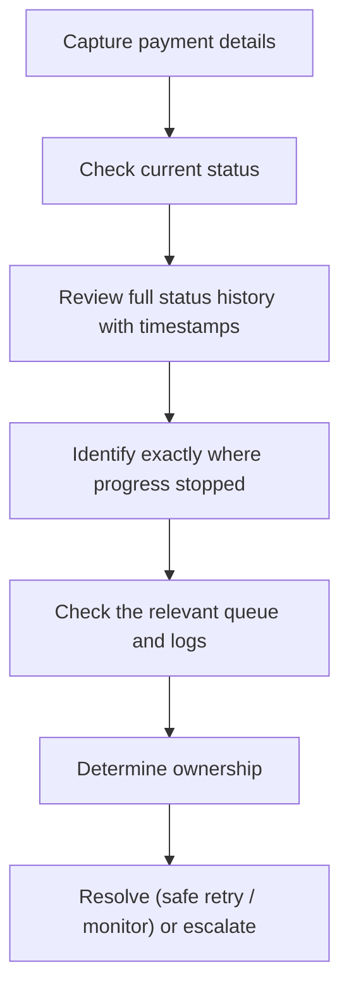

[FPS analyst deep-dive](../index.md) / [Investigations](index.md) &middot; Lesson 19 of 40
{: .lesson-crumbs}

# 19. Delayed Payment Investigation

!!! abstract "Learning objective"
    Distinguish a delayed payment from a failed one, and investigate the timeline to find where processing slowed and who owns it.

## Core concepts

A delayed payment is still alive — it hasn't stopped, it just hasn't finished as quickly as expected, and it may well complete without anyone doing anything at all. That's the core distinction from a failed payment, which has genuinely stopped and needs correction before it can go anywhere. Delay can be introduced at several points: an internal processing queue backing up, a fraud or sanctions review holding a high-value or new-payee payment for legitimate extra scrutiny, an FPS gateway not acknowledging a message (sometimes due to something as specific as a certificate or signing-key issue on the ISO 20022 messaging layer), a slow receiving-bank credit, or — more rarely — settlement liquidity pacing at the sending bank's end.

The investigation is fundamentally a timeline exercise: capture the payment details, check current status, review the full status history with timestamps, identify exactly where progression stopped, check the relevant queue or log for that stage, assign ownership, and then either resolve (a safe retry, monitoring recovery) or escalate. Distinguishing 'one customer's payment is slow' from 'the whole gateway queue is backing up' matters enormously — the second is a systemic problem needing an incident, not a single-ticket fix, and the tell is usually queue depth and processing rate moving away from their normal baseline.

## Visual overview

## Key terms

**Delayed payment**
:   Still processing, has not stopped, and may still complete without any corrective action.

**Failed payment**
:   Processing has genuinely stopped and will not complete without a correction.

**Queue depth / processing rate**
:   Core delay-monitoring metrics — a growing queue or a falling processing rate signals a systemic issue, not an isolated one.

**Fraud/sanctions screening hold**
:   A legitimate, by-design delay for high-value or new-payee payments or a sanctions near-miss — tracked against SLA, not silent.

**Settlement liquidity pacing**
:   A rare scheme-level mechanic where a bank paces outbound payment release against available settlement headroom.

## Worked example

!!! example
    A dashboard normally shows payments completing in seconds; today the average is climbing past 30 minutes. A sample payment's status history shows Submitted at 09:15 with no change for 45 minutes, and the FPS gateway queue has grown from a baseline of 500 messages to 25,000. That combination — one stuck payment plus a systemically growing queue — immediately reframes the case from 'investigate this customer's payment' to 'raise an incident for the gateway,' because the root cause clearly sits upstream of any single transaction.

## Comparison

**Delayed vs failed payment**

|  | Delayed | Failed |
|---|---|---|
| State | Still processing | Processing has stopped |
| Outcome | May still complete on its own | Will not complete without action |
| Typical cause | Queues, systems, or legitimate controls | Validation failure or rejection |
| Customer funds | Ring-fenced, not yet moved | Returned to source account |

## Key points

- A delay is not automatically a failure — the payment may still complete unaided.
- The investigation is a timeline exercise: status history and timestamps are the primary evidence.
- Ownership maps cleanly to where the delay sits: payment hub, fraud/sanctions queue, gateway, or receiving bank.
- Queue depth and processing rate against baseline are what distinguish an isolated case from a systemic incident.

## Exam & interview tips

!!! tip
    - When asked to investigate a delay, always mention checking queue depth and processing rate against baseline — that's what separates 'is this one payment slow' from 'is the whole pipeline slow.'
    - Sanctions/fraud holds are a legitimate cause of delay, not a fault — say so explicitly if asked, since treating every hold as a system problem is a common junior-analyst mistake.

!!! note "Memory trick"
    Delayed = still moving, just slowly. Failed = stopped, needs fixing. Check the timeline before deciding which one you're looking at.

## Scenario questions

??? question "A customer's payment shows SUBMITTED for over 30 minutes. What's your investigation sequence?"
    Capture the payment details, confirm the current status, pull the full status history with timestamps to see exactly when progress stopped, then check the relevant queue (likely the FPS gateway queue) and logs to see whether this is isolated or part of a wider backlog before deciding ownership.

??? question "A payment is held in a fraud review queue for a £25,000 payment to a payee never used before. Is this a system fault?"
    No — this is routine, by-design behaviour: high-value payments to unfamiliar payees are commonly held briefly for review. The analyst's job is to check the queue status and expected clearance time, not to treat it as a bug.

??? question "A deployment at 14:00 is followed by rising payment delays at 14:05 and a growing gateway queue at 14:10. How do you frame the root cause investigation?"
    The timing correlation strongly suggests the deployment introduced the fault — investigate what changed in that release (e.g. a signing certificate or key reference), roll back if confirmed, and verify recovery with a sample of payments before closing the incident.

## Practice questions

??? question "1. What is the core difference between a delayed and a failed payment?"
    ▫️ No real difference
    ✅ Delayed is still processing and may still complete; failed has stopped and needs correction
    ▫️ Failed payments always resolve themselves
    ▫️ Delayed payments are always fraud-related

??? question "2. Why might a high-value payment to a brand-new payee be held briefly?"
    ▫️ It's a system bug
    ✅ Legitimate fraud/risk review is routinely applied to unfamiliar, high-value, or new-payee payments
    ▫️ FPS blocks all new payees permanently
    ▫️ Only card payments get held

??? question "3. What two metrics best distinguish a single slow payment from a systemic backlog?"
    ▫️ Customer age and account type
    ✅ Queue depth and processing rate against their normal baseline
    ▫️ Interest rate and currency
    ▫️ Marketing spend and app rating

??? question "4. What might a certificate or signing-key issue cause at the FPS gateway?"
    ▫️ Faster processing
    ✅ Outbound ISO 20022 messages failing signature validation and being silently retried, causing delay
    ▫️ Automatic account closure
    ▫️ Immediate rejection with a clear reason code

??? question "5. What is settlement liquidity pacing?"
    ▫️ A customer-facing fee
    ✅ A rare mechanic where a bank paces outbound payments against available settlement headroom with its settlement agent
    ▫️ A fraud detection rule
    ▫️ A type of Confirmation of Payee check

??? question "6. If a sample delayed payment shows Submitted with no change for 45 minutes, and the gateway queue has grown 50x versus baseline, what's the right read?"
    ▫️ An isolated one-off, no action needed
    ✅ A systemic gateway issue likely affecting many payments, warranting incident escalation
    ▫️ Definitely fraud
    ▫️ The customer made an error

Previous
[&larr; 18. Missing Payment Investigation](18-missing-payment-investigation.md)

Next
[20. Duplicate Payment Investigation &rarr;](20-duplicate-payment-investigation.md)

