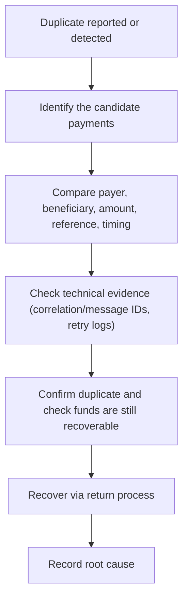

# 20. Duplicate Payment Investigation

!!! abstract "Learning objective"
    Identify duplicate payment patterns, understand idempotency as the core preventive concept, and recover from a confirmed duplicate correctly.

## Core concepts

A duplicate payment is exactly what it sounds like — the same instruction processed more than once when the customer only meant to send it once — and it's treated seriously because it combines financial loss, reconciliation breaks, and a pattern that can look identical to fraud. Duplicates come from a recognisable set of causes: a customer double-clicking 'pay' on a slow connection, a system retry resubmitting after a lost acknowledgement rather than recognising the original actually succeeded, the same technical message being delivered twice by a queue that redelivers after a crash, a database update failing partway and triggering an unwanted retry, or — for business/bulk payments — the same payroll file being uploaded twice by two people unaware of each other.

The core preventive concept is idempotency: a well-designed system should ensure the same request produces exactly one outcome no matter how many times it's submitted, typically via a unique idempotency key attached to each customer request. It's worth knowing that FPS itself validates message uniqueness at the scheme level, but that only protects against duplicate scheme submission — it does nothing to stop a customer genuinely creating two separate front-end instructions, which is why front-end idempotency controls still matter. Investigation compares payer, beneficiary, amount, reference, and close timestamps as business-level evidence, backed by correlation/message IDs and retry logs as technical evidence — and recovery is never automatic: before returning funds, an analyst must confirm the beneficiary account still holds them, because funds already withdrawn can point toward a mule-account fraud pattern rather than a routine operational duplicate.

## Visual overview

## Key terms

**Duplicate payment**
:   The same payment instruction processed and settled more than once when only one was intended.

**Idempotency**
:   A design principle ensuring a repeated request produces only one outcome — implemented via a unique idempotency key.

**Idempotency key**
:   A unique reference attached to a customer's payment request, checked before creating a new payment on retry.

**Correlation/message ID matching**
:   Technical evidence (matching IDs in logs) corroborating that two payments came from the same underlying retried request.

**Duplicate vs mule pattern**
:   If duplicated funds have already left the beneficiary account, treat it as a possible fraud case, not a routine recovery.

## Worked example

!!! example
    Two £500 payments complete seconds apart, same payer, same beneficiary, same reference. On its own that's suggestive but not proof — the confirming evidence is in the logs: a correlation ID shows the payment was submitted, no acknowledgement came back in time, and a retry then resubmitted the same instruction rather than checking whether the original had actually gone through. That's the idempotency gap in action, and it's exactly what a unique request-level idempotency key is designed to close.

## Comparison

**Duplicate causes**

| Cause | Mechanism |
|---|---|
| Customer double submission | Slow connection, user clicks Pay twice |
| System retry | Acknowledgement lost, retry resends instead of checking existing status |
| Message duplication | Queue redelivers a message after a crash before acknowledgement |
| Database processing error | Partial transaction failure triggers an unintended retry |
| Batch/file duplication | The same payroll file uploaded twice by different people |

## Key points

- A duplicate is the same instruction processed twice, not two genuinely different payments that happen to look alike.
- Idempotency (via a unique key per request) is the core technical control that should prevent this.
- Business-level pattern matching plus technical log evidence together confirm a duplicate — neither alone is conclusive.
- Never treat recovery as automatic: check the funds are still present, and treat already-withdrawn duplicated funds as a possible mule/fraud case.

## Exam & interview tips

!!! tip
    - Idempotency is a near-guaranteed technical question in this space — be ready to explain it with the idempotency-key example, not just the dictionary definition.
    - Always mention the fraud-check step before recovery: confirming the beneficiary account still holds the funds shows you understand duplicates and fraud can overlap.

!!! note "Memory trick"
    Same payer, same payee, same amount, same reference, close together in time — that's the duplicate fingerprint. Then prove it with the logs.

## Scenario questions

??? question "A customer reports being charged twice for the same £500 rent payment. What do you check first, and in what order?"
    First compare the business-level attributes (payer, beneficiary, amount, reference, timestamps) across the two payments to see if they look like a duplicate, then pull the technical logs (correlation/message IDs, retry records) to confirm the mechanism, before initiating any recovery.

??? question "Why is 'same amount, same day' not enough on its own to confirm a duplicate?"
    Two genuinely separate, intended payments could easily share an amount and date by coincidence — you need the fuller fingerprint (same beneficiary, same reference, close timestamps) plus technical log evidence before treating it as confirmed rather than assumed.

??? question "A finance team member uploads a payroll file, unaware a colleague already uploaded the same file an hour earlier. What kind of investigation does this trigger, and why is it different from a single customer's duplicate?"
    This is a mass-duplication event rather than an isolated case — potentially hundreds of duplicate payments from one root cause — so it should be investigated and recovered as a batch incident with file-level duplicate detection as the prevention fix, not worked payment-by-payment.

## Practice questions

??? question "1. What does idempotency guarantee, when correctly implemented?"
    ▫️ Faster payments
    ✅ The same request produces only one outcome, however many times it's submitted
    ▫️ Lower fees
    ▫️ Automatic fraud detection

??? question "2. Why can a system retry create a genuine duplicate rather than just resending the same message?"
    ▫️ Retries are always safe
    ✅ If the original payment actually succeeded but its acknowledgement was lost, the retry can create a second, separate payment
    ▫️ FPS blocks all retries
    ▫️ Retries only affect card payments

??? question "3. What should be checked before recovering funds from a confirmed duplicate?"
    ▫️ Nothing further is needed
    ✅ That the beneficiary account still holds the duplicated funds
    ▫️ The customer's employer
    ▫️ The exchange rate

??? question "4. What does FPS's own scheme-level message uniqueness check protect against?"
    ▫️ Every kind of duplicate, including customer double-submission
    ✅ Duplicate scheme-level message submission specifically, not duplicate front-end customer instructions
    ▫️ Nothing at all
    ▫️ Only fraud, not duplicates

??? question "5. If duplicated funds have already been withdrawn from the beneficiary account, what should the analyst consider?"
    ▫️ Automatically write off the loss
    ✅ Whether this may actually be a mule-account fraud pattern rather than a routine duplicate
    ▫️ Ignore it entirely
    ▫️ Blame the sending bank's customer

??? question "6. Which combination of evidence best confirms a duplicate payment?"
    ▫️ Amount alone
    ✅ Matching payer, beneficiary, amount, reference and close timestamps, backed by matching correlation/message IDs in logs
    ▫️ Customer's opinion only
    ▫️ The time of day alone

