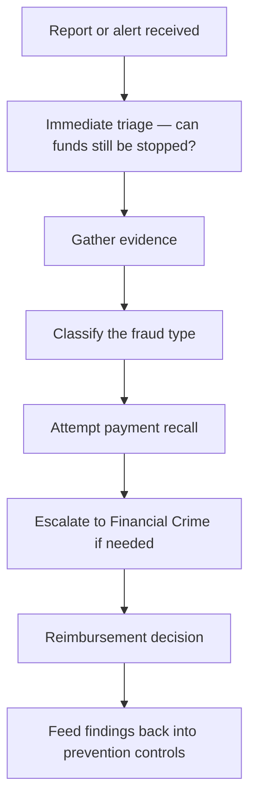

[FPS analyst deep-dive](../index.md) / [Investigations](index.md) &middot; Lesson 21 of 40
{: .lesson-crumbs}

# 21. Fraud Investigation

!!! abstract "Learning objective"
    Distinguish APP fraud, account takeover, and mule accounts, run the fraud investigation and recall workflow, and apply the PSR's mandatory APP fraud reimbursement rules to a case.

## Core concepts

Fraud investigations are fundamentally different from missing, delayed, or duplicate payment cases, because the payment itself usually worked exactly as designed — the system isn't broken, a crime used it successfully. That flips the investigation's core question from 'where did this go wrong technically?' to 'was this transaction legitimate, and can the money still be recovered?'

Three fraud types recur constantly. Authorised push payment (APP) fraud is when a genuine customer is deceived into knowingly sending money themselves — purchase scams, investment scams, romance scams, safe-account scams, invoice/mandate fraud, and CEO impersonation are the common flavours. Account takeover (ATO) is different in kind: a criminal gains unauthorised access to the customer's credentials or device (phishing, SIM-swap, malware, credential stuffing) and sends a payment the customer never authorised at all — governed by different rules (broadly the Payment Services Regulations 2017) than APP fraud. Mule accounts sit on the receiving end of both: an account used to receive and rapidly move on fraudulent funds, identified by patterns like a dormant account suddenly receiving a large credit that's moved on again within minutes.

Detection leans on velocity checks (unusual transaction frequency or speed), behavioural anomaly detection (activity well outside a customer's normal pattern), and sanctions/AML screening. Once a case is triaged, speed is everything on the recall — a request sent within minutes has a meaningfully better chance than one sent hours later, since mule accounts are typically drained fast. Since October 2024, the UK Payment Systems Regulator's mandatory reimbursement rules require sending banks to reimburse most APP fraud victims (up to a cap, cost-split 50/50 with the receiving bank, generally within 5 business days), with a narrow Consumer Standard of Caution exception for cases where a customer ignored a specific, clear warning about the exact scam type they then fell for.

## Visual overview

## Key terms

**Authorised push payment (APP) fraud**
:   The genuine customer is deceived into knowingly authorising a payment to a fraudster.

**Account takeover (ATO) fraud**
:   A criminal gains unauthorised access to credentials/device and sends a payment without the customer's knowledge — an unauthorised transaction.

**Mule account**
:   An account used to receive and rapidly move on the proceeds of fraud — speed of investigation is critical.

**Payment recall**
:   A time-critical request from the sending bank asking the receiving bank to freeze and return funds before they're withdrawn.

**PSR mandatory APP fraud reimbursement (Oct 2024)**
:   UK rule requiring reimbursement of most APP fraud victims, cost-split 50/50 between sending and receiving PSP, up to a cap, with a narrow Standard of Caution exception.

## Worked example

!!! example
    A customer sends £8,500 after a call from someone claiming to be their bank's fraud team, telling them to move money to a 'safe account.' The payment completed three hours earlier. The analyst triages immediately (funds may already be gone), gathers evidence (a CoP 'No Match' the customer overrode — classic scam-coaching), classifies it correctly as APP fraud rather than a dispute, raises an urgent recall flagging a suspected mule account, and separately assesses the case for reimbursement: since there was no specific prior warning the customer ignored, the claim is approved and the loss is split 50/50 between the sending and receiving bank under the PSR rules.

## Comparison

**APP fraud vs account takeover**

|  | APP fraud | Account takeover |
|---|---|---|
| Who authorised it | The genuine customer, deceived | A criminal, without the customer's knowledge |
| Primary framework | PSR mandatory reimbursement rules | Payment Services Regulations 2017 |
| Typical method | Scam call, message, or fake investment | Phishing, SIM-swap, malware, credential stuffing |

## Key points

- Fraud investigations ask 'was this legitimate and recoverable', not 'what broke' — the payment usually processed correctly.
- APP fraud (deceived customer) and account takeover (unauthorised access) are governed by different regulatory frameworks.
- Recall success depends overwhelmingly on speed, since mule accounts are typically drained within hours.
- Since October 2024, most APP fraud victims must be reimbursed by the sending bank, cost-split 50/50 with the receiving bank, subject to a narrow Standard of Caution exception.

## Exam & interview tips

!!! tip
    - Lead any fraud-investigation answer with the framing shift: the payment usually worked as designed, so the question is legitimacy and recoverability, not a technical fault — that single distinction demonstrates real understanding.
    - Know the PSR headline numbers if asked: reimbursement generally within 5 business days (up to 35 for complex cases), 50/50 cost split, a cap aligned to the FSCS limit, and a narrow Standard of Caution exception.

!!! note "Memory trick"
    APP fraud: they pressed send, but were lied to. Account takeover: someone else pressed send. Different crime, different rulebook.

## Scenario questions

??? question "A customer reports being tricked by someone impersonating their bank's fraud team into sending money to a 'safe account.' What fraud type is this, and what governs the reimbursement decision?"
    This is a safe-account scam, a form of APP fraud — the customer genuinely authorised the payment but under deception. The reimbursement decision is governed by the PSR's mandatory APP fraud reimbursement rules, assessed against factors like the Consumer Standard of Caution.

??? question "A customer says they never made a payment that appears on their statement, and their phone was recently affected by unusual SMS activity. What should the analyst suspect, and how does the framework differ from APP fraud?"
    This pattern (unexpected payment, unusual SMS activity possibly indicating SIM-swap) points toward account takeover rather than APP fraud, since the customer states they never authorised it at all — this is assessed under the Payment Services Regulations 2017 as an unauthorised transaction, a different framework from the PSR's APP reimbursement rules.

??? question "A suspected mule account shows two other inbound payments from different senders in the same week, each followed by rapid onward transfers. What's the right next step?"
    This pattern (multiple unrelated inbound payments, rapid onward movement) is a strong indicator of an active mule account rather than a one-off incident, so it should be escalated to Financial Crime for a Suspicious Activity Report and formal investigation, beyond just handling the individual customer's recall request.

## Practice questions

??? question "1. What is the key difference between APP fraud and account takeover fraud?"
    ▫️ No real difference
    ✅ In APP fraud the genuine customer is deceived into authorising the payment; in ATO a criminal sends it without the customer's knowledge
    ▫️ APP fraud is always larger in value
    ▫️ Account takeover only affects business accounts

??? question "2. Why is speed so critical once a suspected fraud case is identified?"
    ▫️ Speed doesn't matter
    ✅ Mule accounts are typically drained within minutes to hours, so a fast recall has a much better chance of success
    ▫️ Faster cases are always resolved in the customer's favour
    ▫️ It only affects reporting timelines

??? question "3. Under the PSR's mandatory APP fraud reimbursement rules, how is the cost typically split?"
    ▫️ Entirely by the receiving bank
    ✅ 50/50 between the sending PSP and the receiving PSP
    ▫️ Entirely by the customer
    ▫️ Entirely by Pay.UK

??? question "4. What is the Consumer Standard of Caution exception?"
    ▫️ A blanket right for banks to refuse all claims
    ✅ A narrow exception allowing a bank to decline reimbursement if the customer ignored a specific, clear warning about the exact scam type
    ▫️ A rule that only applies to business accounts
    ▫️ An automatic 50% reduction on every claim

??? question "5. What is a mule account?"
    ▫️ A dormant account with no transactions
    ✅ An account used to receive and quickly move on the proceeds of fraud
    ▫️ A joint account between two customers
    ▫️ A savings account with high interest

??? question "6. Which regulatory framework primarily governs account takeover (unauthorised transaction) cases?"
    ▫️ The PSR's APP fraud reimbursement rules
    ✅ The Payment Services Regulations 2017
    ▫️ GDPR
    ▫️ The Bribery Act

??? question "7. What should an analyst check first in fraud triage?"
    ▫️ The customer's account opening date
    ✅ Whether the payment has already settled and whether the funds have already been withdrawn by the beneficiary
    ▫️ The exchange rate at time of payment
    ▫️ The customer's marketing preferences

Previous
[&larr; 20. Duplicate Payment Investigation](20-duplicate-payment-investigation.md)

Next
[22. FPS Reconciliation Fundamentals &rarr;](../f5-reconciliation-and-architecture/22-fps-reconciliation-fundamentals.md)

