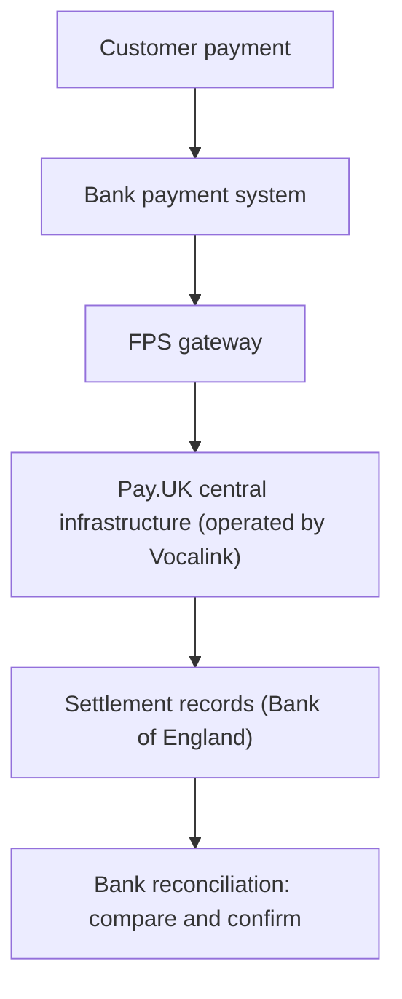

[FPS analyst deep-dive](../index.md) / [Reconciliation & Architecture](index.md) &middot; Lesson 22 of 40
{: .lesson-crumbs}

# 22. FPS Reconciliation Fundamentals

!!! abstract "Learning objective"
    Explain why reconciliation exists, what it checks for, and how FPS's settlement-cycle timing shapes the whole discipline.

## Core concepts

Reconciliation is the discipline of comparing two or more independent records of the same event to confirm they agree — in count, value, status, and reference detail. The underlying question is always the same: does what our systems say happened actually match what happened financially? Every reconciliation check is really testing three things at once: completeness (is every payment that should be recorded actually recorded, on both sides), accuracy (are the amounts, references, and statuses correct), and timeliness (did records appear within the expected window, so a genuine delay isn't mistaken for an error).

The reason this matters so much for FPS specifically comes down to one structural fact: FPS processing and FPS settlement are not the same event. A payment is made available to the beneficiary within seconds, 24/7/365 — but the underlying interbank obligation is settled in defined cycles (historically three times a day at the Bank of England, moving toward more frequent cycles under Pay.UK's New Payments Architecture programme), not instantly per payment. That creates a normal, expected gap between 'the customer sees the money' and 'the banks have squared up the obligation between themselves,' and reconciliation exists specifically to prove that gap always closes correctly. Banks run several reconciliations in parallel — transaction-level, volume, value, status, timing/cut-off, intraday vs end-of-day, suspense-account, and Nostro/settlement-account — because each catches a different class of error that the others would miss.

## Visual overview

## Key terms

**Reconciliation**
:   Comparing independent records of the same event to confirm they agree in count, value, status, and reference.

**Completeness / accuracy / timeliness**
:   The three things every reconciliation check tests for at once.

**Processing vs settlement**
:   Processing confirms the payment instruction moved through the systems; settlement confirms the interbank obligation actually balanced.

**Deferred net settlement**
:   FPS's model — payments complete instantly for the customer, but interbank obligations settle in periodic cycles, not per-payment.

**Suspense account**
:   A temporary general ledger holding area for unmatched items pending investigation; aged balances may require provisioning under IFRS 9.

## Worked example

!!! example
    A £500 payment shows COMPLETED in the bank's internal system. The settlement record for the same payment shows £500 too — the two independent records agree, so the payment is reconciled and the books can be closed on it. If the settlement record instead showed £0, that mismatch alone — regardless of how clean the customer-facing experience was — is a reconciliation break requiring investigation before the day's books can be considered accurate.

## Comparison

**Processing vs settlement**

|  | Processing | Settlement |
|---|---|---|
| Question answered | Did the payment instruction move successfully? | Did the financial obligation between banks balance? |
| Timing | Seconds, 24/7/365 | Periodic cycles (historically 3x/day), moving toward more frequent |
| Can be complete while the other isn't? | Yes — processing can finish while settlement is still outstanding | Yes — same relationship, other direction |

## Key points

- Reconciliation checks completeness, accuracy, and timeliness — all three, not just one.
- FPS's instant customer experience and its periodic settlement cycles are structurally different, which is exactly why reconciliation exists.
- Banks run multiple reconciliation types in parallel (transaction, volume, value, status, timing, intraday/EOD, suspense, Nostro/settlement) because each catches different errors.
- A payment being processing-complete does not guarantee settlement is complete — that gap is the whole point of settlement reconciliation (Lesson 24).

## Exam & interview tips

!!! tip
    - "Why is reconciliation important for FPS?" is a near-guaranteed question — anchor your answer on completeness, accuracy, and no missing/duplicated money, then connect it to regulatory expectations (FCA/PRA, Pay.UK scheme rules, and APP fraud reimbursement evidence requirements since October 2024).
    - Know that FPS's speed to the customer and its settlement timing are two different things — conflating them is a common mistake that this lesson exists specifically to correct.

!!! note "Memory trick"
    The customer seeing the money and the banks squaring up the money are two separate events. Reconciliation proves the second one always happens.

## Scenario questions

??? question "A junior analyst says 'the payment completed, so reconciliation is basically just a formality.' How do you correct this?"
    Explain that processing completion (the customer seeing the money) and settlement completion (the banks squaring up the underlying obligation) are separate events under deferred net settlement — a payment can be fully processed while settlement is still outstanding, which is exactly the gap reconciliation exists to prove closes correctly.

??? question "Finance asks why both a count check and a value check are run, when checking the total value alone would seem to cover it."
    A count check catches missing or duplicated transactions even when the total value happens to net out to the same figure by coincidence, while a value check catches amount errors even when the transaction count matches — running both closes a gap either check alone would miss.

??? question "Why might a bank need Nostro-style reconciliation logic even though FPS is a purely domestic UK rail?"
    The reconciliation logic itself (comparing two independent records of the same financial position) is identical whether it's a Nostro account or a domestic settlement/reserves account — so the same control discipline applies even where classic correspondent Nostro accounts aren't directly used, which sets up Lesson 24.

## Practice questions

??? question "1. What does reconciliation fundamentally check for?"
    ▫️ Only customer satisfaction
    ✅ Completeness, accuracy, and timeliness of independent records
    ▫️ Marketing performance
    ▫️ App store ratings

??? question "2. Why does FPS need reconciliation despite settling payments in seconds for the customer?"
    ▫️ It doesn't need reconciliation
    ✅ The customer-facing speed and the underlying interbank settlement cycle are different events with a normal timing gap between them
    ▫️ Reconciliation is only for CHAPS
    ▫️ FPS payments are never settled

??? question "3. What is deferred net settlement?"
    ▫️ Settling every payment individually and instantly
    ✅ Settling net interbank obligations in periodic cycles rather than per-payment
    ▫️ A type of fraud
    ▫️ A customer complaint process

??? question "4. A payment shows COMPLETED internally but has no matching settlement record. What does this indicate?"
    ▫️ Nothing — this is always expected
    ✅ A reconciliation break requiring investigation
    ▫️ The payment was fraudulent
    ▫️ The customer made an error

??? question "5. Why do banks run multiple types of reconciliation in parallel (transaction, volume, value, status, etc.)?"
    ▫️ Regulatory box-ticking with no real value
    ✅ Each type catches a different class of error the others would miss
    ▫️ It's required by the customer
    ▫️ To slow down processing deliberately

??? question "6. What happens to unmatched reconciliation items pending investigation?"
    ▫️ They are deleted
    ✅ They are held in a suspense account, with aged balances potentially requiring provisioning
    ▫️ They are automatically approved
    ▫️ They are sent to the customer

Previous
[&larr; 21. Fraud Investigation](../f4-investigations/21-fraud-investigation.md)

Next
[23. Reconciliation Breaks &rarr;](23-reconciliation-breaks.md)

