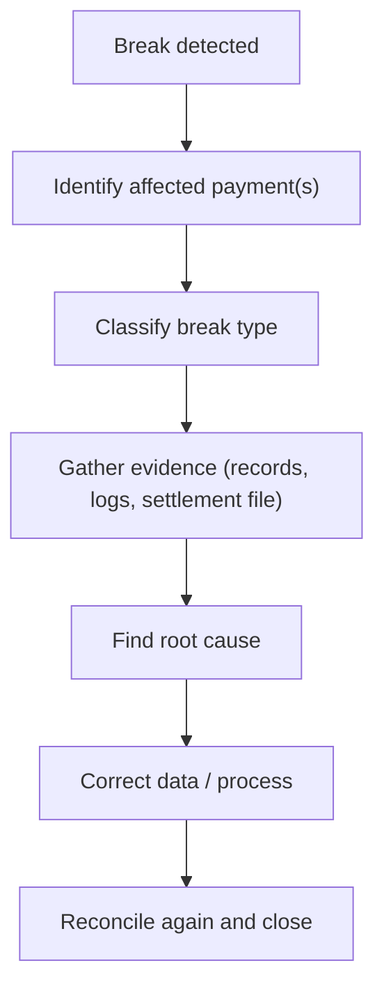

# 23. Reconciliation Breaks

!!! abstract "Learning objective"
    Classify the recurring types of FPS reconciliation break, and run a structured investigation from detection to closure.

## Core concepts

A reconciliation break is simply a case where two systems that should agree don't — and a genuinely wide range of underlying problems can all present the same way. The recurring categories worth knowing cold: missing transaction (a payment exists in one system but not the other, usually a failed or lost settlement message), amount mismatch (both systems have the payment, but the values differ, often a data transformation or rounding issue), duplicate transaction (the same payment appears more than once, usually a retry or file-duplication problem), status mismatch (systems disagree on the payment's current state), timing difference (both records are correct, they just arrived at different points relative to a settlement cut-off — not automatically a real error), settlement break (processing was fine but settlement balancing itself is wrong), reference/static data break (amount and status agree, but a field like sort code or account number differs — often traceable to a CoP override not correctly reflected downstream), fraud hold/APP reimbursement break (a temporary mismatch created by a recall or reimbursement under the mandatory October 2024 rules), and batch/cut-over break (traceable to a known release or maintenance window rather than a genuine defect).

The investigation workflow is consistent regardless of type: detect the break, identify the specific payment(s), classify which category it falls into, gather evidence (payment record, message logs, settlement file), find the root cause, correct the data or process, reconcile again, and only then close the break. The single most important judgement call in this whole lesson is distinguishing a timing difference from a genuine break — treating every mismatch as an error before checking the settlement calendar creates noise and, worse, trains analysts to become desensitised to alerts that are actually real.

## Visual overview

## Key terms

**Reconciliation break**
:   A discrepancy between two systems expected to hold matching information about the same payment.

**Missing transaction break**
:   A payment exists in one system but can't be found in another — commonly a failed settlement message or transmission problem.

**Reference/static data break**
:   Amount and status agree, but a field like sort code or account number differs between systems.

**Timing difference**
:   Records are both correct but appear at different points relative to a settlement window — not automatically a real break.

**Sequence/gap check**
:   Spotting a gap in sequential batch or message numbering as an early signal a whole batch went missing.

## Worked example

!!! example
    A morning reconciliation report flags 100 unmatched FPS payments. A sample payment shows COMPLETED internally with no settlement record at all — a missing transaction break. Pulling the pattern across all 100 shows they share the same time window and the same gateway route, which reframes the investigation from '100 separate problems' to 'one settlement interface stopped transmitting messages' — a single root cause, a single fix (restart the interface, replay the failed messages), and one batch of breaks closed together rather than one by one.

## Comparison

**Break types at a glance**

| Break type | Typical root cause |
|---|---|
| Missing transaction | Failed/lost settlement message, transmission problem |
| Amount mismatch | Data transformation, rounding, manual adjustment error |
| Duplicate transaction | Retry logic, file duplication |
| Status mismatch | Failed status update, message delay |
| Timing difference | Payment landed just before/after a settlement cut-off — often not a real error |
| Reference/static data | Manual keying error, CoP override not reflected downstream |

## Key points

- Every break category has a recognisable signature — learn to pattern-match amount mismatch vs missing record vs timing difference quickly.
- Not every mismatch is an error — timing differences relative to the settlement calendar are often expected, and must be checked before escalating.
- A batch of individually-reported breaks sharing a time window, gateway, or route usually points to one systemic root cause, not many unrelated ones.
- Reference/static data breaks (sort code, account number mismatches) often trace back to a CoP override not correctly propagated downstream.

## Exam & interview tips

!!! tip
    - When asked to investigate a break, always mention checking the settlement calendar/timing window before escalating — this single step is what separates a strong answer from a generic one.
    - Know the escalation-owner table cold: technology (system defect), integration (file/message transmission), operations (data error), finance/settlement (balancing), reference data (static data mismatch), financial crime (fraud hold).

!!! note "Memory trick"
    A break is a symptom, not a diagnosis. Classify it first — the category tells you who to call.

## Scenario questions

??? question "A break shows a payment completed at 23:58 with its settlement record appearing at 00:05. Is this a genuine break?"
    Not necessarily — check the settlement calendar first. A payment completed just before a cut-off can legitimately settle in the next cycle, so this needs to be checked against the timing window before being treated as an error rather than expected behaviour.

??? question "100 breaks appear overnight, all sharing the same gateway and time window. How does this change your approach versus 100 unrelated single-payment issues?"
    Treat it as one systemic root cause rather than 100 separate investigations — find what's common (same interface, same route) and fix that one thing, which resolves all 100 breaks together rather than working each individually.

??? question "A break involves a payment currently subject to a fraud recall request. Should it be logged as an unexplained reconciliation break?"
    No — first confirm whether an open fraud case or scheme recall request explains the mismatch before treating it as an unexplained break; conflating the two wastes investigation effort on something that already has a known cause.

## Practice questions

??? question "1. What defines a reconciliation break?"
    ▫️ Any payment over £1,000
    ✅ A discrepancy between two systems expected to hold matching information
    ▫️ A customer complaint
    ▫️ A fraud confirmation

??? question "2. What's the key judgement call this lesson emphasises above all others?"
    ▫️ Whether to fire the analyst responsible
    ✅ Distinguishing a timing difference from a genuine break before escalating
    ▫️ Always escalating every mismatch immediately
    ▫️ Ignoring small mismatches

??? question "3. A break shows correct amount and status, but a different account number between systems. What type is this?"
    ▫️ Duplicate transaction break
    ✅ Reference/static data break
    ▫️ Timing difference
    ▫️ Settlement break

??? question "4. What does a gap in sequential batch numbering suggest?"
    ▫️ Nothing significant
    ✅ A whole batch or file may have gone missing
    ▫️ The system is working correctly
    ▫️ A customer error

??? question "5. What often causes a reference/static data break specifically?"
    ▫️ Currency conversion
    ✅ A CoP override not correctly reflected in downstream systems, or a manual keying error
    ▫️ Interest rate changes
    ▫️ Marketing preferences

??? question "6. When should a break be escalated to a production incident rather than handled individually?"
    ▫️ Never
    ✅ When it affects a large volume, indicates a systemic failure, or breaches impact thresholds
    ▫️ Only if a customer complains directly
    ▫️ Only on Fridays

??? question "7. What creates a fraud hold/APP reimbursement break specifically?"
    ▫️ A currency mismatch
    ✅ A recall or reimbursement under the mandatory APP fraud rules creating a temporary mismatch
    ▫️ A customer changing their address
    ▫️ A system upgrade

