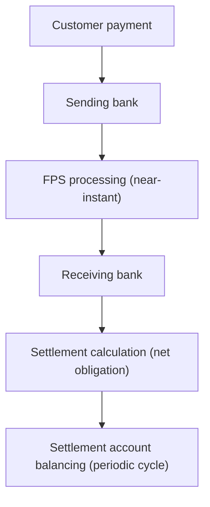

# 24. Nostro & Settlement Reconciliation

!!! abstract "Learning objective"
    Explain settlement accounts and the Nostro concept, and reconcile settlement positions including for indirect participants.

## Core concepts

Settlement is the process by which participating institutions actually complete the transfer of value between each other — distinct from payment processing, which only confirms the instruction moved through the systems. A settlement account records these financial movements between institutions; a Nostro account specifically is an account a bank holds with another financial institution to manage funds — literally 'our account with another bank.' Its counterpart, a Vostro account, is another bank's account held by us.

For UK domestic FPS specifically, direct participants (the large banks holding their own account at the Bank of England) settle through reserves/settlement accounts rather than classic correspondent Nostro accounts, so day-to-day FPS work may not involve managing a Nostro account directly. But the underlying reconciliation logic is identical, and Nostro accounts become directly relevant whenever FPS is the domestic last-mile leg of an international transfer — a correspondent bank funding a GBP account that then triggers a domestic FPS payment. Indirect (agency) participants — many challenger and digital banks — don't hold their own settlement account at all; they settle through a sponsor bank (e.g. ClearBank, Banking Circle), which makes their settlement reconciliation conceptually identical to Nostro reconciliation, since they're reconciling their position against an account held at another institution.

FPS uses deferred net settlement: individual payments land for the customer in seconds, but net obligations between participants settle periodically — historically three times a day, moving toward more frequent cycles under the Bank of England's RTGS renewal programme. This timing structure has real operational teeth: net sender caps limit how much exposure one participant can build up against others between cycles, indirect participants typically need to prefund or collateralise their position with their sponsor ahead of each cycle, and end-of-day settlement sign-off is usually performed independently by Treasury or Finance as a second control layer beyond payments operations.

## Visual overview

## Key terms

**Settlement account**
:   An account recording financial movements between institutions — money owed or received as part of payment processing.

**Nostro account**
:   An account a bank holds with another institution to manage funds — 'our account with another bank.'

**Vostro account**
:   Another bank's account held by us — the mirror image of a Nostro account.

**Net sender cap**
:   A scheme-imposed limit on the maximum net exposure one participant can build up against others between settlement cycles.

**Prefunding / collateral shortfall**
:   When an indirect participant's sponsor bank finds the prefunded or collateralised balance insufficient for a settlement cycle's net obligation.

## Worked example

!!! example
    During one day, Bank A sends £2 million in FPS payments and receives £1.5 million from Bank B. Rather than settling all 1,800 individual payments one by one, deferred net settlement nets this down to a single obligation: Bank A owes Bank B £500,000 for that cycle. Settlement reconciliation confirms that net figure — and only that net figure — actually moved correctly between the two institutions' settlement accounts at the Bank of England.

## Comparison

**Nostro vs Vostro**

| Term | Meaning |
|---|---|
| Nostro | Our account held by another bank |
| Vostro | Another bank's account held by us |

## Key points

- Settlement confirms the interbank financial obligation actually balanced — a separate question from whether the payment processed.
- Direct FPS participants settle via Bank of England reserve accounts; indirect participants settle via a sponsor bank, which is functionally Nostro-style reconciliation.
- Nostro accounts become directly relevant when FPS is the domestic leg of an international/correspondent transfer.
- Net sender caps and prefunding/collateral requirements are real operational controls tied to the settlement cycle timing, actively monitored by Treasury.

## Exam & interview tips

!!! tip
    - A strong answer to "what's the difference between processing and settlement" explicitly names deferred net settlement — that's the specific mechanism, not just the general concept.
    - Know that indirect participants' sponsor-bank reconciliation is conceptually identical to Nostro reconciliation — this is a favourite "do you actually understand the concept, not just the definition" interview probe.

!!! note "Memory trick"
    Nostro = 'our' account elsewhere. A payment being complete for the customer doesn't mean the banks have settled up yet.

## Scenario questions

??? question "A challenger bank operating as an indirect FPS participant asks why its settlement reconciliation process looks so similar to classic Nostro reconciliation, even though it's a UK-only digital bank."
    Its settlement account is held with its sponsor bank rather than directly at the Bank of England — reconciling a position held at another institution is exactly what Nostro reconciliation logic is designed for, so the same control discipline applies even without a traditional correspondent-banking Nostro account.

??? question "Finance reports the day's FPS settlement position is £100,000 out of balance. What's the correct first move?"
    Find the specific difference (expected vs actual settlement total), then search for the underlying payment records that explain that gap — rather than assuming a single cause, confirm whether it's one large missing batch or many small discrepancies before assigning root cause.

??? question "Why would Treasury independently sign off the end-of-day settlement position, separately from the payments reconciliation team?"
    It provides a second, independent control layer — if the same team that reconciles day-to-day payment breaks were also the sole sign-off for the overall settlement position, an error or gap in their own process could go unchecked.

## Practice questions

??? question "1. What does a Nostro account represent?"
    ▫️ A customer's savings account
    ✅ An account a bank holds with another institution to manage funds — 'our account with another bank'
    ▫️ A fraud alert queue
    ▫️ A type of reconciliation break

??? question "2. How do direct FPS participants typically settle, versus indirect participants?"
    ▫️ Both settle identically via Nostro accounts
    ✅ Direct participants use a Bank of England reserves/settlement account; indirect participants settle via a sponsor bank
    ▫️ Neither settles at all
    ▫️ Indirect participants settle directly with Pay.UK

??? question "3. What is a net sender cap?"
    ▫️ A customer transaction limit
    ✅ A scheme-imposed limit on maximum net exposure one participant can build up between settlement cycles
    ▫️ A fraud detection rule
    ▫️ An interest rate cap

??? question "4. When does a Nostro account become directly relevant to a purely domestic FPS payment?"
    ▫️ Never
    ✅ When the FPS payment is the domestic last-mile leg of an international/correspondent transfer
    ▫️ Only for CHAPS payments
    ▫️ Only for card payments

??? question "5. What is deferred net settlement?"
    ▫️ Settling each payment individually and instantly
    ✅ Netting obligations between participants and settling periodically rather than per-payment
    ▫️ A fraud prevention technique
    ▫️ A customer notification system

??? question "6. Why might an indirect participant experience a prefunding/collateral shortfall?"
    ▫️ A currency conversion error
    ✅ Its sponsor bank finds the prefunded/collateralised balance insufficient for the net settlement obligation of a cycle
    ▫️ A customer complaint
    ▫️ A CoP mismatch

