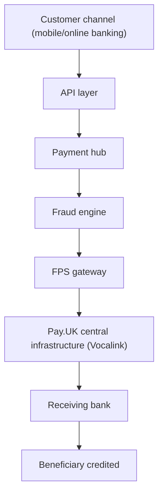

[FPS analyst deep-dive](../index.md) / [Reconciliation & Architecture](index.md) &middot; Lesson 25 of 40
{: .lesson-crumbs}

# 25. Typical Bank Architecture

!!! abstract "Learning objective"
    Read a high-level FPS bank architecture end to end, and know which component and which team owns each stage of the payment journey.

## Core concepts

An FPS analyst doesn't need to write the payment platform's code, but does need to know where a payment enters the bank, which systems process it in what order, where failures characteristically happen, and which team owns each component — because that knowledge is what turns 'my payment disappeared' into a specific, ownable investigation rather than a guess. The standard journey: customer channel (mobile app, online banking, branch, corporate portal) creates the payment instruction; the API layer authenticates, validates, and routes the request into backend systems; the payment hub — the central processing engine — validates, manages status through its lifecycle, routes to downstream systems, and handles exceptions; the fraud engine checks amount, behaviour, beneficiary risk, and velocity, returning approve, hold, or reject; the FPS gateway formats and sends the outbound scheme message and receives the response; Pay.UK's central infrastructure (operated on its behalf by Vocalink) routes between participants; and the receiving bank validates and credits the beneficiary.

In production, tier-1 UK banks implement this same logical architecture very differently depending on their technology history. Banks built through decades of mergers (Lloyds from Lloyds TSB/HBOS/TSB/MBNA, NatWest from RBS Group) tend to lean on integration middleware — Tibco, IBM MQ — to bridge previously separate legacy estates, while shifting new flows toward Kafka-based event streaming. Barclays and HSBC run centralised, largely ISO 20022-aligned payment hubs pairing MQ (guaranteed point-to-point delivery to core/mainframe systems) with Kafka (high-volume event distribution to fraud and monitoring). Challenger and digital banks (Monzo, Starling, Revolut) typically skip legacy mainframe estates entirely, accessing FPS as indirect participants through a sponsor bank or banking-as-a-service provider, built on cloud-native microservices, Kafka-style streaming, and cloud-hosted databases like PostgreSQL rather than MQ and Oracle. The lesson worth internalising: the logical architecture is the same everywhere; the concrete implementation reflects each bank's history.

## Visual overview

## Key terms

**Payment hub**
:   The central processing engine — validates, manages status through the lifecycle, routes to downstream systems, handles exceptions.

**API layer**
:   Connects customer channels to backend banking systems, handling authentication, validation, and routing.

**Fraud engine**
:   Assesses a payment against risk rules and behaviour before submission, returning approve, hold, or reject.

**FPS gateway**
:   The technical connection point between the bank's internal systems and Pay.UK's central FPS infrastructure.

**Last successful hand-off**
:   The architecture investigation anchor: find the last component that definitely processed the payment correctly — the failure usually sits just after it.

## Worked example

!!! example
    Customer requests are running normally, the API layer is healthy, but the payment hub's queue is climbing steadily while the FPS gateway itself is reporting healthy. That pattern alone — normal in, backing up at the hub, healthy further downstream — narrows the investigation to the payment hub specifically (in one real incident, a database performance issue slowing processing there) rather than wasting time checking the gateway or the API layer, which the dashboard has already ruled out.

## Comparison

**Component ownership**

| Component | Typical owner |
|---|---|
| Mobile app | Digital team |
| API layer | Application team |
| Payment hub | Payments technology |
| Fraud engine | Fraud technology / risk |
| FPS gateway | Payments infrastructure |
| Database | Database team |

## Key points

- The payment hub is the architecture's single source of truth for 'where is this payment right now' — most investigations start there.
- Every component has a typical owning team — knowing this turns a vague investigation into a specific escalation.
- Tier-1 banks share the same logical architecture but differ hugely in implementation, largely driven by merger history versus being built cloud-native from day one.
- The core investigation technique is finding the last successful hand-off between components — the failure is almost always just after that point.

## Exam & interview tips

!!! tip
    - "Explain a typical FPS architecture" is a standard interview question — walk it in order (channel → API → hub → fraud → gateway → scheme → receiving bank) and name at least one real technology (MQ, Kafka, a sponsor bank) to show it's not purely theoretical.
    - Know why merger-history banks (Lloyds, NatWest) lean on integration middleware while digital banks don't — it signals genuine understanding of *why* architecture differs, not just that it does.

!!! note "Memory trick"
    Same logical map everywhere: channel, API, hub, fraud, gateway, scheme, receiving bank. Only the technology under each box changes bank to bank.

## Scenario questions

??? question "A customer says 'my payment disappeared.' Walk through which components you'd check, in order."
    Start at the payment hub to check the last known status, then follow the chain in order — fraud engine decision, gateway logs and response, and finally the receiving bank's confirmation — stopping as soon as you find the last component that definitely processed it correctly, since that's where ownership of the next step sits.

??? question "Why might a tier-1 bank formed through several mergers (like Lloyds or NatWest) have a fundamentally messier architecture diagram in practice than the clean textbook version in this lesson?"
    Each merger brought in a separate legacy technology estate (e.g. Lloyds TSB, HBOS, TSB, MBNA) that needed to be bridged rather than replaced, which is exactly why integration middleware like Tibco or MQ plays such a large practical role — the logical architecture is the same, but the real implementation reflects decades of technology history layered together.

??? question "A new analyst asks why understanding architecture matters if they'll never write the payment platform code themselves."
    Almost every real investigation involves tracing a payment across multiple systems and teams — without knowing which component does what and who owns it, an analyst can't efficiently identify where a failure occurred, which team to escalate to, or what evidence to gather, regardless of whether they ever touch the underlying code.

## Practice questions

??? question "1. What is the payment hub's core role?"
    ▫️ Customer authentication only
    ✅ The central processing engine — validation, status management, routing, and exception handling
    ▫️ Marketing analytics
    ▫️ Currency conversion only

??? question "2. Why do merger-history banks like Lloyds and NatWest lean on integration middleware such as Tibco or MQ?"
    ▫️ It's required by regulation
    ✅ To bridge previously separate legacy technology estates inherited through mergers
    ▫️ It's faster than any alternative
    ▫️ Digital banks use the same approach

??? question "3. What does the fraud engine return as a decision?"
    ▫️ Only approve or reject, no middle option
    ✅ Approve, hold for manual review, or reject/block
    ▫️ A credit score
    ▫️ A currency exchange rate

??? question "4. A dashboard shows normal API traffic but a growing payment hub queue, with a healthy gateway. Where does the investigation focus?"
    ▫️ The mobile app
    ✅ The payment hub
    ▫️ The receiving bank
    ▫️ The customer's account settings

??? question "5. Why do many digital/challenger banks avoid IBM MQ and Oracle in favour of Kafka-style streaming and PostgreSQL?"
    ▫️ Those technologies don't exist
    ✅ They're built cloud-native from day one without a legacy mainframe estate to bridge
    ▫️ It's mandated by Pay.UK
    ▫️ FPS requires it

??? question "6. What is the core architecture investigation technique described in this lesson?"
    ▫️ Contacting the customer's employer
    ✅ Finding the last successful hand-off between components, since the failure usually sits just after it
    ▫️ Restarting every system simultaneously
    ▫️ Assuming fraud by default

??? question "7. Who typically owns the fraud engine component?"
    ▫️ Digital team
    ✅ Fraud technology / risk
    ▫️ Database team
    ▫️ The customer

Previous
[&larr; 24. Nostro & Settlement Reconciliation](24-nostro-and-settlement-reconciliation.md)

Next
[26. Middleware (MQ, Kafka, Tibco) &rarr;](../f6-systems-and-sql/26-middleware-mq-kafka-tibco.md)

