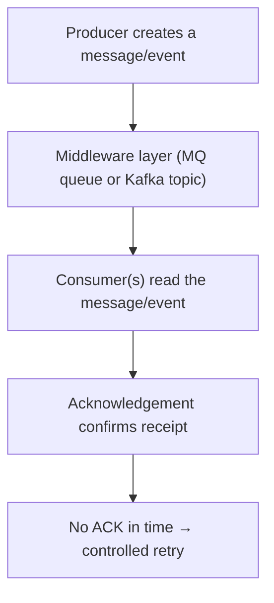

[FPS analyst deep-dive](../index.md) / [Systems & SQL](index.md) &middot; Lesson 26 of 40
{: .lesson-crumbs}

# 26. Middleware (MQ, Kafka, Tibco)

!!! abstract "Learning objective"
    Explain what middleware does, how MQ and Kafka differ, and how tier-1 UK banks combine them in practice.

## Core concepts

A large bank's payment estate is really many separately-built systems — mobile app, payment hub, fraud engine, FPS gateway, database, reporting platform — that were rarely designed by the same team at the same time. Middleware is the messaging layer that lets them talk to each other reliably without every system needing a bespoke, direct connection to every other system. Wiring everything directly together doesn't scale: too many connections, painful maintenance, and no consistent place to handle retries or failures. Middleware fixes this by sitting in between, providing queuing, guaranteed delivery, retry handling, and monitoring as shared infrastructure rather than something every team reinvents.

Two technologies dominate this space, and they solve different problems. MQ (message queuing, most commonly IBM MQ in UK banking) is the traditional model: a producer puts a message on a queue, a consumer takes it off, and once processed the message is gone — a point-to-point, transactional model well suited to guaranteed once-and-only-once delivery between two systems, which matters enormously when the message represents real money moving. Kafka is an event-streaming platform built around topics rather than queues: events are retained (not removed once read), and many independent consumers can read the same stream in parallel — ideal for broadcasting something like a 'PaymentCreated' event to fraud analytics, reconciliation, and reporting simultaneously, none of which should have to compete for the same message. Tibco plays a similar integration role to MQ but is especially common as the enterprise service bus bridging legacy platforms in banks formed through mergers, where systems that were never designed to talk to each other need a translation layer.

## Visual overview

## Key terms

**Middleware**
:   Software that connects separately-built applications so they can exchange information reliably without direct point-to-point wiring.

**Queue**
:   A holding area for messages waiting to be processed — absorbs traffic spikes and temporary consumer slowdowns.

**Acknowledgement (ACK)**
:   A response confirming a message was received — its absence is what triggers a retry, with a real risk of duplicate processing if the original actually succeeded.

**MQ**
:   Traditional point-to-point message queuing (e.g. IBM MQ) — a message is typically removed once consumed, well suited to guaranteed transactional delivery.

**Kafka**
:   Event-streaming platform organised around retained topics rather than queues, supporting many independent consumers reading the same stream.

## Worked example

!!! example
    A payment hub publishes a message onto an outbound MQ queue destined for the FPS gateway. If the gateway service is down, the message simply waits safely on the queue rather than being lost — but if the queue itself grows from a normal depth of a few hundred messages to tens of thousands, that's the signal something downstream has stopped consuming, and the investigation starts at the consumer, not the message itself. Compare this to a 'PaymentCompleted' event published to a Kafka topic: the fraud analytics platform, the reconciliation engine, and the MI reporting system can all independently read that same event without any of them removing it for the others — exactly the fan-out MQ's point-to-point model isn't built for.

## Comparison

**MQ vs Kafka**

|  | MQ | Kafka |
|---|---|---|
| Model | Point-to-point queue | Retained, multi-consumer topic |
| Message lifecycle | Removed once consumed | Retained for a configurable period, replayable |
| Best fit | Guaranteed transactional delivery between two systems | Broadcasting events to many independent downstream consumers |
| Typical UK banking use | Payment hub ↔ mainframe-adjacent core banking, FPS gateway | Fraud analytics, reconciliation, MI reporting consuming the same event stream |

## Key points

- Middleware exists so systems don't need bespoke, direct connections to every other system they talk to.
- A growing queue depth signals a consumer problem, not necessarily a message problem — investigate the consumer first.
- MQ suits guaranteed, transactional, point-to-point delivery; Kafka suits high-volume, multi-consumer event broadcasting.
- Tibco is especially common as the integration layer bridging legacy platforms in banks formed through multiple mergers.

## Exam & interview tips

!!! tip
    - Know one concrete reason Kafka suits reconciliation/incident work specifically: its replay capability lets an analyst rebuild the exact event sequence for a disputed payment, which traditional MQ can't do without separate audit logging.
    - If asked to name real technologies, mention IBM MQ, Kafka, and Tibco specifically — it signals you've looked past the textbook diagram.

!!! note "Memory trick"
    MQ: one message, one consumer, then it's gone. Kafka: one event, many consumers, still there to replay.

## Scenario questions

??? question "Operations reports FPS payments are delayed. The payment status shows SUBMITTED, and the outbound MQ queue has grown from 500 to 75,000 messages. What's the investigation focus?"
    The queue growth points to a consumer problem, not a message-creation problem — check whether the FPS gateway service (the consumer reading that queue) is down or has slowed, since that's what's preventing the queue from draining.

??? question "Why might a reconciliation analyst specifically prefer that a payment event stream runs on Kafka rather than traditional MQ?"
    Kafka retains events and supports replay, so the analyst can reconstruct the exact sequence of events for a disputed payment during investigation — MQ removes a message once consumed, so equivalent replay capability would need to be built separately via audit logging.

??? question "A junior analyst asks why the bank doesn't just connect every system directly to every other system instead of using middleware at all."
    Direct connections between every pair of systems doesn't scale — the number of connections grows rapidly, maintenance becomes difficult, and there's no consistent, shared place to handle retries, monitoring, and error handling, which middleware provides once rather than requiring every team to build it separately.

## Practice questions

??? question "1. What problem does middleware solve for a bank's payment systems?"
    ▫️ It replaces the need for a database
    ✅ It lets separately-built systems exchange information reliably without direct point-to-point connections
    ▫️ It performs fraud checks
    ▫️ It sets interest rates

??? question "2. What typically happens to an MQ message once it has been consumed?"
    ▫️ It is broadcast to all other consumers
    ✅ It is removed from the queue
    ▫️ It is duplicated automatically
    ▫️ It is converted to a Kafka event

??? question "3. Why is Kafka well suited to broadcasting a 'PaymentCompleted' event to fraud, reconciliation, and reporting systems at once?"
    ▫️ It isn't suited to this
    ✅ Multiple independent consumers can read the same retained event stream without competing for it
    ▫️ Kafka deletes events after one read
    ▫️ Kafka only supports one consumer per topic

??? question "4. What does a sharply growing queue depth typically indicate?"
    ▫️ Nothing worth investigating
    ✅ A consumer problem — the receiving application has slowed, stopped, or can't keep pace
    ▫️ A successful deployment
    ▫️ A fraud attack in progress

??? question "5. Why is Tibco especially common in banks like Lloyds and NatWest specifically?"
    ▫️ It's required by FPS scheme rules
    ✅ These banks were formed through multiple mergers and need to bridge legacy platforms never designed to talk to each other
    ▫️ It's the newest technology available
    ▫️ It replaces the need for a payment hub

??? question "6. What creates the risk of duplicate payment processing after a retry?"
    ▫️ Using Kafka instead of MQ
    ✅ The original message may have actually succeeded even though no acknowledgement was received in time
    ▫️ Database indexing
    ▫️ Fraud engine rules

Previous
[&larr; 25. Typical Bank Architecture](../f5-reconciliation-and-architecture/25-typical-bank-architecture.md)

Next
[27. Databases in FPS Systems &rarr;](27-databases-in-fps-systems.md)

