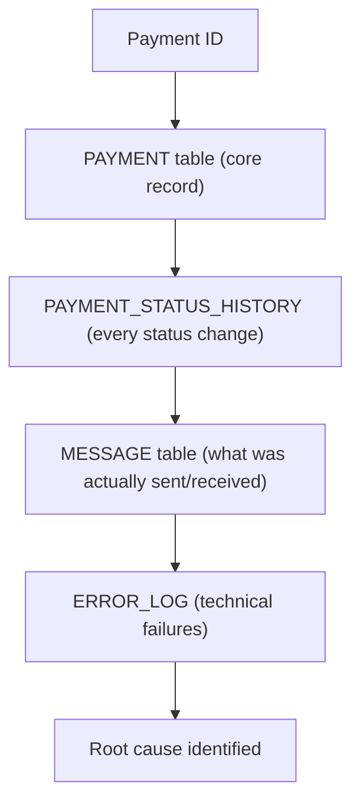

# 27. Databases in FPS Systems

!!! abstract "Learning objective"
    Explain how FPS payment data is stored across related tables, and know where to look for evidence during an investigation.

## Core concepts

A payment moves through many systems on its journey, and each stage creates or updates data somewhere — the database is what stores the evidence of what actually happened, which is why database literacy is a core investigation skill even for analysts who never write application code. A simplified payment data model has a handful of recurring tables worth knowing cold: a PAYMENT table holding the core record (ID, customer, amount, status, key timestamps); a PAYMENT_STATUS_HISTORY table recording every status change with its own timestamp, which is what actually lets an analyst see where a payment stopped rather than just where it currently sits; a MESSAGE table capturing the communications exchanged between systems, which often reveals the real story a generic status hides (a payment showing SUBMITTED while the message table shows the gateway response was actually a timeout); an ERROR_LOG table for technical failures; and a RECONCILIATION table recording match/break outcomes, which is exactly what the reconciliation processes from Block F5 read from and write exceptions back into.

A few core relational concepts matter for investigation work specifically: a primary key uniquely identifies each row (PAYMENT_ID, so no two payments collide), a foreign key links tables together (a payment's CUSTOMER_ID pointing back to a customer record), an index makes searching large tables fast rather than requiring a full scan of millions of rows, and a transaction guarantees a set of related changes either all happen or none do — so a payment record is never left half-updated if something fails partway through creating it.

In production, tier-1 UK banks typically run Oracle (often on Exadata hardware, with tools like GoldenGate for near-real-time replication) for the core, mission-critical payment ledger given its transactional integrity and clustering for high availability; Microsoft SQL Server for mid-tier applications like fraud case management and operations dashboards; and increasingly PostgreSQL for newer cloud-native workloads, both at digital banks built on it from day one and at established banks migrating selected workloads off legacy estates. At high volumes, payment tables are commonly partitioned by date so recent-activity queries stay fast, with older records archived out to a separate store while remaining accessible for the multi-year retention periods UK banks are typically required to meet.

## Visual overview

## Key terms

**PAYMENT_STATUS_HISTORY**
:   Records every status change with its timestamp — the actual evidence for where a payment got stuck, not just its current status.

**Primary key**
:   A column uniquely identifying each row in a table — no two rows share the same value.

**Foreign key**
:   A column linking one table to another, e.g. a payment's customer reference pointing to the customer table.

**Index**
:   A structure that makes searching large tables fast, avoiding a full scan across millions of rows.

**Transaction (database)**
:   A guarantee that a related set of changes either all commit or none do, so data is never left half-updated.

## Worked example

!!! example
    A customer says their payment was taken but the receiver never got it. The PAYMENT table shows status SUBMITTED. On its own, that's ambiguous — SUBMITTED could mean anything from 'about to complete' to 'stuck for hours.' Pulling PAYMENT_STATUS_HISTORY shows CREATED, VALIDATED, SUBMITTED and nothing after — confirming no completion event ever arrived. Checking the MESSAGE table for that payment then shows the actual gateway response was a timeout, not a pending response — which reframes the investigation from 'still processing' to 'stuck at the gateway, hand off to Payments Technology,' a conclusion the status field alone could never have supported.

## Comparison

**Database technology by role at tier-1 UK banks**

| Technology | Typical role |
|---|---|
| Oracle | Core, mission-critical payment ledger — strong transactional integrity, clustering for high availability |
| Microsoft SQL Server | Mid-tier applications — fraud case management, operations dashboards, reporting |
| PostgreSQL | Newer cloud-native workloads — digital banks' core ledgers, migrated legacy workloads |
| DB2 | Legacy mainframe-adjacent estates, progressively being displaced |

## Key points

- The database is the evidence store for every stage of a payment's journey — reading it well is a core investigation skill.
- PAYMENT_STATUS_HISTORY, not current status alone, is what actually locates where processing stopped.
- The MESSAGE table often reveals a more specific truth than the payment's own status field.
- Tier-1 banks typically split Oracle (core ledger), SQL Server (mid-tier/reporting), and increasingly PostgreSQL (cloud-native) across different roles rather than using one database for everything.

## Exam & interview tips

!!! tip
    - A strong answer to "why is status history important" always contrasts it with current status alone — current status tells you where a payment is now, history tells you where it stopped.
    - Know why payment tables get partitioned by date at scale: it keeps queries against recent activity fast even as historical volume grows into the billions of rows.

!!! note "Memory trick"
    Current status tells you where a payment is. Status history tells you where it stopped.

## Scenario questions

??? question "A payment shows status SUBMITTED and the customer insists it 'just vanished.' What's the correct sequence of tables to check?"
    Start with PAYMENT_STATUS_HISTORY to see exactly which stages completed and where progress stopped, then check the MESSAGE table for that payment to see what was actually sent and what response (if any) came back — the combination usually reveals a more specific finding than the status field alone.

??? question "Why would a fraud case management system likely run on SQL Server rather than the same Oracle cluster as the core payment ledger?"
    Fraud case management is a mid-tier application rather than the mission-critical transactional core — SQL Server is commonly used for this tier, keeping it separate from the core ledger's dedicated high-availability Oracle infrastructure.

??? question "A new analyst asks why old payment records aren't simply deleted once they're a year old."
    UK banks are typically required to retain payment records for several years for audit, investigation and regulatory purposes — instead of deleting them, older records are archived out of the 'hot' operational database into a separate store, keeping current queries fast while preserving access for anyone who needs the historical record.

## Practice questions

??? question "1. Why is PAYMENT_STATUS_HISTORY more useful than current status alone during an investigation?"
    ▫️ It isn't more useful
    ✅ It shows exactly where in the sequence a payment stopped progressing, not just its current state
    ▫️ It replaces the need for a payment ID
    ▫️ It only exists for failed payments

??? question "2. What does a primary key guarantee?"
    ▫️ Fast queries automatically
    ✅ That no two rows in a table share the same identifying value
    ▫️ That a payment will complete successfully
    ▫️ That the record is encrypted

??? question "3. Why might a payment's status field show SUBMITTED while the MESSAGE table reveals a more specific truth?"
    ▫️ This can never happen
    ✅ The status field is often generic, while the message table records the actual gateway/system response, such as a timeout
    ▫️ Message tables are always wrong
    ▫️ SUBMITTED always means success

??? question "4. What does a database transaction guarantee?"
    ▫️ Faster processing
    ✅ That a set of related changes either all commit or none do, avoiding a half-updated record
    ▫️ Automatic fraud detection
    ▫️ Lower storage costs

??? question "5. Why do tier-1 UK banks commonly use Oracle for the core payment ledger specifically?"
    ▫️ It's the cheapest option
    ✅ Strong transactional integrity (ACID compliance) and clustering for high availability suit mission-critical financial data
    ▫️ It's required by Pay.UK
    ▫️ It doesn't support SQL

??? question "6. Why are large payment tables often partitioned by date?"
    ▫️ To make data harder to find
    ✅ To keep queries against recent activity fast even as historical volume grows very large
    ▫️ It's a legal requirement with no technical benefit
    ▫️ To reduce the number of columns

