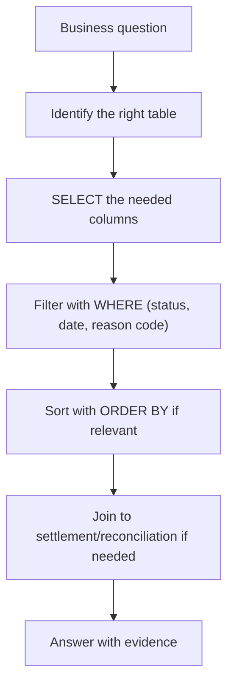

[FPS analyst deep-dive](../index.md) / [Systems & SQL](index.md) &middot; Lesson 28 of 40
{: .lesson-crumbs}

# 28. SQL Basics for Payment Analysts

!!! abstract "Learning objective"
    Write basic SQL to retrieve, filter, sort, and join payment data to answer real operational questions independently.

## Core concepts

SQL (Structured Query Language) is how an analyst talks to a database directly, and the value is speed and independence — instead of asking another team to check a payment, you can answer 'where is my payment?', 'how many payments failed today?', or 'did this actually settle?' yourself, with evidence. A basic query has a consistent shape: SELECT the columns you want, FROM the table, WHERE a condition narrows the result down to what matters. Selecting every column with SELECT * is fine for a quick look at a small result, but on a production table that might hold millions of rows, naming only the columns you actually need is both faster and kinder to shared infrastructure everyone else is also querying.

A handful of clauses cover most day-to-day investigation work: WHERE filters to specific rows (a status, a payment ID, an amount threshold), AND/OR combine multiple conditions (AND narrows — every condition must be true; OR widens — any one condition being true is enough), ORDER BY sorts results (newest first is the most common investigation pattern), DISTINCT lists the unique values that exist in a column (useful for spotting an unexpected status appearing in the data), and COUNT answers 'how many' questions directly rather than requiring you to count rows by eye. Filtering by date range and by failure/reason code specifically are two of the most common real investigation patterns — narrowing a huge table down to exactly the window an alert fired in, or exactly the reason code group under investigation, is usually the very first query run once an incident starts.

The query type that separates a confident analyst from a beginner is the join. A payment record on its own only reflects what the bank's own system believes happened — joining the payments table to a settlement table is what actually confirms whether a payment cleared through the scheme, and is exactly the query a reconciliation analyst runs each morning to catch a payment marked COMPLETED internally with no matching settlement record at all.

## Visual overview

## Key terms

**SELECT / FROM / WHERE**
:   The core shape of a SQL query — which columns, from which table, filtered to which rows.

**AND vs OR**
:   AND narrows results (every condition must be true); OR widens results (any one condition is enough).

**ORDER BY**
:   Sorts query results — ascending or descending — most commonly by timestamp during investigations.

**JOIN**
:   Combines rows from two tables based on a shared key — e.g. linking a payment to its settlement record to confirm it actually cleared.

**LEFT JOIN ... IS NULL**
:   A pattern for finding rows in one table with no matching row in another — the classic query for spotting a missing settlement record.

## Worked example

!!! example
    Operations asks 'how many payments failed with an account-related reason code yesterday?' Rather than waiting for another team, the analyst filters the payments table to status = FAILED, restricts the failure code to the account-related group (AC01, AC04, AC06), and restricts the date to yesterday — turning a vague question into an exact, evidence-backed count in one query, run independently, in under a minute.

## Comparison

**AND vs OR**

|  | AND | OR |
|---|---|---|
| Effect on results | Narrows — every condition must be true | Widens — any one condition being true is enough |
| Example use | Failed payments over £1,000 (status AND amount) | Failed or rejected payments (status OR status) |

## Key points

- A basic query's shape — SELECT, FROM, WHERE — covers the large majority of day-to-day investigation needs.
- AND narrows a result set; OR widens it — mixing these up is a very common beginner mistake worth actively avoiding.
- Filtering by date range and by reason code are the two most common real-world investigation query patterns.
- A join to the settlement table is what actually proves a payment cleared through the scheme — the payment table alone only reflects the bank's own belief.

## Exam & interview tips

!!! tip
    - Never say "just use SELECT *" as a good habit in an interview — explicitly naming why it's avoided on production tables (unnecessary data volume, slower queries) is what signals real experience.
    - Be ready to explain a LEFT JOIN ... WHERE settlement.id IS NULL pattern in plain English — it's the single most common reconciliation-break query and a favourite technical interview probe.

!!! note "Memory trick"
    SELECT what, FROM where, WHERE which ones. Join when one table alone can't prove the full story.

## Scenario questions

??? question "A colleague writes a query combining 'status = FAILED' and 'status = REJECTED' using AND instead of OR, and gets zero results. Why?"
    AND requires both conditions to be true for the same row, but a single payment can't simultaneously have two different status values — the query should use OR, since it's looking for rows matching either condition, which is what actually widens the result to include both statuses.

??? question "Finance asks whether every payment marked COMPLETED yesterday actually settled through the scheme. How would you answer this with SQL rather than by eye?"
    Join the payments table to the settlement table on the payment ID, filtered to yesterday's completed payments, and look for rows where no matching settlement record exists (a LEFT JOIN with a NULL check on the settlement side) — this surfaces exactly the population that completed internally but has no settlement confirmation, rather than requiring a manual comparison.

??? question "An incident alert fires at 14:03. What's the analyst's likely first query, and why?"
    Filter payments to the specific date and a tight time window around 14:00-14:15, since narrowing the population down to exactly when the alert fired is what turns a huge, generic table into a focused, investigable set of affected payments.

## Practice questions

??? question "1. What does WHERE do in a SQL query?"
    ▫️ Sorts the results
    ✅ Filters rows down to only the ones matching a condition
    ▫️ Joins two tables
    ▫️ Deletes data

??? question "2. Why is SELECT * generally avoided on large production tables?"
    ▫️ It's a syntax error
    ✅ It can return unnecessary volumes of data, slowing the query and using excess resources
    ▫️ It only works on small tables
    ▫️ It's not valid SQL

??? question "3. What's the difference between AND and OR in a WHERE clause?"
    ▫️ No difference
    ✅ AND requires every condition to be true (narrows results); OR requires just one to be true (widens results)
    ▫️ AND is faster than OR
    ▫️ OR only works with numbers

??? question "4. Why would an analyst join the payments table to a settlement table?"
    ▫️ To make the query slower deliberately
    ✅ To confirm whether a payment actually cleared through the scheme, not just what the bank's own system recorded
    ▫️ Joins are never used in payment investigations
    ▫️ To delete unmatched records

??? question "5. What does a LEFT JOIN with a check for a NULL settlement ID typically find?"
    ▫️ Duplicate payments
    ✅ Payments marked COMPLETED internally with no matching settlement record — a reconciliation break
    ▫️ The fastest-processing payments
    ▫️ Fraud cases only

??? question "6. Why is filtering by a specific date-and-time window a common first query during an incident?"
    ▫️ It's rarely useful
    ✅ It narrows a huge table down to exactly the population affected by the alert that fired
    ▫️ It always returns zero results
    ▫️ It replaces the need for a payment ID

Previous
[&larr; 27. Databases in FPS Systems](27-databases-in-fps-systems.md)

Next
[29. Failed Payment Analysis Using SQL &rarr;](29-failed-payment-analysis-using-sql.md)

