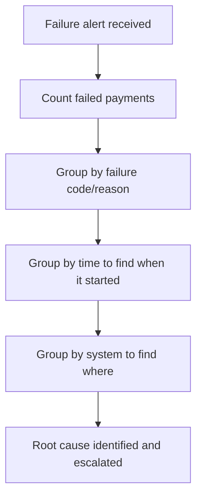

# 29. Failed Payment Analysis Using SQL

!!! abstract "Learning objective"
    Quantify a failure spike, find its pattern, and distinguish a one-off customer error from a systemic incident using SQL.

## Core concepts

When Operations reports 'FPS failures have increased,' a Payments Analyst needs to move from a vague statement to four concrete answers fast: how many payments failed, why, when did it start, and is it isolated or widespread. Failures cluster into recognisable categories worth knowing at a glance — customer data failures (invalid account or sort code), validation failures (amount or format issues), fraud failures (a risk rule triggered), technical failures (timeout, gateway unavailable, database error), and receiving-bank rejections (account closed or unable to receive). Each category implies a completely different response: a customer data failure needs no system fix at all, while a technical failure needs urgent escalation.

The investigation follows a consistent shape: count how many failed (quantify the problem), group by failure code or reason (find what's driving it), look at the trend over time (find when it started, which is usually the single most diagnostic signal — a sudden spike at one specific timestamp screams 'something changed right then,' most often a deployment or infrastructure event), and check whether it's concentrated in one system or spread broadly. A useful refinement once you're comfortable grouping by day is comparing today against a trailing average — flagging any day where failures run well above the recent baseline rather than relying on gut feel for what 'normal' looks like.

One pattern worth knowing specifically: not every failure is visible immediately. A payment can show COMPLETED internally and only reveal a problem later when a return message arrives overnight from the receiving bank — which means a 'failure investigation' sometimes has to join completed payments to a returns or exception table, not just filter on status = FAILED, because the real story hasn't been written into the payment's own status field yet.

## Visual overview

## Key terms

**Failure category**
:   The grouping of a failure's underlying cause — customer data, validation, fraud, technical, or receiving-bank rejection — each implying a different response.

**Failure trend**
:   Grouping failures by time to find exactly when a spike started — the single most diagnostic signal for isolating a root cause.

**Trailing average comparison**
:   Comparing today's failure count against a rolling recent average to flag a genuine anomaly rather than normal day-to-day variation.

**Delayed-visibility failure**
:   A payment that shows COMPLETED but only reveals a problem later via a return or exception — requires joining beyond the payment's own status field.

**Failure rate**
:   Failed payments divided by total payments, expressed as a percentage — the headline health metric for the payment service.

## Worked example

!!! example
    A dashboard shows failure counts of 5, then 8, then suddenly 500 in the next hour. That jump alone — not the raw count of 500 — is the signal. Grouping those failures by reason code shows nearly all of them share the same TIMEOUT code, and grouping by system shows they're concentrated at the FPS gateway. Three queries — count, group by code, group by system — turn 'failures have increased' into a specific, escalatable finding: a gateway connectivity issue starting at a precise timestamp, handed to Payments Technology rather than investigated payment by payment.

## Comparison

**Failure category vs typical response**

| Category | Typical response |
|---|---|
| Customer data (e.g. invalid account) | No system fix needed — inform the customer to correct details |
| Validation (amount/format) | Check whether validation rules or customer input process need review |
| Fraud | Route to the fraud team for review |
| Technical (timeout, gateway) | Urgent escalation to Payments Technology/Infrastructure |
| Receiving-bank rejection | Advise customer to obtain updated beneficiary details |

## Key points

- Failures cluster into recognisable categories — customer data, validation, fraud, technical, receiving-bank — each needing a different response.
- The time a spike started is usually the single most diagnostic clue, often pointing straight at a deployment or infrastructure event.
- Comparing today's failure count against a trailing average is more reliable than judging by feel whether a day is 'bad.'
- Not every failure is visible immediately — some only surface later via a return or exception, requiring a join beyond a simple status filter.

## Exam & interview tips

!!! tip
    - A strong interview answer to "how would you investigate a failure spike" leads with quantify → group by reason → group by time → group by system, in that order — the order itself demonstrates a structured approach.
    - Mention the delayed-visibility pattern (a COMPLETED payment later revealing a problem via a return) if asked for a 'tricky' failure scenario — it shows you know status = FAILED isn't always the complete picture.

!!! note "Memory trick"
    Count it, group it, time it, place it. Four queries turn a vague complaint into a specific root cause.

## Scenario questions

??? question "Operations says 'failures have increased' with no further detail. What are your first three queries?"
    First count total failures for the relevant period to quantify the scale, then group by failure code/reason to see what's driving it, then group by time to find exactly when it started — together these turn a vague report into a specific, evidence-backed finding.

??? question "A batch of payments shows COMPLETED, but overnight the receiving bank raises several return requests against them. Should these be investigated as 'failures'?"
    Yes — even though the status field says COMPLETED, joining these payments to the returns table reveals a real problem that only became visible once the return message arrived; the reconciliation team then needs to match returns against the originals and reverse or represent as appropriate.

??? question "Why would an analyst want to know whether a failure spike is concentrated in one failure code and one system, versus spread thinly across many codes and systems?"
    A spike concentrated in one code and one system points to a specific, fixable root cause (e.g. one gateway having an issue), while a broad, thin spread across many unrelated codes more likely reflects normal background noise or several unrelated small issues rather than one incident worth a major escalation.

## Practice questions

??? question "1. What is usually the most diagnostic single piece of information when investigating a failure spike?"
    ▫️ The customer's name
    ✅ Exactly when the spike started
    ▫️ The payment currency
    ▫️ The bank's marketing calendar

??? question "2. A failure spike is concentrated entirely in the TIMEOUT reason code at the FPS gateway. What does this suggest?"
    ▫️ A customer data problem
    ✅ A technical/infrastructure incident requiring urgent escalation
    ▫️ Normal daily variation
    ▫️ A fraud attack

??? question "3. Why might a payment showing COMPLETED still need investigating as a 'failure'?"
    ▫️ COMPLETED payments are never investigated
    ✅ It may later be returned by the receiving bank, revealing a problem the status field never captured
    ▫️ COMPLETED always means fully resolved with no exceptions
    ▫️ This scenario cannot occur

??? question "4. What does comparing today's failure count to a trailing average help avoid?"
    ▫️ Nothing useful
    ✅ Mistaking normal day-to-day variation for a genuine anomaly, or vice versa
    ▫️ The need for any SQL at all
    ▫️ Customer complaints

??? question "5. Why does a customer data failure (e.g. invalid account number) typically need no system fix?"
    ▫️ It always indicates a fraud attempt
    ✅ The cause is incorrect information provided by the customer, not a defect in the bank's systems
    ▫️ It's actually a technical failure in disguise
    ▫️ Customer data failures don't exist in FPS

??? question "6. What's the correct order of investigation steps for a reported failure increase?"
    ▫️ Escalate immediately with no analysis
    ✅ Count failures, group by reason, group by time, group by system
    ▫️ Ignore it until a customer complains
    ▫️ Only check fraud rules first

