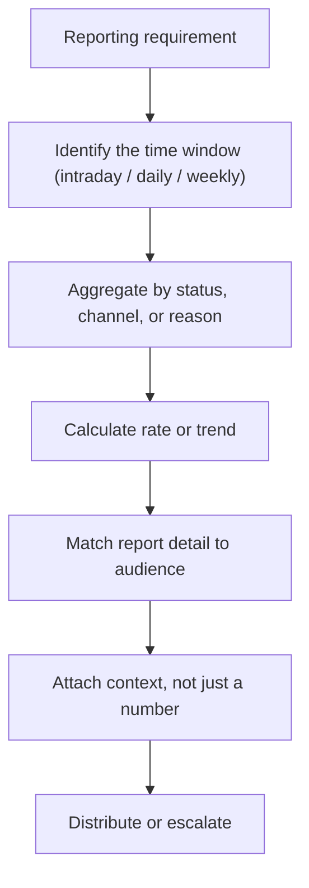

# 30. Operational Reporting

!!! abstract "Learning objective"
    Build the standard set of FPS operational reports, and match each report's content and cadence to the audience it actually serves.

## Core concepts

Operational reporting is what turns raw payment data into something a specific audience can act on — and a Payments Analyst is very often the person building or validating these reports before they're circulated, so understanding how each figure is derived matters as much as being able to read the final number. The standard report set covers a handful of recurring needs: a daily volume report (yesterday's totals by status and channel, confirming normal processing before the day starts), a weekly volume report (the same view rolled up to spot trends a single day can't show), a success/failure rate report (the percentage completing successfully, tracked against a threshold), and an exception queue report (what's currently stuck or held right now, needing same-day action).

Getting the cadence and audience right matters as much as the numbers themselves. A daily volume report suits the operations team each morning; a success/failure rate report needs to reach the operations manager and duty manager, since they own the service against an SLA and need to know immediately if it drops below target; an exception queue report is intraday — often hourly — because exceptions carry time-based SLAs, and a once-a-day report would mean breaches are only discovered long after they mattered; and a weekly volume report suits senior management, who care about trend and capacity rather than any single day's figure. Sending the wrong level of detail to the wrong audience is a common reporting mistake — a duty manager doesn't need a full row-by-row breakdown, and senior management doesn't need hourly exception counts.

The habit that separates a strong operational report from a weak one is always attaching context to a number rather than reporting it bare. A raw count of 1,650 overnight failures means very little on its own; paired with 'against a normal baseline of around 900, driven mainly by a spike in TIMEOUT failures starting at 02:00' it becomes something the reader can actually act on. A good report always answers not just 'what happened' but 'is this normal, is it a trend, and does anyone need to do something about it.'

## Visual overview

## Key terms

**Daily volume report**
:   Yesterday's payment totals by status and channel — confirms normal processing before the day starts.

**Success/failure rate report**
:   The percentage of payments completing successfully, tracked over time against an SLA threshold.

**Exception queue report**
:   A live, intraday list of currently stuck or held payments — refreshed frequently because exceptions carry time-based SLAs.

**Reporting cadence**
:   How often a report runs — matched to how quickly its audience needs to act on it (intraday, daily, weekly, monthly).

**Trailing context**
:   Pairing a raw figure with comparison/explanation (a baseline, a cause) so the reader can judge whether it's normal or requires action.

## Worked example

!!! example
    The night shift hands over to the day team with a bare figure: '1,650 failures overnight.' On its own, that number tells the day team nothing about whether to worry. Paired with the failure-analysis technique from the previous lesson — 'against a normal baseline of around 900, with the excess almost entirely TIMEOUT failures starting at 02:00' — the same number becomes an actual handover: the day team knows immediately what happened, roughly when, and which team likely needs to be looped in, rather than starting their own investigation from zero.

## Comparison

**Report cadence and audience**

| Report | Frequency | Primary audience |
|---|---|---|
| Exception queue report | Intraday (hourly) | Payments analysts, operations team |
| Daily volume report | Daily | Operations team, shift lead |
| Success/failure rate report | Daily/intraday | Operations manager, duty manager |
| Weekly volume report | Weekly | Team lead, senior management |

## Key points

- Different reports serve different audiences at different cadences — matching both correctly is as important as the underlying query.
- Exception queue reports need to run intraday specifically because exceptions carry time-based SLAs that a once-daily report would catch too late.
- A report that states only a raw figure is incomplete — always answer whether it's normal, whether it's a trend, and whether action is needed.
- Volume, success/failure rate, and open exceptions are commonly combined into one daily dashboard summary for a fast morning read.

## Exam & interview tips

!!! tip
    - A strong answer to "how would you build a daily report and who would you send it to" explicitly matches each section's detail level to its audience, not just describes the SQL — that judgement is what's actually being tested.
    - Always mention pairing a number with context (a baseline or a cause) — reporting a bare figure is a common, easily-avoided mistake worth naming proactively.

!!! note "Memory trick"
    A number alone is data. A number with a baseline and a cause is a report.

## Scenario questions

??? question "The weekly volume report shows a 15% jump versus the prior week, well above the usual 1-2% growth. What's the right next step before reporting this upward as good news?"
    Break the figure down by channel and hour of day to establish whether it reflects genuine business growth (e.g. a new merchant integration going live) or a data artefact such as duplicate records from a replay, before passing the finding to the team lead — reporting an unexplained anomaly as straightforward growth risks a wrong conclusion.

??? question "An hourly exception queue report shows 40 payments held for over an hour against a 30-minute SLA. What should the analyst do, beyond simply noting the breach?"
    Escalate the specific affected payment IDs to the team responsible for manual review, then re-run the exception query roughly 30 minutes later to confirm the queue is actually clearing rather than continuing to grow — a single report without a follow-up check doesn't confirm resolution.

??? question "Why would sending the full row-by-row daily volume breakdown to senior management, instead of the weekly rolled-up trend view, be a reporting mistake?"
    Senior management's decisions are typically about trend, resourcing and capacity rather than any single day's detail — a row-by-row daily breakdown is the wrong level of granularity for that audience and buries the signal they actually need under detail meant for the operations team.

## Practice questions

??? question "1. Why does an exception queue report need to run intraday rather than once a day?"
    ▫️ It doesn't need to run intraday
    ✅ Exceptions carry time-based SLAs, so a once-daily report would discover breaches far too late to act on
    ▫️ Exception data doesn't change during the day
    ▫️ Intraday reports are easier to build

??? question "2. Who is the primary audience for a success/failure rate report, and why?"
    ▫️ Marketing, for customer campaigns
    ✅ The operations manager and duty manager, who own the service against an SLA and need immediate awareness of threshold breaches
    ▫️ External auditors only
    ▫️ No one — it's purely archival

??? question "3. What's the key habit that separates a strong operational report from a weak one?"
    ▫️ Including as many numbers as possible
    ✅ Pairing every figure with context — a baseline or explanation — rather than reporting a bare number
    ▫️ Sending every report to every audience
    ▫️ Avoiding any comparison to previous periods

??? question "4. Why does a weekly volume report suit senior management better than a daily report?"
    ▫️ Senior management never look at payment data
    ✅ Senior management typically care about trend and capacity, which a single day's figures can't show
    ▫️ Weekly reports are simply shorter
    ▫️ Daily reports are technically impossible to produce

??? question "5. What does a combined daily dashboard query typically bring together?"
    ▫️ Only customer complaints
    ✅ Volume, success/failure rate, and open exceptions in one summary row
    ▫️ Marketing metrics only
    ▫️ Employee attendance data

??? question "6. Why is a raw figure like '1,650 failures overnight' incomplete on its own?"
    ▫️ It's actually complete information
    ✅ Without a baseline or cause attached, the reader can't judge whether it's normal or requires action
    ▫️ Raw figures should never be reported
    ▫️ It should always be rounded to the nearest thousand

