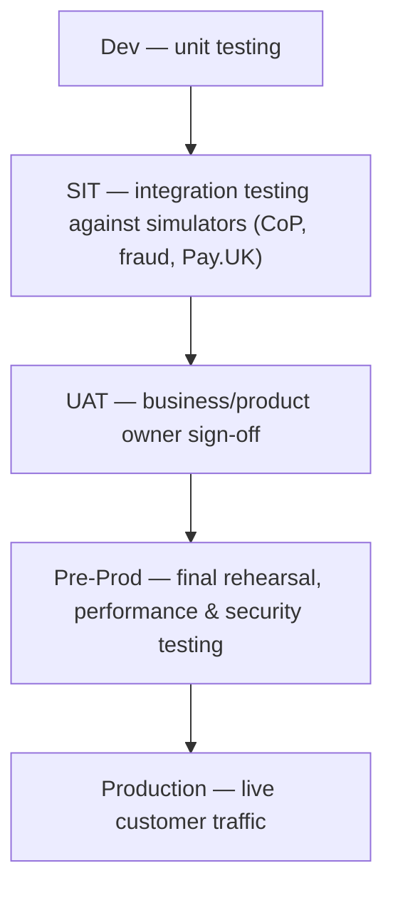

[FPS analyst deep-dive](../index.md) / [Testing FPS](index.md) &middot; Lesson 31 of 40
{: .lesson-crumbs}

# 31. Test Strategy for FPS

!!! abstract "Learning objective"
    Explain what a test strategy defines, distinguish the test levels, and describe the standard banking environment chain and its entry/exit criteria.

## Core concepts

A test strategy is the document that decides how a system will be tested before a single test case is written — what's in scope, which test levels will run, which environments each runs in, how test data is sourced and refreshed, and what has to be true before moving from one stage to the next. For FPS specifically, this can't be informal: a defect in production can mean money sent to the wrong beneficiary, an irreversible loss, a breach of CoP or fraud obligations, and real regulatory scrutiny from the PSR, FCA, or Pay.UK. A documented strategy is what makes testing repeatable across releases rather than reinvented each time, and gives auditors and new team members alike a shared answer to 'what does tested and safe actually mean here.'

The test levels build on each other rather than duplicating effort. Functional testing checks one feature against its own requirement in isolation (does the amount field reject non-numeric input). Integration testing checks that two connected systems exchange data correctly (does the payment hub correctly interpret the CoP adapter's response) — this typically runs in the System Integration Test (SIT) environment, where simulators for Pay.UK, CoP, and fraud services are available. End-to-end testing proves the whole journey works together, from customer initiation through to beneficiary credit, which is where the happy path, negative, CoP, and fraud scenarios covered later in this block ultimately get executed as one connected flow rather than separate exercises.

Banking test programmes run a consistent chain of environments, each closer to production than the last: Dev (developers build and unit test), SIT (integration against internal systems and external simulators), UAT (business and product owners confirm the system meets requirements using curated scenarios), Pre-Prod (a final rehearsal including performance and security testing), and Production (live traffic). A well-run strategy states explicit entry and exit criteria for each stage — for example, SIT can't be exited with any open Critical or High defects — so 'ready to move on' is a documented fact, not a judgement call made under release pressure.

## Visual overview

## Key terms

**Test strategy**
:   The high-level document defining how a system will be tested — scope, levels, environments, data, and entry/exit criteria — before test cases are written.

**Functional vs integration testing**
:   Functional: one feature against its own requirement, in isolation. Integration: two or more connected systems exchanging data correctly together.

**End-to-end testing**
:   Validates the complete payment journey from customer initiation to beneficiary credit, proving the whole chain works, not just each link.

**Entry/exit criteria**
:   The documented conditions required to start a test stage, and the conditions required to consider it complete before moving to the next.

**Test data masking**
:   Using synthetic or anonymised data in non-production environments so no real customer data is exposed, while still passing structural checks like sort code modulus validation.

## Worked example

!!! example
    A test strategy for a new FPS feature states that SIT cannot be exited with any open Critical or High severity defect. Mid-testing, a Critical defect is found where a CoP timeout silently duplicates a payment. Because the exit criterion is written down and agreed in advance, there's no debate about whether the release can proceed to UAT — it simply can't, until that specific defect is fixed and retested, which is exactly the discipline a documented strategy is meant to enforce under time pressure.

## Comparison

**Test levels and what they prove**

| Level | Question answered | Typical environment |
|---|---|---|
| Functional | Does this feature meet its requirement? | Dev / SIT |
| Integration | Do connected systems exchange data correctly? | SIT |
| End-to-end | Does a full payment journey complete correctly across all systems? | SIT / UAT |
| UAT | Does the system meet business and customer needs? | UAT |
| Regression | Have existing features been broken by a new change? | SIT / UAT / Pre-Prod |

## Key points

- A test strategy is decided before test cases are written — it's the plan for how testing will happen, not the tests themselves.
- Functional testing proves a part works; integration testing proves the parts work together; end-to-end proves the whole journey works.
- The standard banking environment chain (Dev → SIT → UAT → Pre-Prod → Production) increases in production-similarity at each stage.
- Explicit entry/exit criteria remove ambiguity about whether a release is ready to progress, especially under time pressure.

## Exam & interview tips

!!! tip
    - A reliable interview answer to "how would you build a test strategy" walks scope → test levels → environments → test data → entry/exit criteria → regression, in that order — the structure itself is the signal you know what you're doing.
    - Know at least two payment-specific test data considerations (sort code/account modulus validity, no real customer data in non-prod) — generic "we use test data" answers sound thin for a payments role specifically.

!!! note "Memory trick"
    A test strategy answers one question up front: how will we prove, repeatably, that this is safe to release?

## Scenario questions

??? question "A new FPS feature is ready to move from SIT to UAT, but one High-severity defect remains open. What should happen, and why?"
    If the documented exit criteria state no open Critical/High defects at SIT exit, the release should not progress to UAT until that defect is resolved and retested — the point of writing entry/exit criteria in advance is precisely to prevent this kind of judgement call being made under release pressure.

??? question "Why can't a bank simply use real customer account data copied into the SIT environment to make testing more realistic?"
    Real customer data in non-production environments breaches data protection obligations — test data must be masked, anonymised, or synthetically generated, while still needing to pass structural validation (like sort code modulus checks) so it exercises the system realistically without exposing genuine customer information.

??? question "A junior tester asks why end-to-end testing is needed if functional and integration testing have already passed for every individual component."
    Functional and integration testing prove each part, and each connection between two parts, works correctly — but only running the complete journey (customer initiation through to beneficiary credit) proves the whole chain actually works together as a real payment would experience it, which individual component testing can't guarantee on its own.

## Practice questions

??? question "1. What does a test strategy define?"
    ▫️ Individual test case steps only
    ✅ How a system will be tested overall — scope, levels, environments, data, and entry/exit criteria
    ▫️ The final release date
    ▫️ Marketing messaging for a new feature

??? question "2. What's the key difference between functional and integration testing?"
    ▫️ No real difference
    ✅ Functional tests one feature in isolation; integration tests whether connected systems exchange data correctly together
    ▫️ Integration testing only happens in production
    ▫️ Functional testing is only for fraud rules

??? question "3. What does end-to-end testing specifically prove that testing each system alone cannot?"
    ▫️ Nothing additional
    ✅ That the complete payment journey works across every connected system, not just each link individually
    ▫️ The exact cost of the payment platform
    ▫️ Customer satisfaction scores

??? question "4. What is SIT primarily used for?"
    ▫️ Live customer traffic
    ✅ Integration testing against internal systems and external simulators like CoP, fraud, and Pay.UK
    ▫️ Marketing approval
    ▫️ Final production sign-off

??? question "5. Why must test data pass sort code/account number modulus checking?"
    ▫️ It's not actually required
    ✅ Otherwise tests fail for the wrong reason rather than proving real system behaviour
    ▫️ Modulus checking only applies in production
    ▫️ It's a fraud detection technique, unrelated to test data

??? question "6. What is the purpose of documented entry/exit criteria between test stages?"
    ▫️ To slow down releases unnecessarily
    ✅ To make 'ready to progress to the next stage' a documented fact rather than a judgement call under pressure
    ▫️ They are optional and rarely used
    ▫️ To replace the need for regression testing

Previous
[&larr; 30. Operational Reporting](../f6-systems-and-sql/30-operational-reporting.md)

Next
[32. Happy Path Testing &rarr;](32-happy-path-testing.md)

