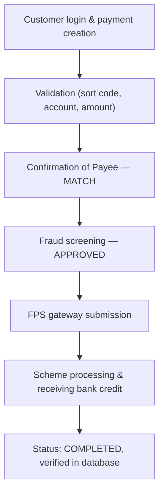

[FPS analyst deep-dive](../index.md) / [Testing FPS](index.md) &middot; Lesson 32 of 40
{: .lesson-crumbs}

# 32. Happy Path Testing

!!! abstract "Learning objective"
    Design a successful FPS payment test scenario across the full status journey, and collect evidence proving each system touchpoint worked.

## Core concepts

Happy path testing validates the normal case: valid customer details, no validation errors, fraud checks passing, all systems available, and the payment completing successfully. The question it answers is simple but foundational — can a valid FPS payment actually travel successfully through the entire ecosystem? A well-designed happy path test walks through every stage explicitly: customer login and payment creation, validation of sort code/account/amount, a CoP check returning MATCH, fraud screening returning approved, submission to the FPS gateway, scheme processing, receiving-bank crediting, and finally a COMPLETED status — expecting the status to move CREATED → VALIDATED → APPROVED → SUBMITTED → ACCEPTED → COMPLETED in that specific order.

What separates a strong tester from a weak one here is not accepting the confirmation screen at face value. A payment can look successful on screen while backend evidence tells a different story — the payment table, the status history, and the message log all need checking independently, because a customer-facing 'success' message proves the UI worked, not that every backend system agrees. A genuinely thorough happy path pack goes well beyond one fixed £500 example too: it covers a first payment to a brand-new beneficiary (proving CoP and beneficiary creation together), a repeat payment to a saved beneficiary, an Open Banking/PISP-initiated payment, boundary amounts (a minimum like £0.01 and a realistic high amount), payments either side of midnight (proving date-stamping and daily limits reset correctly for a 24/7 scheme), a full-length reference with special characters, and a future-dated standing-order-style payment. Even successful-looking payments can hide real defects — an incorrect final status shown in the database despite the payment completing, a reference silently dropped, a duplicate transaction, or the wrong amount credited — which is exactly why backend validation matters as much as the happy screen.

## Visual overview

## Key terms

**Happy path test**
:   Validates the normal, expected scenario — valid data, all checks pass, payment completes successfully end to end.

**Expected status journey**
:   The specific, predictable sequence a successful payment should follow: created, validated, approved, submitted, accepted, completed.

**Backend evidence**
:   Payment record, status history, and message logs — proof the payment succeeded at every system, not just on the confirmation screen.

**Boundary happy path scenario**
:   Testing the successful case at the edges of realistic variation — minimum amount, midnight cut-off, maximum reference length — not only a mid-range example.

**Silent happy-path defect**
:   A bug that hides behind an apparently successful payment, e.g. a correct customer-facing message but an incorrect backend status.

## Worked example

!!! example
    A test payment of £500 shows a clean confirmation screen: 'Payment sent successfully.' Querying the backend payment status history separately shows CREATED, VALIDATED, SUBMITTED — with no COMPLETED event ever recorded, despite the receiving bank having actually credited the beneficiary. The customer-facing journey was flawless; the backend status update silently failed. Without checking backend evidence independently of the screen, this defect — one that would leave operations unable to confirm the payment ever completed — would have gone completely unnoticed.

## Comparison

**Evidence types to collect**

| Evidence type | What it proves |
|---|---|
| Frontend (confirmation screen, reference) | The customer-facing journey behaved correctly |
| Backend (payment record, status history) | The system actually recorded the payment correctly, independent of the screen |
| Integration (gateway response, receiving-bank confirmation) | Every connected system agreed the payment succeeded |

## Key points

- The expected status journey (created → validated → approved → submitted → accepted → completed) is itself a test oracle — a skipped or reverted status is a defect signal.
- Backend evidence (payment record, status history, message log) must be checked independently of the customer-facing confirmation.
- A thorough happy path pack covers realistic variation — new vs existing beneficiary, boundary amounts, midnight cut-offs, future-dated payments — not one fixed example.
- Even an apparently successful payment can hide real defects: wrong final status, dropped reference, duplicate transaction, or incorrect credited amount.

## Exam & interview tips

!!! tip
    - A strong answer to "how would you test a successful payment" explicitly separates frontend evidence from backend evidence — mentioning only the confirmation screen signals a shallow understanding.
    - Have at least two boundary happy-path scenarios ready to name beyond the standard example (e.g. minimum amount, midnight cut-off, future-dated payment) — it shows the pack goes beyond one fixed test case.

!!! note "Memory trick"
    A confirmation screen proves the UI worked. Backend evidence proves the payment worked.

## Scenario questions

??? question "A payment shows 'Payment sent successfully' on screen, but the customer later calls to ask if it actually went through. What should the tester have checked before signing this test off as passed?"
    The backend payment record, status history, and message logs independently of the confirmation screen — a customer-facing success message only proves the UI displayed correctly, not that every backend system agrees the payment actually completed.

??? question "Why would a happy path pack specifically include a payment at £0.01 and a payment at a high-but-legitimate amount, rather than only a mid-range £500 example?"
    Testing only a mid-range amount doesn't prove the happy path holds across the realistic range a real customer might use — boundary amounts confirm the successful journey works correctly at the edges too, not just in the comfortable middle.

??? question "A regression run after a fraud engine update needs to prove normal payments still work. Which single test would you prioritise re-running, and why?"
    A standard happy path test to an existing beneficiary — it's the fastest, highest-confidence check that the core successful journey (including fraud approval) hasn't been broken by the change, before investing time in broader scenario coverage.

## Practice questions

??? question "1. What does happy path testing validate?"
    ▫️ Only failure scenarios
    ✅ The normal case where valid data and all checks lead to a successfully completed payment
    ▫️ Fraud engine rule tuning only
    ▫️ Database backup procedures

??? question "2. Why must backend evidence be checked separately from the confirmation screen?"
    ▫️ It's unnecessary — the screen is always accurate
    ✅ A payment can appear successful on screen while backend systems record a different, incorrect status
    ▫️ Backend evidence is only relevant for failed payments
    ▫️ The screen and backend always match exactly

??? question "3. What is the expected status journey for a successful FPS payment?"
    ▫️ COMPLETED then CREATED
    ✅ CREATED → VALIDATED → APPROVED → SUBMITTED → ACCEPTED → COMPLETED
    ▫️ Only SUBMITTED and COMPLETED
    ▫️ There is no defined sequence

??? question "4. Why should a happy path pack include a payment submitted just before and just after midnight?"
    ▫️ It has no testing value
    ✅ It proves date-stamping, value-dating, and daily limit resets behave correctly for a 24/7 scheme
    ▫️ Midnight payments are technically impossible
    ▫️ Only fraud rules care about time of day

??? question "5. Which of these is a defect that could occur even in an apparently successful payment?"
    ▫️ The payment being rejected outright
    ✅ A correct confirmation screen but an incorrect final status recorded in the database
    ▫️ The customer logging out
    ▫️ A CoP No Match warning

??? question "6. Why test a repeat payment to an existing saved beneficiary, not just a brand-new one?"
    ▫️ It's not worth testing separately
    ✅ It proves the saved-payee/'pay again' journey works without requiring full beneficiary re-entry
    ▫️ Saved beneficiaries never need CoP checks
    ▫️ It only matters for business accounts

Previous
[&larr; 31. Test Strategy for FPS](31-test-strategy-for-fps.md)

Next
[33. Negative Testing in FPS &rarr;](33-negative-testing-in-fps.md)

