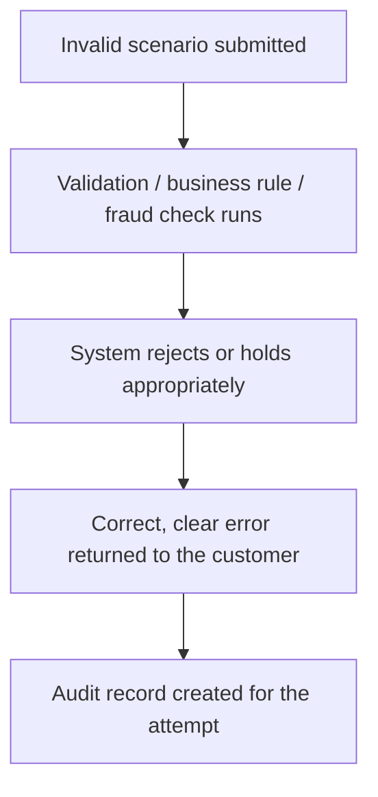

[FPS analyst deep-dive](../index.md) / [Testing FPS](index.md) &middot; Lesson 33 of 40
{: .lesson-crumbs}

# 33. Negative Testing in FPS

!!! abstract "Learning objective"
    Design failure scenarios across customer input, business rules, fraud controls, and technical faults, and verify each fails safely with correct evidence.

## Core concepts

Negative testing verifies a system behaves correctly when something goes wrong — the question is whether the payment system rejects, holds, or errors safely, with a clear message and an accurate audit trail, rather than failing randomly or silently. Failures in FPS cluster into four recognisable groups: customer input issues (invalid sort code or account number, missing reference, invalid amount), business rule failures (payment exceeds limit, insufficient funds, restricted beneficiary), fraud controls (suspicious activity, velocity breach, high-risk transaction), and technical failures (gateway unavailable, timeout, database failure, message rejected). Each group needs proving separately, because each represents a different kind of risk and a different correct response — an invalid sort code should be rejected immediately and clearly, while a fraud-triggered payment should be held for review rather than either silently approved or bluntly rejected without explanation.

Beyond the obvious cases, a genuinely thorough negative pack covers the scenarios most likely to be missed: negative or zero amounts, amounts with excess decimal precision, unsupported special characters in the reference field, a session expiring mid-payment, a sort code technically valid in format but belonging to a branch no longer participating in FPS, a non-GBP currency code (since FPS is GBP-only), a race condition where two near-simultaneous payments would individually be affordable but not together, and a malformed API payload missing a mandatory field. Duplicate submission testing deserves particular attention — a customer double-clicking 'Pay,' or retrying after a slow response, must never result in two payments, and this is proven by checking the database directly rather than trusting the screen showed only one confirmation. Boundary testing is the other core discipline here: proving a limit is enforced correctly means testing the value just below, exactly at, and just above the limit, not only a value comfortably within or comfortably outside it.

## Visual overview

## Key terms

**Negative testing**
:   Verifying a system fails safely — with correct rejection, clear messaging, and accurate audit records — when something goes wrong.

**Boundary testing**
:   Testing a limit at the value just below, exactly at, and just above it, to prove the edge case is handled correctly, not just the obvious middle.

**Duplicate submission testing**
:   Proving a double-click or retry never creates two payment records, verified against the database rather than the screen alone.

**Malformed payload testing**
:   Sending an API request with a missing field or wrong data type, expecting a structured error and no payment record created.

**Fails-safely**
:   The defining standard for negative testing — a system that errors clearly, logs correctly, and never loses or duplicates data, rather than one that simply avoids crashing.

## Worked example

!!! example
    A customer clicks 'Pay' on a £500 transfer, the app appears to hang briefly, and they click it again. A weak system creates two £500 payments. A properly tested system detects the duplicate — same payer, same beneficiary, same amount, near-identical timestamp — and creates exactly one payment record, which the test proves not by trusting the confirmation screen but by directly querying the database for how many payment records actually exist for that reference.

## Comparison

**Negative test categories**

| Category | Example |
|---|---|
| Customer input | Invalid sort code, missing reference |
| Business rule | Insufficient funds, limit exceeded |
| Fraud control | Velocity breach, suspicious device |
| Technical failure | Gateway timeout, malformed API payload |

## Key points

- Negative scenarios fall into four groups — customer input, business rule, fraud, technical — each needing its own correct response, not a one-size-fits-all rejection.
- Boundary testing means checking just below, at, and just above a limit — not just comfortably inside or outside it.
- Duplicate submission must be proven against the database directly, since the screen alone can't confirm only one payment record was actually created.
- A malformed API payload should return a structured error and create no payment record — silent corruption reaching the scheme is the failure mode to specifically rule out.

## Exam & interview tips

!!! tip
    - Know the boundary-testing pattern cold: test just below, exactly at, and just above a limit (e.g. £19,999 / £20,000 / £20,001) — it's a near-guaranteed practical question.
    - For duplicate-submission scenarios, always mention verifying against the database directly (e.g. counting matching records), not just observing the screen — that distinction is what separates a strong answer.

!!! note "Memory trick"
    A good payment system isn't measured only by what it accepts — it's measured by how cleanly it rejects everything it shouldn't.

## Scenario questions

??? question "A tester submits a payment for exactly £20,000 against a £20,000 FPS limit and it's accepted; £20,001 is rejected. Is this boundary testing complete?"
    Not quite — a full boundary test also confirms the value just below the limit (£19,999) is accepted, proving the system correctly handles all three edge points rather than just the pass/fail transition at the exact limit.

??? question "A customer's session times out between entering payment details and confirming. What must the test prove, beyond simply that the payment doesn't complete?"
    That no partial payment record is created in the database and the customer is safely returned to login — proving the system fails cleanly with no orphaned data, not just that the payment visibly didn't go through on screen.

??? question "Why is testing a non-GBP currency code on an FPS request a meaningful negative test, given FPS is a UK domestic scheme?"
    It proves the validation layer correctly rejects a request that shouldn't be processable by FPS at all, rather than assuming upstream systems will always prevent an invalid currency from ever reaching this point — defence in depth means testing the check exists here too.

## Practice questions

??? question "1. What does negative testing verify?"
    ▫️ That payments always succeed
    ✅ That the system rejects, holds, or errors safely when something goes wrong, with clear messaging and audit records
    ▫️ Marketing copy accuracy
    ▫️ Server uptime only

??? question "2. How should a payment limit of £20,000 be boundary-tested?"
    ▫️ Testing only £10,000 and £30,000
    ✅ Testing £19,999 (accepted), £20,000 (accepted), and £20,001 (rejected)
    ▫️ Testing only amounts above the limit
    ▫️ Boundary testing doesn't apply to limits

??? question "3. How should duplicate payment prevention actually be verified?"
    ▫️ By trusting the confirmation screen shows only one success message
    ✅ By querying the database directly to confirm only one payment record exists for that reference/amount/beneficiary
    ▫️ It cannot be tested
    ▫️ By asking the customer to confirm

??? question "4. What should happen when an internal API receives a payload missing a mandatory field like sortCode?"
    ▫️ The payment should still be created with a blank value
    ✅ The API should return a structured 4xx error with no payment record created
    ▫️ The system should guess a default sort code
    ▫️ This scenario is out of scope for testing

??? question "5. Why test a sort code that is structurally valid but belongs to a non-participating branch?"
    ▫️ This scenario never occurs in practice
    ✅ To confirm the system returns a clear 'beneficiary bank cannot be reached' message rather than a generic failure
    ▫️ Structurally valid sort codes never fail
    ▫️ It's only relevant for CHAPS, not FPS

??? question "6. Why does a race condition test (two near-simultaneous payments individually affordable but not together) matter?"
    ▫️ It has no real-world relevance
    ✅ It proves the system won't let a balance go beyond its agreed limit due to a timing gap in balance checks
    ▫️ Race conditions only affect fraud engines
    ▫️ It only applies to business accounts

Previous
[&larr; 32. Happy Path Testing](32-happy-path-testing.md)

Next
[34. Confirmation of Payee (CoP) Testing &rarr;](34-confirmation-of-payee-cop-testing.md)

