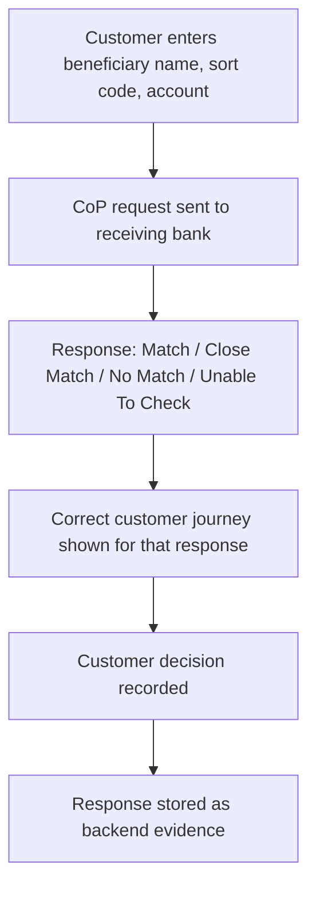

# 34. Confirmation of Payee (CoP) Testing

!!! abstract "Learning objective"
    Design test scenarios for all four CoP outcomes plus realistic edge cases, and validate both customer journey and backend evidence for each.

## Core concepts

Confirmation of Payee testing proves the service that checks whether a customer-entered beneficiary name matches the account details held by the receiving bank — the whole point being to reduce misdirected payments and authorised push payment fraud before money moves. There are four response types, and each demands a distinct, correctly-tested customer journey: Match (the payment continues normally, no extra friction); Close Match (a similar-but-not-exact name, where the customer should see a clear warning with the option to continue, cancel, or edit); No Match (the name doesn't match at all, requiring the bank to warn the customer of the risk and let them decide per policy, never silently blocking or silently allowing); and Unable To Check (a technical failure — receiving bank unavailable, timeout — which must be handled gracefully without incorrectly rejecting an otherwise-valid payment).

Beyond the four basic outcomes, the scenarios most likely to be missed — and most likely to cause real customer harm if mishandled — involve realistic account complexity: a joint account where the customer enters only one of two names (typically expected to return MATCH or CLOSE MATCH given one correct name is present), a business paid by its trading name rather than its registered legal name (CLOSE MATCH or NO MATCH depending on whether the trading name is held as secondary reference data), an account type explicitly out of CoP's scope such as certain safeguarding accounts (which should return a clear 'not available' response, never a misleading MATCH or NO MATCH), a beneficiary who's recently changed their registered name, and — critically — a customer who proceeds despite a No Match warning, where the system must explicitly record that decision, since this evidence is exactly what later APP fraud reimbursement disputes hinge on.

CoP integration spans multiple systems (mobile app → payment API → payment hub → CoP adapter → CoP service → receiving bank), so integration testing needs to confirm the request and response map correctly at each hop, and the response must be stored in its own record (payment ID, response, timestamp, provider) rather than only reflected transiently in the customer journey — a payment that completes with no stored CoP evidence is an audit failure waiting to surface.

## Visual overview

## Key terms

**Match / Close Match / No Match / Unable To Check**
:   The four CoP response types, each requiring a distinct, correctly-tested customer journey and system behaviour.

**Secondary reference data**
:   Additional registered names (e.g. a trading name) that can affect whether a name is matched, close-matched, or not matched at all.

**CoP not supported for account type**
:   A specific, correct response for account types explicitly out of CoP's scope — must never be confused with MATCH or NO MATCH.

**Recorded override**
:   The system explicitly logging a customer's decision to proceed despite a No Match warning — critical evidence for later fraud reimbursement disputes.

**COP_RESPONSE record**
:   The stored backend evidence of a CoP check — payment ID, response, timestamp, provider — independent of what the customer journey displayed.

## Worked example

!!! example
    A customer pays a coffee shop using its trading name, 'Joe's Coffee,' while the account is registered under its legal entity name, 'JC Hospitality Ltd.' Whether this returns MATCH, CLOSE MATCH, or NO MATCH depends entirely on whether the trading name is held as secondary reference data by the receiving bank — and the test that matters isn't just checking the raw response code, but confirming the customer sees a clear, non-technical explanation of why the names look different, rather than a confusing raw mismatch warning that gives them no useful basis for a decision.

## Comparison

**CoP response types and expected behaviour**

| Response | Expected behaviour |
|---|---|
| Match | Payment continues normally, no extra warning |
| Close Match | Clear warning shown; customer can continue, cancel, or edit |
| No Match | Risk clearly explained; customer decision captured per policy |
| Unable To Check | Handled gracefully; does not incorrectly reject a valid payment; issue logged |

## Key points

- Each of the four CoP responses needs its own correctly-tested customer journey — treating them interchangeably is the core failure mode to test against.
- Realistic edge cases (joint accounts, trading names, unsupported account types) are where CoP defects most often hide and cause the most customer harm.
- A customer proceeding despite a No Match warning must be explicitly recorded — this is the evidence that later determines fraud reimbursement liability.
- CoP responses must be stored as their own backend record, independent of the customer journey, or the audit trail has a gap.

## Exam & interview tips

!!! tip
    - Name at least one CoP edge case beyond the four basic responses (joint account, trading name, account type not supported) when asked how you'd test CoP — it shows awareness beyond the textbook happy path.
    - Know precisely why recording a customer's override of a No Match warning matters: it's the specific evidence that later determines APP fraud reimbursement liability.

!!! note "Memory trick"
    Four responses, four distinct journeys. A silently-upgraded Close Match to a Match is the defect that actually hurts a real customer.

## Scenario questions

??? question "A customer enters only 'John Smith' as the beneficiary name on a joint account registered as 'John Smith & Jane Smith.' What outcome would you expect, and why?"
    Typically MATCH or CLOSE MATCH rather than NO MATCH, since one of the two correct account holder names is present — the exact outcome depends on the CoP secondary reference data rules, but a full NO MATCH would be a defect worth investigating given a genuinely correct name was entered.

??? question "A production incident shows a sudden spike in No Match responses after the receiving bank changes its account-name formatting. How would you investigate this as a testing/QA issue rather than assuming it's a wave of fraud?"
    Query the CoP response table grouped by result to confirm the scale of the spike, then compare against what changed on the receiving bank's side (formatting) versus the matching logic on the sending side — this points to a name-matching rule configuration issue rather than a genuine surge in mismatched payments.

??? question "Why would a CoP test pack specifically include a scenario where a beneficiary has recently changed their registered name?"
    It's a realistic, easily-missed edge case — the customer's saved beneficiary details may be outdated, so testing confirms the system returns an appropriate Close Match or No Match rather than a confusing result, and that the customer journey allows them to update their saved details rather than getting stuck.

## Practice questions

??? question "1. What should happen when CoP returns Close Match?"
    ▫️ The payment is silently blocked with no explanation
    ✅ The customer sees a clear warning and can choose to continue, cancel, or edit the details
    ▫️ The response is treated identically to a full Match with no warning
    ▫️ The payment is automatically cancelled with no customer input

??? question "2. Why is 'Close Match silently treated as Match with no warning shown' considered a serious defect?"
    ▫️ It isn't a real risk
    ✅ The customer proceeds with a payment to a potentially wrong person without ever being alerted to the discrepancy
    ▫️ Close Match and Match are functionally identical by design
    ▫️ It only affects business accounts

??? question "3. What is the correct response when CoP checks a beneficiary account type explicitly out of scope, such as certain safeguarding accounts?"
    ▫️ A default MATCH
    ✅ A default NO MATCH
    ▫️ A clear 'CoP not available for this account type' response, distinct from either match outcome
    ▫️ The payment is silently rejected

??? question "4. Why must a customer's decision to proceed despite a No Match warning be explicitly recorded?"
    ▫️ It has no real importance
    ✅ This evidence is critical for later APP fraud reimbursement dispute assessments
    ▫️ It's only needed for business accounts
    ▫️ Customer decisions are never reviewable afterward

??? question "5. What does Unable To Check mean, and how should it be handled?"
    ▫️ The name definitely doesn't match — reject the payment
    ✅ A technical failure occurred (e.g. timeout) — the system must handle it gracefully without incorrectly rejecting a valid payment
    ▫️ It's identical to No Match
    ▫️ It means the receiving bank rejected the payment

??? question "6. Why must CoP responses be stored in their own backend record?"
    ▫️ It's not necessary if the customer journey looked correct
    ✅ A payment can complete with no stored CoP evidence, creating an audit gap that surfaces during disputes or regulatory review
    ▫️ CoP responses are never needed after the payment completes
    ▫️ Only No Match responses need to be stored

