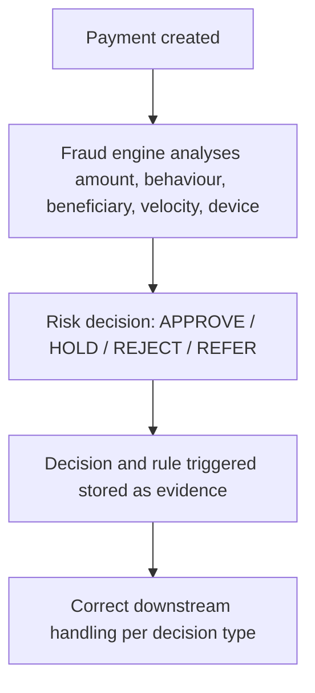

[FPS analyst deep-dive](../index.md) / [Testing FPS](index.md) &middot; Lesson 35 of 40
{: .lesson-crumbs}

# 35. Fraud Testing in FPS

!!! abstract "Learning objective"
    Design fraud test scenarios across APP fraud, velocity, mule indicators, and account takeover, and validate that genuine customers aren't unnecessarily blocked.

## Core concepts

Fraud testing exists because FPS payments are fast, often irreversible, and available 24/7 — exactly the properties that make the scheme attractive to fraudsters, and a failed fraud control means real customer financial loss, not just a technical bug. The fraud engine analyses amount, customer behaviour, beneficiary risk, device information, and velocity patterns, returning one of four decisions: APPROVE (continue), HOLD (manual review), REJECT (blocked), or REFER (further investigation) — and each decision needs its own tested, correct downstream handling, not a single generic 'blocked' outcome.

The core fraud scenarios worth testing deliberately: APP fraud (a customer technically authorises the payment themselves, but under deception — a new beneficiary and an amount well outside the customer's normal pattern should raise the risk score and trigger a HOLD); high-value payment deviation (a customer who normally sends £100-£500 suddenly sending £25,000, expecting at least a REFER); velocity checks (an unusual burst of payment frequency — twenty payments in five minutes against a normal pattern of one a day — expecting a HOLD); mule account indicators (a beneficiary account suddenly receiving many payments from unrelated senders in a short window, expecting HIGH RISK/BLOCK or REVIEW); new-beneficiary risk (a brand-new payee immediately receiving a large payment, expecting step-up authentication or a HOLD); and account takeover signals (a new device login plus a password reset plus an unusual large payment together, expecting BLOCK). Two subtler categories matter too: first-party/synthetic identity fraud (a newly-opened, minimally-verified account immediately receiving and trying to move a large payment — the fraud engine needs to flag the combination of signals even though no single one alone would trigger a rule) and cross-channel fraud signals (a suspicious card alert or login shortly before an FPS payment attempt should feed into the FPS risk decision, not be evaluated in isolation).

The discipline that separates strong fraud testing from weak fraud testing is testing false positives with equal seriousness to testing true positives. A customer legitimately buying a car for £20,000 must not be blocked by an overly aggressive rule — proving genuine customers aren't punished is just as much a fraud-testing responsibility as proving fraudsters are caught, since an over-blocking system causes real customer harm and erodes trust just as surely as an under-blocking one causes financial loss. Since the October 2024 mandatory APP reimbursement rules, fraud testing has a direct evidentiary responsibility too: proving the fraud case record captures enough detail (CoP result, risk decision, warnings shown, whether the customer overrode a warning) to actually support a downstream reimbursement assessment.

## Visual overview

## Key terms

**Fraud decision outcomes**
:   APPROVE, HOLD, REJECT, or REFER — each requiring distinct, correctly-tested downstream handling.

**Velocity check**
:   Detecting unusual payment frequency (e.g. twenty payments in five minutes versus a normal one-a-day pattern) as a strong fraud/account-takeover signal.

**Mule account indicators**
:   A beneficiary account receiving sudden, high-volume, unrelated inbound payments followed by rapid onward movement — tested as a distinct scenario from sender-side fraud.

**False positive testing**
:   Proving genuine, legitimate customer payments are not blocked by overly aggressive fraud rules — as important as proving real fraud is caught.

**Cross-channel fraud signal**
:   A risk indicator from another channel (e.g. a card alert or suspicious login) that should factor into an FPS payment's risk decision rather than being evaluated in isolation.

## Worked example

!!! example
    A test customer with two years of £100-£500 monthly payment history suddenly attempts to send £25,000 to a beneficiary added five minutes earlier. The fraud engine correctly returns HOLD with a high risk score, citing both the amount deviation and new-beneficiary risk together. A separate test then submits a completely ordinary £5,000 mortgage payment from a customer with a long, consistent history of exactly that payment — and this one must return APPROVE without friction, proving the same fraud engine correctly distinguishes real risk from a legitimate large-but-expected transaction rather than just reacting to a high amount alone.

## Comparison

**Fraud decision outcomes**

| Decision | Meaning |
|---|---|
| APPROVE | Payment can continue |
| HOLD | Manual review required |
| REJECT | Payment blocked |
| REFER | Additional investigation needed |

## Key points

- Each fraud decision (APPROVE/HOLD/REJECT/REFER) needs distinct, correctly-tested downstream handling, not one generic blocked outcome.
- Velocity checks and mule indicators are complementary but distinct — one watches sender behaviour, the other watches receiving-account patterns.
- False positive testing (proving genuine customers aren't blocked) is as core a responsibility as proving real fraud is caught.
- Since October 2024's mandatory APP reimbursement rules, the fraud case record's evidentiary completeness is itself a testable requirement.

## Exam & interview tips

!!! tip
    - Always mention false positive testing explicitly when asked how you'd test fraud controls — interviewers specifically listen for whether a candidate treats over-blocking as a real risk, not just under-blocking.
    - Know the APP reimbursement evidentiary angle: since October 2024, fraud testing should prove the case record captures enough (CoP result, decision, warnings, customer override) to support a downstream reimbursement assessment — this connects fraud testing directly to a live regulatory requirement.

!!! note "Memory trick"
    Fraud testing has two equally important jobs: catch the fraudster, and don't punish the genuine customer.

## Scenario questions

??? question "A customer with two years of consistent £5,000 monthly mortgage payments has that exact payment blocked by the fraud engine one month. What kind of defect is this, and why does it matter?"
    This is a false positive — a legitimate, expected payment incorrectly blocked. It matters because over-aggressive fraud rules cause real customer harm and erosion of trust, and testing must prove the fraud engine correctly distinguishes genuine expected behaviour from real risk, not just react to amount alone.

??? question "A new account, verified with minimal friction, receives a large incoming FPS payment and immediately attempts to move it out again. No single fraud rule triggers on its own. How should this be tested and caught?"
    As a first-party/synthetic identity fraud scenario — the fraud engine needs to flag the combination of new account age plus rapid in-and-out fund movement together, since testing single-signal rules in isolation would miss exactly this kind of layered risk pattern.

??? question "Why would a fraud test specifically include a scenario where a beneficiary name closely matches a sanctions/watch list entry, even if the payment is ultimately released as a false match?"
    To prove the payment is correctly held for manual review and routed to the financial crime team with full evidence logged regardless of the eventual outcome — the legal and audit obligation is about the process being followed correctly, not just the final release decision.

## Practice questions

??? question "1. What does a velocity check detect?"
    ▫️ Payment currency errors
    ✅ Unusual payment frequency, such as a sudden burst of payments against a normally low-frequency pattern
    ▫️ Sort code formatting issues
    ▫️ Device screen resolution

??? question "2. Why is false positive testing considered as important as catching real fraud?"
    ▫️ It isn't important
    ✅ Over-blocking genuine customers causes real harm and erodes trust just as surely as under-blocking causes financial loss
    ▫️ False positives never actually occur
    ▫️ Only REJECT decisions need testing

??? question "3. What combination of signals indicates a possible mule account?"
    ▫️ A single large payment from one known sender
    ✅ Many unrelated senders paying into an account in a short window, followed by rapid onward movement of funds
    ▫️ A dormant account with no activity at all
    ▫️ A payment made during business hours

??? question "4. Why should cross-channel fraud signals (e.g. a card alert) feed into an FPS payment's risk decision?"
    ▫️ They're irrelevant to FPS
    ✅ Evaluating the FPS payment in isolation from recent suspicious activity on other channels misses meaningful risk context
    ▫️ Cross-channel signals are only relevant for business accounts
    ▫️ This only applies to first-time customers

??? question "5. Since October 2024, what additional evidentiary responsibility does fraud testing carry?"
    ▫️ None — nothing has changed
    ✅ Proving the fraud case record captures enough detail (CoP result, decision, warnings, customer override) to support APP reimbursement assessment
    ▫️ Fraud testing no longer needs to cover velocity checks
    ▫️ Only technical failures need to be logged

??? question "6. What is first-party/synthetic identity fraud testing specifically designed to catch?"
    ▫️ A stolen card used online
    ✅ A newly-opened, minimally-verified account receiving and immediately trying to move a large payment, where no single rule alone would trigger
    ▫️ A customer forgetting their password
    ▫️ A payment to an existing, long-used beneficiary

Previous
[&larr; 34. Confirmation of Payee (CoP) Testing](34-confirmation-of-payee-cop-testing.md)

Next
[36. Regression Testing &rarr;](36-regression-testing.md)

