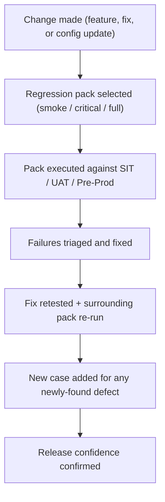

# 36. Regression Testing

!!! abstract "Learning objective"
    Build a tiered, maintainable FPS regression pack drawing from happy path, negative, CoP, and fraud scenarios, and run the defect verification workflow correctly.

## Core concepts

A regression test pack is a curated, reusable collection of test cases proving core system behaviour still works after a change — answering one specific question: has anything that used to work stopped working because of this? In FPS, even a small, unrelated-looking change (a new screen, a fraud rule tweak, a database migration) can silently break an existing payment journey, and without regression testing, a fix for one defect can quietly introduce another, or a broken CoP integration can go unnoticed until it's already live in production.

A well-designed pack deliberately doesn't try to cover everything — that would be too slow to run repeatedly and would defeat its own purpose. Instead it pulls the highest-confidence scenarios from each earlier area: from happy path, a successful payment to both an existing and a brand-new beneficiary; from negative testing, an invalid sort code rejection, an insufficient-funds rejection, and duplicate-payment prevention; from CoP, all three core outcomes (Match, Close Match, No Match) plus timeout handling; from fraud, a normal payment approved, a velocity breach held, and a known blacklisted beneficiary rejected. Packs are structured in tiers matched to how often they need to run: a smoke pack (a handful of the most critical checks, run after every deployment), a critical regression pack (broader coverage, run nightly or before UAT sign-off), and a full regression pack (everything, including edge cases, run as the pre-production release gate).

When a regression test fails, a structured verification workflow follows every time: the defect is raised with reproduction steps and evidence, triaged for severity, fixed by development, the specific failing case is retested to confirm the fix, the surrounding pack is re-run to catch any side effects the fix itself might have introduced, and — critically — if the defect wasn't already covered by an existing case, a new permanent regression case is added so it can never silently reappear undetected. A pack that never gets maintained becomes actively misleading: it keeps testing yesterday's system while missing today's risks. Real maintenance means adding a case for every significant production defect, retiring genuinely obsolete cases when features are decommissioned, refreshing stale test data (sort codes, fraud thresholds, and CoP rules all drift over time), automating stable repeatable scenarios, and re-baselining the whole pack after any major architecture change rather than assuming old scenarios still map cleanly onto a rebuilt system.

## Visual overview

## Key terms

**Regression test pack**
:   A curated, reusable set of test cases proving core system behaviour still works after a change — answers 'has anything that used to work broken?'

**Tiered regression (smoke / critical / full)**
:   Structuring the pack by how often it needs to run — a small fast subset after every deployment, a broader set nightly, everything at the pre-production gate.

**Defect verification workflow**
:   The structured sequence after a regression failure: raise, triage, fix, retest, re-run the surrounding pack, add a new permanent case, close.

**Pack maintenance**
:   Ongoing upkeep — adding cases for real production defects, retiring obsolete ones, refreshing stale test data, automating stable scenarios.

**Post-release smoke test**
:   A lightweight regression subset run directly in production with safe, low-value test transactions immediately after a release.

## Worked example

!!! example
    A production defect is found: an FPS gateway timeout causes a duplicate payment because of a missing idempotency key check on retry. The fix is applied, and the QA analyst retests the specific failing case (FPS_REG_009 — duplicate payment submission) to confirm it now passes. But the workflow doesn't stop there — the surrounding regression pack is re-run to confirm the fix didn't break anything else, and because this exact scenario (a gateway timeout combined with an automatic retry) wasn't already covered by an existing case, a new permanent regression test (FPS_REG_022) is added specifically for it, so this defect can never silently reappear undetected in a future release.

## Comparison

**Regression tiers**

| Tier | Trigger | Scope |
|---|---|---|
| Smoke | Every deployment to SIT/UAT | 10-15 critical, fastest scenarios |
| Critical | Nightly automated run | Full happy path, negative, CoP, fraud core set |
| Full | Pre-production release gate | Complete pack plus non-functional checks |

## Key points

- A regression pack answers one specific question: has anything that used to work stopped working because of this change?
- Packs are deliberately not exhaustive — they pull the highest-confidence scenarios from each area, tiered by how often they need to run.
- Every regression failure follows the same workflow: retest the specific fix, re-run the surrounding pack for side effects, add a permanent case if one didn't already exist.
- An unmaintained pack becomes actively misleading — it keeps proving yesterday's system works while missing today's actual risks.

## Exam & interview tips

!!! tip
    - A strong answer to "how would you build a regression pack" explicitly mentions tiering (smoke/critical/full) — naming just "we run the tests again" misses the structural discipline that's actually being tested.
    - Know the specific rule that a new permanent regression case gets added for every confirmed production defect — this is the single habit that stops the same bug reappearing silently, and interviewers listen for it specifically.

!!! note "Memory trick"
    A regression pack is only as valuable as its last update — stop maintaining it, and it stops protecting anything.

## Scenario questions

??? question "A fraud rule change is deployed. Which tier of the regression pack should run immediately after deployment, and which should run overnight?"
    The smoke pack (a handful of the fastest, most critical checks) should run immediately after deployment to prove nothing is fundamentally broken, while the fuller critical regression pack — covering happy path, negative, CoP, and fraud core scenarios in more depth — runs overnight to give broader confidence before the next working day.

??? question "A production defect is fixed and the specific failing regression test now passes. Is the defect ready to close?"
    Not yet — the surrounding regression pack needs to be re-run first to confirm the fix itself didn't introduce a new problem elsewhere, and if the defect wasn't already covered by an existing case, a new permanent one should be added before the defect is considered fully closed.

??? question "The regression pack has grown so large it now takes six hours to run, and teams have started skipping it before releases. What's the correct response?"
    Review and re-tier the pack — move lower-risk cases out of the frequently-run smoke/critical tiers and into the full pre-prod-only tier, and prioritise automating stable, repeatable scenarios — rather than accepting that the pack gets skipped, which defeats its entire purpose.

## Practice questions

??? question "1. What question does a regression test pack answer?"
    ▫️ Is this a new feature ready for release?
    ✅ Has anything that used to work stopped working because of this change?
    ▫️ How fast is the payment platform?
    ▫️ Is the customer satisfied with the service?

??? question "2. Why does a well-designed regression pack deliberately avoid trying to cover everything?"
    ▫️ Coverage doesn't matter
    ✅ An exhaustive pack would be too slow to run repeatedly, defeating the purpose of frequent regression checks
    ▫️ Only happy path scenarios are worth including
    ▫️ Full coverage is technically impossible

??? question "3. What happens after a regression defect fix is retested and passes?"
    ▫️ The process ends immediately
    ✅ The surrounding regression pack is re-run to confirm the fix didn't introduce a new problem elsewhere
    ▫️ No further action is needed
    ▫️ The test case is deleted

??? question "4. Why is adding a permanent regression case for every confirmed production defect so important?"
    ▫️ It's optional busywork
    ✅ It ensures that exact defect can never silently reappear undetected in a future release
    ▫️ It only matters for Critical severity defects
    ▫️ It replaces the need for a fix

??? question "5. What is a smoke pack used for?"
    ▫️ The full pre-production release gate
    ✅ A small, fast subset of the most critical scenarios run after every deployment
    ▫️ Only fraud scenario testing
    ▫️ Annual regulatory audits only

??? question "6. Why does a regression pack need ongoing maintenance rather than being built once?"
    ▫️ Maintenance is unnecessary once built
    ✅ Stale test data, retired features, and unrecorded new defects mean an unmaintained pack keeps testing yesterday's system while missing today's risks
    ▫️ Regression packs automatically update themselves
    ▫️ Only automated tests require maintenance

