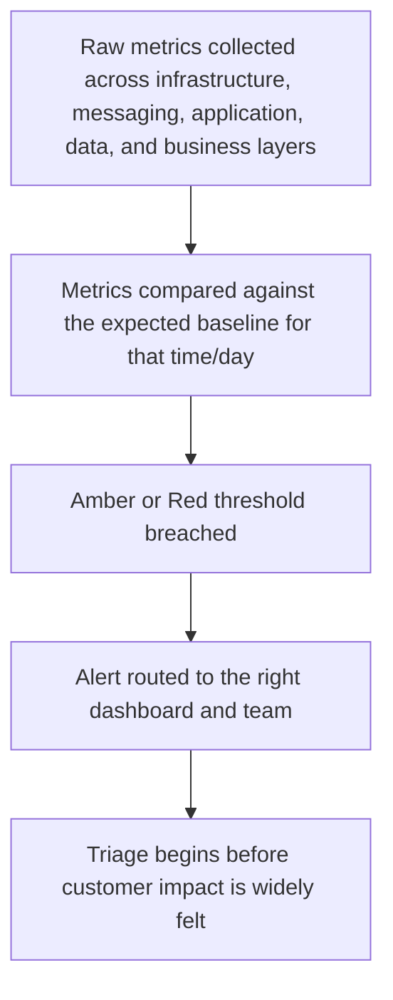

[FPS analyst deep-dive](../index.md) / [Monitoring & Live Simulation](index.md) &middot; Lesson 37 of 40
{: .lesson-crumbs}

# 37. Monitoring FPS Systems in Production

!!! abstract "Learning objective"
    Explain why proactive FPS monitoring matters, describe the layered approach to watching a live payment system, and design alert thresholds that catch real problems without drowning the team in noise.

## Core concepts

FPS runs 24 hours a day, every day of the year, moving real customer money in seconds — which means a fault doesn't sit quietly waiting for the next business day to be noticed, it starts generating customer complaints almost immediately. The entire purpose of production monitoring is to flip that dynamic: the goal is for the operations team to already know something is wrong, and roughly why, before the first customer call ever lands. A bank that only finds out about a payment problem from social media or the complaints queue has already lost the window where it could have been fixed quietly.

Good monitoring is layered rather than a single dashboard. At the bottom sits infrastructure health — servers, network links, disk and CPU capacity. Above that sits the messaging layer — are queues moving, or is a backlog building. Above that sits application health — is the payment hub, the gateway, or the fraud engine actually processing requests correctly. Above that sits data health — are payment statuses updating as expected in the database. And at the very top sits business health — the numbers a non-technical stakeholder actually cares about, like how many payments completed in the last hour and what proportion failed. A mature monitoring setup watches all five layers, because a problem often shows up at the bottom (rising CPU on a database server) well before it becomes visible at the top (a customer-facing failure), and catching it early at the infrastructure layer is what prevents the business-layer alert from ever firing at all.

Within that layered view, a production support team tracks a consistent set of signals day to day: payment volume (and whether today's shape matches the expected pattern for this time of day and day of week — lunchtime and Friday afternoon volumes look very different from a Tuesday at 3am), success rate, the specific failure reasons behind any failures, how many payments are sitting in a pending or in-flight state for longer than expected, average and peak processing time per payment, message queue depth, overall system availability, database performance, and the health of everything FPS depends on externally — Pay.UK connectivity, the fraud engine, the CoP service. Thresholds for all of these should be set against a rolling baseline of what 'normal' looks like for that specific hour and day, not a single fixed number for all situations — a queue depth that's perfectly normal at 9am on a Monday could be a five-alarm warning sign at 3am on a Sunday, and a threshold that ignores that context either fires constantly on nothing (alert fatigue, which trains people to ignore alerts) or stays silent through a genuine problem because the fixed number was set too loosely to ever catch it.

## Visual overview

## Key terms

**Layered monitoring**
:   Watching infrastructure, messaging, application, data, and business-level health together, since problems often surface at a lower layer before they ever become customer-visible.

**Baseline-aware threshold**
:   An alert threshold set against the normal pattern for that specific time and day, rather than one fixed number applied at all times.

**Alert fatigue**
:   The effect of thresholds that fire too often on non-issues, which trains a team to start ignoring alerts — often more dangerous than having no alert at all.

**Pending/in-flight payment**
:   A payment that has been submitted but hasn't yet reached a final status — monitoring how many are stuck, and for how long, is an early warning signal.

**External dependency health**
:   The availability and responsiveness of systems FPS relies on but doesn't control directly, such as Pay.UK, the fraud engine, and the CoP service.

## Worked example

!!! example
    On an ordinary Tuesday, the payment queue typically holds around 200-400 messages at any moment during business hours. At 2pm, it climbs steadily to 6,000 and keeps rising. A threshold that just says 'alert if queue depth exceeds 10,000' stays silent the whole time, because 6,000 never technically breaches it — even though it's fifteen times the normal level for that time of day and clearly heading toward real trouble. A baseline-aware threshold that instead compares against the expected range for a Tuesday afternoon fires an Amber warning as soon as the queue crosses roughly three times its usual level, giving the team a head start before it becomes a Red, customer-impacting event.

## Comparison

**Three-tier dashboard model**

| Dashboard | Audience | Typical content |
|---|---|---|
| Executive | Senior leadership | High-level KPIs — overall success rate, customer impact, incident status |
| Operations / NOC | 24/7 monitoring team | Live metrics, active alerts, queue depth, current incident tracker |
| Engineering | Technical teams | Detailed logs, system-level metrics, error breakdowns, diagnostic detail |

## Key points

- FPS runs continuously, so monitoring exists to surface problems before customers notice them, not after.
- A layered approach — infrastructure, messaging, application, data, business — catches problems at a lower layer before they become customer-visible.
- Thresholds set against a time-and-day-aware baseline catch real problems far earlier than a single fixed number can.
- The three-tier dashboard model (Executive, Operations/NOC, Engineering) gives each audience the right level of detail for their role.

## Exam & interview tips

!!! tip
    - Be ready to name several of the core monitored areas beyond just 'success rate' — volume shape, pending payment count, and external dependency health are the ones that show a deeper understanding of production support.
    - When asked how you'd set an alert threshold, explicitly mention comparing against a baseline for that time/day rather than quoting one fixed number — that distinction is what separates a mature answer from a superficial one.

!!! note "Memory trick"
    Monitoring's job isn't to tell you a payment failed — it's to tell you before the customer does.

## Scenario questions

??? question "A queue depth alert is set to fire only above 10,000 messages, but customers start complaining about delayed payments while the queue sits at 6,000 during a normally quiet period. What's the underlying monitoring design flaw?"
    The threshold is a single fixed number rather than baseline-aware — 6,000 messages might be trivial at midday on a Monday but represents a major deviation during a normally quiet window, and a threshold that ignores time-of-day/day-of-week context will miss exactly this kind of developing problem until it's much further along.

??? question "A new monitoring rule fires an Amber alert every time queue depth rises even slightly above its five-minute average, and within a week the operations team has started muting it. What went wrong, and what should change?"
    This is alert fatigue — a threshold too sensitive to normal, harmless variation trains the team to ignore it, which is often more dangerous than having no alert, since a genuine problem will now also go unnoticed. The threshold needs to be set against a wider, more representative baseline (e.g. hourly pattern over several weeks) so it only fires on genuinely unusual deviation.

??? question "Database CPU utilisation on a payment system climbs steadily for two hours with no customer-facing impact yet. Why does layered monitoring specifically make this visible, and why does catching it now matter?"
    Because infrastructure-layer metrics are watched independently of business-layer/customer-impact metrics, this rising CPU is visible immediately even though no payment has failed yet — catching it at this stage means the team can investigate and act before it escalates into slow processing, timeouts, and eventually customer-visible failures at the business layer.

## Practice questions

??? question "1. Why does FPS monitoring need to be proactive rather than reactive?"
    ▫️ FPS only processes payments during business hours
    ✅ FPS runs 24/7 with fast, often irreversible payments, so a fault generates customer impact almost immediately if not caught early
    ▫️ Proactive monitoring is required only for CHAPS, not FPS
    ▫️ Customers rarely notice payment failures

??? question "2. What is the main risk of a fixed, non-baseline-aware alert threshold?"
    ▫️ It never triggers under any conditions
    ✅ It can either fire constantly on normal variation (alert fatigue) or stay silent through a genuine problem, depending on how loosely it's set
    ▫️ It only applies to fraud alerts
    ▫️ It removes the need for dashboards entirely

??? question "3. What does layered monitoring specifically allow a team to do?"
    ▫️ Ignore infrastructure-level metrics entirely
    ✅ Catch a problem at a lower layer (e.g. rising database CPU) before it becomes visible at the business/customer-impact layer
    ▫️ Replace the need for an Operations dashboard
    ▫️ Monitor only the fraud engine

??? question "4. Who is the primary audience for an Operations/NOC dashboard?"
    ▫️ Senior executives only
    ✅ The 24/7 monitoring team, who need live metrics, active alerts, and current incident status
    ▫️ External auditors
    ▫️ Marketing teams

??? question "5. Why is tracking pending/in-flight payment count useful?"
    ▫️ It has no operational value
    ✅ A growing number of payments stuck before reaching a final status is an early warning sign of a developing problem
    ▫️ It only matters for completed payments
    ▫️ It replaces the need for success rate monitoring

??? question "6. Why does 'external dependency health' need its own monitoring, separate from the bank's own systems?"
    ▫️ External systems never fail
    ✅ FPS relies on systems the bank doesn't directly control, like Pay.UK and the fraud engine, and their degradation can cause FPS failures even when the bank's own infrastructure is fine
    ▫️ External dependencies are irrelevant to payment success
    ▫️ Only internal systems need monitoring

Previous
[&larr; 36. Regression Testing](../f7-testing-fps/36-regression-testing.md)

Next
[38. Incident Management &rarr;](38-incident-management.md)

