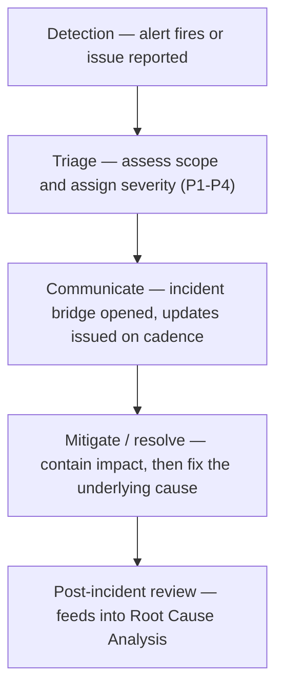

[FPS analyst deep-dive](../index.md) / [Monitoring & Live Simulation](index.md) &middot; Lesson 38 of 40
{: .lesson-crumbs}

# 38. Incident Management

!!! abstract "Learning objective"
    Classify incident severity using a P1-P4 framework, describe the stages of the incident response lifecycle, and communicate correctly and consistently during a live incident.

## Core concepts

The moment monitoring surfaces a genuine problem, incident management takes over — a structured, repeatable process for containing customer impact, keeping the right people informed, and restoring service, rather than an ad hoc scramble that depends on who happens to notice first. Every incident moves through the same broad lifecycle: it's detected (via an alert or a report), triaged and classified by severity, communicated to the relevant audiences, mitigated or resolved, and then reviewed afterward — that final review stage is what feeds into the Root Cause Analysis process covered in the next lesson, so incident management and RCA are really two connected halves of the same discipline.

Severity classification is what makes the rest of the process consistent rather than a matter of individual judgement under pressure. A P1 (Severity 1) incident means a significant number of customers are affected by a live, ongoing issue with a clear financial or service impact — this triggers an Incident Manager being paged immediately, a live incident bridge (a continuously-open call or chat channel where all relevant teams coordinate together) being opened, and status updates issued on a tight cadence, often every 15-30 minutes, whether or not there's meaningfully new information to share. A P2 is serious but narrower in scope or impact — perhaps a single payment type or a smaller customer segment — and still gets urgent attention but without necessarily needing the full bridge-and-15-minute-cadence treatment. A P3 is a moderate issue with limited or no immediate customer impact, handled through normal working hours. A P4 is a minor, cosmetic, or informational issue that gets logged and scheduled without any urgency at all. Severity should be assigned based on actual, current impact and scope — not on how technically complex the underlying fix looks, since a technically trivial fix can still be sitting behind a P1-level customer impact, and a technically hard fix can sometimes be masking a genuinely low-impact issue.

During a live incident, communication discipline matters as much as the technical fix. Different audiences need different things at different points: customer-facing teams need plain-language, accurate updates they can pass on without technical jargon; technical teams on the bridge need precise, detailed diagnostic information; and senior stakeholders need a concise, business-impact-focused summary rather than a blow-by-blow technical narrative. A well-run incident bridge has clear ground rules — one person (the Incident Manager) owns the coordination and the decision to escalate or stand down, updates go out on schedule even when the honest update is simply 'still investigating, no change,' and every action taken and its outcome gets logged in real time rather than reconstructed from memory afterward, because that log becomes the primary evidence base for the RCA that follows.

## Visual overview

## Key terms

**P1-P4 severity**
:   A structured classification of incident severity by actual customer impact and scope, used to set response urgency, escalation, and communication cadence consistently.

**Incident bridge**
:   A continuously-open call or chat channel where all relevant teams coordinate together during an active incident, coordinated by a single Incident Manager.

**Incident Manager**
:   The individual who owns coordination during an incident — driving the process, deciding on escalation, and ensuring updates go out on schedule, without necessarily fixing the issue themselves.

**Mitigate vs resolve**
:   Mitigate: reduce or contain customer impact quickly (e.g. a workaround or rollback). Resolve: fix the actual underlying issue, which may happen later than mitigation.

**Update cadence**
:   The fixed schedule (e.g. every 15-30 minutes for a P1) on which status updates are issued during an incident, regardless of whether there's new information.

## Worked example

!!! example
    At 09:10, monitoring shows the FPS success rate has dropped from a normal 99%+ to 88%, with failures concentrated on outbound payments. This meets the P1 bar — a clear, ongoing, significant customer impact. An Incident Manager pages the fraud platform and gateway teams, opens a bridge, and issues a first update within ten minutes: 'Investigating an increase in outbound FPS payment failures since approximately 09:00. Next update in 20 minutes.' Even at the 09:30 update, if the cause still isn't confirmed, an update still goes out on schedule saying exactly that — the discipline of a fixed cadence exists precisely so nobody outside the bridge is left guessing whether the incident is still being actively worked.

## Comparison

**Incident severity levels**

| Severity | Definition | Typical response |
|---|---|---|
| P1 | Significant, ongoing customer impact across a large scope | Incident Manager paged, bridge opened, updates every 15-30 min |
| P2 | Serious but narrower in scope or impact | Urgent response, less formal cadence than P1 |
| P3 | Moderate issue, limited/no immediate customer impact | Handled during normal working hours |
| P4 | Minor, cosmetic, or informational | Logged and scheduled, no urgency |

## Key points

- The incident lifecycle — detect, triage, communicate, mitigate/resolve, review — is the same structure regardless of severity, just with different urgency at each stage.
- Severity (P1-P4) should always be assigned based on actual current customer impact and scope, not the technical complexity of the fix.
- Different audiences during an incident need different communication — plain language for customer teams, technical detail for the bridge, concise business impact for senior stakeholders.
- A fixed update cadence (even when the honest update is 'no change yet') and a real-time action log are what make the post-incident review and RCA possible afterward.

## Exam & interview tips

!!! tip
    - Be precise about the P1-P4 distinction being driven by actual current customer impact and scope, not by how technically hard the fix looks — interviewers often probe this exact confusion.
    - Know the difference between mitigate and resolve and be ready to give an example of each (e.g. rolling back a bad deployment mitigates quickly; fixing the underlying code defect resolves it properly) — conflating the two is a common weak-answer signal.

!!! note "Memory trick"
    Severity is about impact right now, not difficulty. A one-line fix can still be a P1 if enough customers are affected.

## Scenario questions

??? question "A defect is technically very simple to fix (a one-line configuration change) but is currently causing 40% of outbound FPS payments to fail. What severity should this be classified as, and why?"
    P1 — severity is driven by actual current customer impact and scope, not by how hard the fix looks. A large proportion of failing payments meets the P1 bar regardless of how quickly the underlying fix can technically be deployed.

??? question "Twenty minutes into a P1 incident, the cause still hasn't been confirmed. Should the scheduled update be skipped until there's something concrete to report?"
    No — the update should still go out on schedule, honestly stating that investigation is ongoing with no confirmed cause yet. The discipline of a fixed cadence exists specifically so stakeholders aren't left guessing whether the incident is still being actively worked, even when there's no new substance to report.

??? question "An incident is mitigated by rolling back a recent deployment, and the success rate returns to normal within ten minutes. Is the incident now resolved?"
    Not fully — the rollback has mitigated the customer impact by removing the immediate symptom, but the underlying defect in the rolled-back change still needs to be properly fixed (resolved) before it can be safely redeployed, and the incident should proceed to Root Cause Analysis to understand what actually went wrong.

## Practice questions

??? question "1. What determines whether an incident is classified as P1?"
    ▫️ How technically complex the underlying fix is
    ✅ The actual current scope and severity of customer impact
    ▫️ Which team happens to notice it first
    ▫️ Whether it occurred during business hours

??? question "2. What is the role of an Incident Manager during a live incident?"
    ▫️ To personally write the code fix
    ✅ To own coordination — driving the process, deciding on escalation, and ensuring updates go out on schedule
    ▫️ To handle customer complaints directly
    ▫️ To approve marketing communications

??? question "3. What is the difference between mitigating and resolving an incident?"
    ▫️ They mean exactly the same thing
    ✅ Mitigating reduces or contains customer impact quickly (e.g. a rollback); resolving fixes the actual underlying issue, which may come later
    ▫️ Mitigating always happens after resolving
    ▫️ Only P1 incidents can be mitigated

??? question "4. Why does a P1 incident require updates on a fixed cadence, even with no new information?"
    ▫️ It's unnecessary if nothing has changed
    ✅ It ensures stakeholders outside the bridge always know the incident is still being actively worked, rather than being left to assume it's been forgotten
    ▫️ Fixed cadences are only used for P3 and P4 incidents
    ▫️ It replaces the need for a final incident report

??? question "5. Why does an incident bridge need clear ground rules and a single coordinating owner?"
    ▫️ It slows the response down unnecessarily
    ✅ Without a single owner driving updates, escalation decisions, and logging, a high-pressure bridge easily becomes chaotic and inconsistent
    ▫️ Ground rules are only needed for P4 incidents
    ▫️ Technical teams prefer working without coordination

??? question "6. What does the post-incident review stage feed into?"
    ▫️ Nothing further — it's the final step
    ✅ Root Cause Analysis, which digs into why the incident happened and how to prevent recurrence
    ▫️ Marketing communications only
    ▫️ It replaces the need for monitoring

Previous
[&larr; 37. Monitoring FPS Systems in Production](37-monitoring-fps-systems-in-production.md)

Next
[39. Root Cause Analysis &rarr;](39-root-cause-analysis.md)

