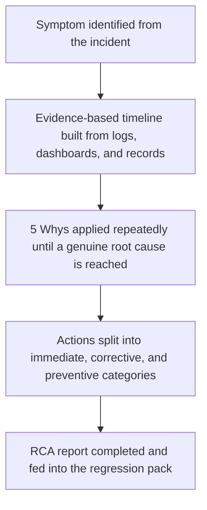

[FPS analyst deep-dive](../index.md) / [Monitoring & Live Simulation](index.md) &middot; Lesson 39 of 40
{: .lesson-crumbs}

# 39. Root Cause Analysis

!!! abstract "Learning objective"
    Build an evidence-based incident timeline, apply the 5 Whys technique to reach a genuine root cause, and structure findings into immediate, corrective, and preventive actions.

## Core concepts

Root Cause Analysis exists because resolving an incident's symptom and understanding why it happened are two different jobs — restoring the success rate to normal tells you the immediate problem is gone, not that it won't come straight back next week under the same conditions. RCA is typically triggered automatically for P1 and P2 incidents (given their scale of impact), and its output is what actually stops a fault class from recurring, by identifying not just what broke but the chain of conditions that allowed it to break unnoticed until it was already customer-facing.

The process starts with rebuilding a precise, evidence-based timeline of exactly what happened and when — pulling from monitoring dashboards, alert logs, application logs, the incident bridge's own real-time log, deployment records, and any relevant change history, cross-referenced against each other rather than relying on anyone's memory of the sequence. With the timeline established, the core technique is the '5 Whys': starting from the visible symptom and asking 'why did that happen' repeatedly, each answer becoming the next question, until the chain stops producing a new, more fundamental answer and a genuine root cause is reached — typically after four or five iterations, though the number itself isn't the point, reaching a cause that's actually fixable is. A worked example: gateway timeouts occur on outbound payments (the symptom) — why? because the fraud engine's response time jumped from roughly 200ms to 4 seconds — why? because a batch reporting job was consuming heavy database resources on the same database the fraud engine reads from — why? because batch and real-time workloads had never been separated onto isolated resources — why? because no one had flagged this as a risk, since fraud engine response time itself wasn't a directly monitored metric with its own alert threshold — arriving at a root cause that's really two combined conditions: no workload isolation between batch and real-time processing, and no direct monitoring on fraud engine latency to catch the degradation before it cascaded into customer-facing failures. Other techniques exist for more complex, multi-factor incidents — a fishbone (Ishikawa) diagram organises potential contributing causes into categories like people, process, technology, and environment, while fault tree analysis works backward from the failure through the logical combinations of conditions that could produce it — but the 5 Whys is the standard, fastest starting technique for most single-thread incidents.

A root cause on its own doesn't close an RCA — the findings need to translate into three distinct categories of action, each with a named owner and target date: immediate actions (what was done to restore service right now, largely already covered by the incident's mitigation step), corrective actions (fixing the actual underlying defect the root cause identified — here, isolating the batch job's resource usage from the fraud engine's), and preventive actions (changes that stop this entire class of problem recurring in a different form — here, adding fraud engine response time as its own monitored KPI with its own alert threshold, and adding a new regression test that simulates a slow fraud engine to confirm the gateway handles it safely). A completed RCA report brings all of this together — incident summary, timeline, root cause, evidence, and the three action categories — and, critically, feeds directly back into the regression pack covered in Block F7: a fault that's been found once and understood should never be able to reach production silently a second time without a specific test standing in its way.

## Visual overview

## Key terms

**5 Whys**
:   A technique that repeatedly asks 'why did that happen' starting from the visible symptom, using each answer as the next question, until a genuine, fixable root cause is reached.

**Evidence-based timeline**
:   A precise incident timeline built from cross-referenced monitoring, logs, and records — not reconstructed from memory.

**Immediate / corrective / preventive actions**
:   Three distinct categories of RCA follow-up: restoring service now, fixing the actual defect, and preventing the whole class of problem recurring differently.

**Workload isolation**
:   Separating different types of processing (e.g. batch reporting vs real-time transaction handling) onto separate resources so one can't degrade the other.

**Fishbone (Ishikawa) diagram**
:   An alternative RCA technique that organises potential contributing causes into categories like people, process, technology, and environment — useful for more complex, multi-factor incidents.

## Worked example

!!! example
    A P1 incident's symptom is a spike in gateway timeouts. The first 'why' finds the fraud engine slowed sharply; the next 'why' finds a heavy batch job running against the same database; the next finds batch and real-time workloads were never isolated; the final 'why' finds fraud engine latency simply wasn't a monitored metric, so nobody could have caught the slowdown before it became customer-facing. The RCA report then separates its actions cleanly: immediate (the batch job was killed mid-incident to restore service), corrective (reschedule the batch job outside peak hours and move it to isolated infrastructure), and preventive (add fraud engine response time as a monitored KPI with its own Amber/Red thresholds, and add a regression test simulating a slow fraud engine). Restoring the success rate alone would have fixed today's incident; only this full chain of actions stops the same underlying gap from causing next month's.

## Comparison

**RCA action categories**

| Category | Purpose | Example |
|---|---|---|
| Immediate | Restore service right now | Kill the resource-heavy batch job during the incident |
| Corrective | Fix the actual underlying defect | Reschedule/isolate the batch job onto separate infrastructure |
| Preventive | Stop the whole class of problem recurring differently | Add fraud engine latency as a monitored KPI; add a regression test for a slow fraud engine |

## Key points

- RCA exists because resolving an incident's symptom doesn't explain why it happened or guarantee it won't recur — that's a separate, deliberate follow-up process.
- The 5 Whys technique repeatedly asks 'why' from the visible symptom until it reaches a genuine, fixable underlying cause, usually after four or five iterations.
- A completed RCA separates its findings into immediate, corrective, and preventive actions, each with a named owner and target date.
- RCA findings should feed directly into the regression pack, so a fault that's been understood once can't silently reach production again in the same form.

## Exam & interview tips

!!! tip
    - Be ready to walk through a full 5 Whys chain out loud for a plausible FPS incident — interviewers frequently ask this directly, and a shallow two-step answer signals limited real understanding of the technique.
    - Always distinguish corrective from preventive actions explicitly when describing RCA outputs — conflating 'fix the specific bug' with 'stop this class of bug recurring' is one of the most common gaps in a weaker answer.

!!! note "Memory trick"
    Fixing the symptom ends today's incident. Root cause analysis is what stops it from having a sequel.

## Scenario questions

??? question "An RCA concludes with the finding 'the gateway timed out' as the root cause and stops there. What's wrong with this conclusion?"
    'The gateway timed out' is the symptom, not the root cause — the 5 Whys process needs to continue asking why the gateway timed out (e.g. the fraud engine was slow), and why that happened, until reaching a genuinely fixable underlying condition, rather than stopping at the first restatement of the original problem.

??? question "A batch job causing database contention is rescheduled to run overnight after an incident. Is this action corrective, preventive, or both, and is anything still missing?"
    This is a corrective action — it fixes the specific defect that caused this incident. It is not yet preventive, since it doesn't address the underlying gap that allowed this class of problem to go undetected — a preventive action would still be needed, such as adding direct monitoring on the resource the batch job was contending for, so a similar future issue is caught before it cascades.

??? question "Two weeks after an RCA is completed, the same root cause resurfaces in a slightly different form and causes a second incident. What does this suggest about the original RCA's action plan?"
    It suggests the preventive actions weren't sufficient, weren't actually implemented, or weren't broad enough to cover the whole class of problem rather than just the exact original scenario — a good RCA process should include following up on whether preventive actions were completed and effective, not just documenting them and moving on.

## Practice questions

??? question "1. Why is restoring a payment success rate to normal not the same as completing a Root Cause Analysis?"
    ▫️ It is the same thing
    ✅ Restoring the success rate fixes today's symptom, but doesn't explain the underlying cause or guarantee the same fault won't recur
    ▫️ RCA is only needed for P3 and P4 incidents
    ▫️ Success rate has no relationship to RCA

??? question "2. What does the 5 Whys technique involve?"
    ▫️ Asking five unrelated questions about the incident
    ✅ Repeatedly asking 'why did that happen', using each answer as the next question, until a genuine root cause is reached
    ▫️ Interviewing five different team members
    ▫️ Waiting five days before starting the investigation

??? question "3. What's the difference between a corrective action and a preventive action?"
    ▫️ They are the same category with two names
    ✅ Corrective fixes the specific underlying defect found; preventive stops the whole class of problem from recurring in a different form
    ▫️ Preventive actions are only used for P4 incidents
    ▫️ Corrective actions are optional

??? question "4. Why should an RCA timeline be built from logs and dashboards rather than team members' memory?"
    ▫️ Memory is always equally reliable
    ✅ Cross-referenced evidence produces an accurate sequence of events, which memory alone under incident pressure often cannot
    ▫️ Logs are only needed for P1 incidents
    ▫️ Timelines aren't actually required for RCA

??? question "5. What should an RCA's findings ultimately feed into, according to the feedback loop described in this lesson?"
    ▫️ Nothing further is required once the report is written
    ✅ The regression test pack, so the understood fault can't silently reach production again undetected
    ▫️ Marketing communications
    ▫️ Only the executive dashboard

??? question "6. When is a fishbone (Ishikawa) diagram more useful than the 5 Whys?"
    ▫️ It's never useful for RCA
    ✅ For more complex, multi-factor incidents, where organising potential causes into categories like people, process, technology, and environment helps more than a single linear chain
    ▫️ Only for P4 incidents
    ▫️ It replaces the need for an incident timeline

Previous
[&larr; 38. Incident Management](38-incident-management.md)

Next
[40. Live Production Simulation (End-to-End FPS Investigation) &rarr;](40-live-production-simulation-end-to-end-fps-investigation.md)

