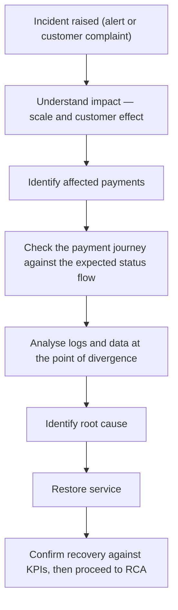

# 40. Live Production Simulation (End-to-End FPS Investigation)

!!! abstract "Learning objective"
    Apply the full investigation framework to failed, missing, duplicate, and settlement-mismatch payment scenarios, correctly classify and communicate during a live incident, and bring together monitoring, incident management, and RCA into one connected capstone exercise.

## Core concepts

This final lesson is the capstone of the whole FPS analyst curriculum — a deliberate simulation of the job itself, pulling together monitoring (knowing what 'normal' looks like and spotting the deviation), incident management (classifying and communicating correctly under pressure), Root Cause Analysis (going beyond the symptom to the real cause), and the payment lifecycle, data, architecture, and SQL knowledge built up across every earlier block. Every FPS investigation, regardless of the specific complaint, follows the same underlying framework: understand the impact, identify exactly which payments are affected, trace the payment's journey through the system, analyse the supporting logs and data, identify the root cause, restore service, and finally confirm recovery — a structure that scales seamlessly from a single customer's complaint about one payment up to a full-scale P1 incident affecting thousands.

Four scenario types recur constantly in real production support work, each with its own investigative shape. A failed payment (money never left, or was debited with no completion) is investigated by pulling the payment record and status history, comparing the actual status journey against the expected one to see exactly where it diverged, checking the relevant system's logs at that point (often a gateway or fraud engine timeout), and — critically — confirming no duplicate record exists and the customer's balance hasn't been left in an inconsistent state before closing it out. A missing payment (debited from the sender, not yet visible to the recipient) is investigated by confirming the payment actually completed and was accepted by the receiving bank, then checking whether the elapsed time is still within the receiving bank's normal posting window before treating it as a genuine fault rather than an expected short delay. A duplicate payment (two charges for one instruction) is investigated by searching for matching records on customer, amount, and near-identical timestamp, then confirming the diagnosis by checking whether both records share an identical transaction ID or idempotency key — genuinely separate deliberate payments won't share that identifier, duplicates will. A settlement mismatch (the bank's internal payment totals don't match the scheme's settlement record for the day) is investigated by comparing the two totals directly via SQL, then checking whether the gap is explained by ordinary timing — a payment recorded at 23:59 can legitimately fall into the next day's settlement batch — before escalating a genuine, unexplained shortfall to Treasury and Finance, since an unreconciled settlement position carries real financial and regulatory weight.

The fully worked capstone scenario ties all of this together in sequence: a monitoring alert fires showing the success rate has dropped sharply; the scale is confirmed by querying payment counts by status; the specific failure reason is identified by grouping failed payments by their failure reason, revealing a concentration of fraud-engine-related timeouts; the incident is correctly classified as P1 given the scale of customer impact, triggering a bridge and a fixed update cadence; once the fix is applied, recovery is confirmed against the same KPIs introduced in monitoring — success rate back to its normal range, queue depth back to baseline, and a specific check that no duplicate payments or stranded debits were created during the incident window; and finally the incident proceeds into a full 5 Whys Root Cause Analysis, ending with corrective and preventive actions that include a new regression scenario added to the test pack before the next release. Nothing in this simulation stops the moment the success rate recovers — recovery is where the technical firefighting ends, but the investigation only closes once the root cause is understood, prevention is in place, and the testing safety net has been updated so the same fault class can't quietly reach production again.

## Visual overview

## Key terms

**Investigation framework**
:   The consistent sequence used for any FPS investigation: understand impact, identify affected payments, trace the payment journey, analyse logs/data, identify root cause, restore service, confirm recovery.

**Idempotency key**
:   A unique identifier attached to a single payment attempt, used to detect and reject a second submission of the same instruction — the definitive evidence separating a duplicate from two genuine payments.

**Receiving bank posting window**
:   The short additional time a receiving bank has to complete internal crediting after a payment is accepted — checking this window prevents a normal short delay being misdiagnosed as a fault.

**Settlement cut-off timing**
:   The batch boundary that can cause a payment recorded just before midnight to appear in the next day's settlement record, explaining an apparent — but not genuine — settlement mismatch.

**Recovery confirmation**
:   Verifying a fix has actually worked using the same KPIs introduced in monitoring (success rate, queue depth) plus specific checks for duplicate payments or stranded debits, not just observing the alert has cleared.

## Worked example

!!! example
    A customer reports two identical £250 payments taken for what they insist was a single transfer. Pulling their payment records shows two entries, same amount, same beneficiary, timestamps eleven seconds apart — but the detail that actually confirms a duplicate rather than two genuine payments is that both records carry the exact same transaction ID, meaning the same original instruction was processed twice, most likely because the customer's banking app retried automatically after a slow response rather than the customer deliberately sending twice. That single shared identifier is what turns a plausible theory into a confirmed diagnosis.

## Comparison

**Four recurring investigation scenarios**

| Scenario | First check | Common cause |
|---|---|---|
| Failed payment | Status history vs expected journey; gateway/fraud engine logs | Timeout at gateway or fraud engine |
| Missing payment | Confirm completion + receiving bank acceptance | Still within normal receiving-bank posting window |
| Duplicate payment | Matching transaction ID / idempotency key | Retry after timeout, missing idempotency control |
| Settlement mismatch | Compare internal total vs settlement record via SQL | Cut-off timing difference, or a genuine unmatched transaction |

## Key points

- Every FPS investigation follows the same underlying framework regardless of scale — from one customer's complaint to a full P1 incident.
- Failed, missing, duplicate, and settlement-mismatch payments each have a distinct, recognisable diagnostic pattern worth knowing cold.
- A shared idempotency key or transaction ID — not just matching amount and timing — is the specific evidence that confirms a duplicate payment.
- Recovery should be confirmed against concrete KPIs (success rate, queue depth, no stranded debits or duplicates), and the investigation isn't complete until RCA and a regression update follow.

## Exam & interview tips

!!! tip
    - When asked to walk through investigating any FPS complaint, structure your answer around the same seven-step framework every time (impact → affected payments → journey → logs → root cause → restore → confirm) — the structure itself demonstrates a repeatable, professional process rather than guesswork.
    - For duplicate-payment questions specifically, always name the idempotency key/transaction ID check as the deciding piece of evidence — it's the detail that separates a confirmed diagnosis from a plausible-sounding guess.

!!! note "Memory trick"
    Recovery ends the firefighting. Root cause analysis ends the investigation.

## Scenario questions

??? question "A customer says a payment left their account but the recipient hasn't received it, ninety minutes after the payment shows as completed and accepted by the receiving bank. What should you check before escalating this as a fault?"
    Whether ninety minutes is still within the receiving bank's normal expected posting window (industry expectation is typically up to around two hours) — if it is, this is very likely a normal short delay rather than a genuine issue, and setting clear expectations with the customer is more appropriate than immediately escalating it as a system fault.

??? question "Operations reports that today's internal payment total is £50,000 higher than the settlement system's total for the same day. What are the two main hypotheses to investigate first, and how would you distinguish them?"
    First, a timing/cut-off difference — check whether payments near 23:59-00:01 fell on different sides of the settlement batch boundary, which would explain the gap as timing rather than loss. Second, a genuinely missing or failed settlement message — checked by comparing the specific transaction-level records on each side via SQL rather than just the totals. If the gap can't be explained by timing, it needs escalating to Treasury/Finance as a potential real shortfall.

??? question "A monitoring alert shows the FPS success rate has dropped to 85%, with the majority of failures reasoned as 'Fraud Timeout.' Walk through how this should be handled from alert to closure."
    Confirm the scale by querying payment counts by status, then the specific cause by grouping failed payments by failure reason to see the fraud-timeout concentration. Classify as P1 given the scale of impact, open a bridge, and issue updates on a fixed cadence. Once a fix is applied, confirm recovery against success rate and queue depth KPIs and check specifically for duplicate payments or stranded debits from the incident window. Only then proceed to a full 5 Whys RCA, ending with corrective and preventive actions — including a new regression scenario for a slow fraud engine — before considering the incident fully closed.

## Practice questions

??? question "1. What is the correct first step when investigating any FPS payment complaint, according to the framework in this lesson?"
    ▫️ Immediately raise a P1 incident
    ✅ Understand the impact and identify exactly which payments are affected
    ▫️ Contact the receiving bank before checking internal records
    ▫️ Escalate to Treasury and Finance

??? question "2. What specifically confirms two similar payment records are a duplicate rather than two genuine separate payments?"
    ▫️ They have the same amount
    ✅ They share an identical transaction ID or idempotency key, indicating the same instruction was processed twice
    ▫️ They occurred on the same day
    ▫️ The customer says so

??? question "3. Why shouldn't every 'missing payment' complaint be immediately escalated as a fault?"
    ▫️ Missing payments are never a genuine issue
    ✅ The receiving bank has a short additional normal window to complete posting after acceptance, so a short delay within that window isn't necessarily a fault
    ▫️ Escalation is always the correct first step
    ▫️ Missing payments can't be investigated

??? question "4. Why can a settlement mismatch sometimes resolve itself without any real financial loss?"
    ▫️ Settlement mismatches are never genuine
    ✅ A payment recorded near the settlement cut-off can legitimately fall into the next day's batch, making it appear as a timing difference rather than a genuine loss
    ▫️ Settlement always matches exactly
    ▫️ Only Treasury can explain mismatches

??? question "5. In the capstone simulation, why does the investigation continue after the success rate returns to 99.8%?"
    ▫️ It doesn't need to continue further
    ✅ Restoring the success rate confirms the symptom is gone but not why it happened or that it won't recur — Root Cause Analysis and a regression update are still required
    ▫️ Recovery confirmation replaces the need for RCA
    ▫️ Only P4 incidents require further investigation after recovery

??? question "6. What should recovery confirmation specifically check, beyond the success rate returning to normal?"
    ▫️ Nothing else is required
    ✅ Queue depth returning to baseline, plus confirmation of no duplicate payments or stranded customer debits during the incident window
    ▫️ Only the executive dashboard needs checking
    ▫️ Customer complaint volume from the previous month

